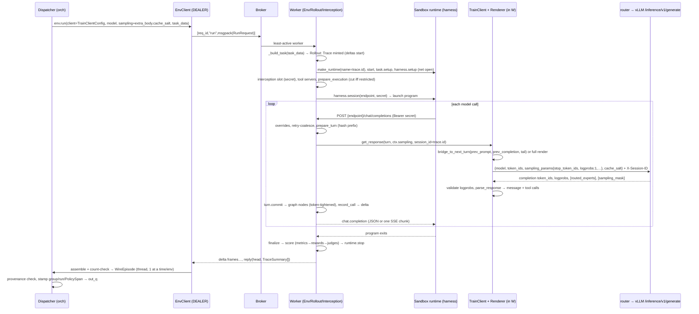
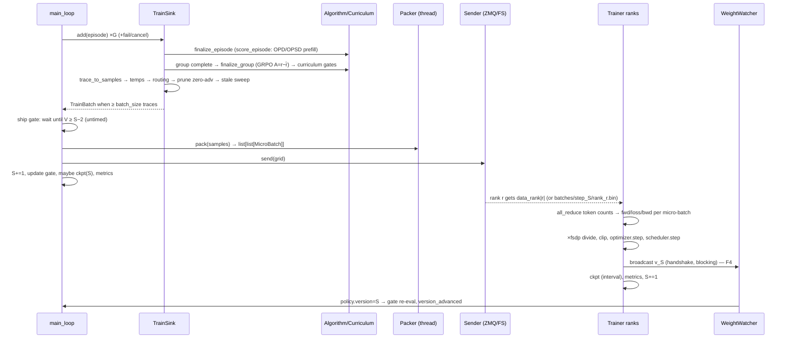

# End-to-end flows: cross-process traces for prime-rl @ b944873

> **Pin.** prime-rl `b944873`, verifiers `69cc0f9`, renderers `6b8da3f`. Checkout: `/tmp/atlas-prime/prime-rl`.
> **What this is.** Sections 01–11 each describe one component. This doc follows data and control *across* them: every hop names the process, what it does, the code cite (`path:line`), and the section that explains it (`→ 03 §3.8`). Every flow ends with a **timing and blocking** box: what waits on what, the bound, and where it can hang.
> **vLLM caveat.** Claims about vLLM internals (pause semantics, prefix cache, `collective_rpc` fan-out, `StatelessProcessGroup`) were read in vLLM **0.24**. The pin is **0.29.0**.

## How to use this doc

- **Find the flow** in the index and jump to its anchor. Hop IDs (`F2.M4`) are stable, so you can cite them in issues.
- **Hop tables** hold the detail. The mermaid diagram is only a picture of it.
- **Debugging a hang?** Go straight to the flow's timing box, or to the [global hang registry](#hang-registry).
- **Path prefixes** (all relative to the checkout root):

| Prefix | Expands to |
|---|---|
| `orch/` | `src/prime_rl/orchestrator/` |
| `tr/` | `src/prime_rl/trainer/` |
| `tw/` / `tb/` | `src/prime_rl/transports/weights/` / `src/prime_rl/transports/batch/` |
| `inf/` | `src/prime_rl/inference/` |
| `ep/` | `src/prime_rl/entrypoints/` |
| `utils/` | `src/prime_rl/utils/` |
| `tpl/` | `src/prime_rl/templates/` |
| `cfg/` | `packages/prime-rl-configs/src/prime_rl/configs/` |
| `v1/` | `deps/verifiers/verifiers/v1/` |
| `rend/` | `deps/renderers/renderers/` |

**Notation.** $S$ is `progress.step`, the batch the orchestrator is collecting (1-indexed). $V$ is `policy.version`, the version inference has applied (0-indexed; $v_0$ is the base model). $M$ is `max_off_policy_steps` (default 8). `TARGET_LAG = 1` (`orch/orchestrator.py:95`). $W$ is `inference_world_size`.

| Flow | Anchor | One line |
|---|---|---|
| F1 | [Cold start](#f1) | `uv run rl` → 4 process kinds up → startup broadcast $v_0$ → dispatch gate opens → first `RunRequest` |
| F2 | [One rollout](#f2) | task → env-server worker → sandbox → harness → interception → renderer → vLLM → trace graph → `WireEpisode` |
| F3 | [One training step](#f3) | group complete → credit → samples → batch → ship gate → pack → send → trainer step → broadcast → ckpt |
| F4 | [One weight update](#f4) | marker handshake, stale drop, pause(keep)/update/resume, `policy.version` advance, per transport |
| F5 | [Resume](#f5) | what each process calls "latest", what is lost, failure branches |
| F6 | [Shutdown](#f6) | `max_steps` drain/final broadcast/final ckpt; crash teardown; multi-node done-files |
| F7 | [Online eval](#f7) | eval trigger on version apply, PREFER_EVAL interleaving, epochs spanning versions |
| — | [Hang registry](#hang-registry) | every timeout and every unbounded wait, in one table |

---

<a id="f1"></a>
## F1 — Cold start of a single-node `uv run rl @ rl.toml`

Nothing in the launcher waits for readiness. Every process is spawned immediately, and readiness is pushed down into the consumers. The orchestrator waits for env servers and inference. The trainer and orchestrator meet at the startup broadcast (→ 01 §2.1).

```mermaid
sequenceDiagram
  participant L as Launcher (rl)
  participant I as Inference (router :8000 + vLLM :8100)
  participant E as Env server (broker+workers)
  participant O as Orchestrator
  participant T as Trainer (torchrun ranks)
  L->>L: cli(RLConfig) → validators → resolved JSONs → clean_future_steps(-1)
  L->>I: Popen inference @ inference.json (CUDA_VISIBLE_DEVICES=infer GPUs)
  L->>E: Popen env-server @ envs/<split>/<name>.json (one per source)
  L->>O: Popen orchestrator @ orchestrator.json
  L->>T: Popen torchrun ... @ trainer.json (CUDA_VISIBLE_DEVICES=train GPUs)
  E->>E: bind tcp://127.0.0.1:0 → write <name>.address
  O->>O: bind ZMQ PUB :5555 + PULL :5556
  O->>E: poll .address (≤600 s), health (≤600 s), load taskset client-side
  O->>I: GET /health (engine + router), /v1/models (≤3600 s)
  T->>T: mesh, model build, optimizer; NCCL: TCPStore on :29501 waits for W peers
  O->>I: POST /init_broadcaster ×n (NCCL) → workers join group rank 1+offset+idx
  T->>T: DataLoader: ZMQ SUB + PUSH READY(dp_rank)
  T->>T: prune broadcasts > v0; touch broadcasts/step_0/.sender_ready
  O->>O: watcher.sync_startup(0): wait .sender_ready
  O->>I: pause → ack(.receiver_ready) → /update_weights → resume
  T-->>I: transfer v0; .started … .finished
  O->>O: policy.version=0 → hooks: trigger_eval(0), on_policy_update → gate open
  O->>O: start(): dispatcher + watcher tasks, main_loop
  O->>E: first RunRequest (eval first if [eval] and not skip_first_step)
  T->>T: wait_for_batch() (untimed)
```

### F1.L — Launcher (`ep/rl.py`)

| # | Action | Code | → |
|---|---|---|---|
| L1 | `main()` → `rl(cli(RLConfig))`. `cli` merges defaults, root `@` files, nested `--x @ f`, then CLI, and validates once | `ep/rl.py:699-701`; `deps/pydantic-config/src/pydantic_config/cli.py:1592-1730` | 02 §3.1 |
| L2 | Phase 1 `propagate_shared_fields` (fill-if-absent, conflicts are errors). Phase 2 runs ~22 after-validators in definition order. `auto_setup_weight_broadcast` (`:439`) sets $W = dp \cdot tp$ **before** `auto_setup_deployment` (`:687`) auto-fills DP, so local runs undercount $W$ | `packages/prime-rl-configs/src/prime_rl/utils/validation.py:10-191`; `cfg/rl.py:311-867`, `:458-469`, `:696-703` | 02 §3.5–3.6, §7.7; 01 §7.5 |
| L3 | Config validation imports every source's taskset/harness/env package (launcher host must have them all installed) | `cfg/orchestrator.py:172-176` | 10 §3.2; 01 §7.21 |
| L4 | Run identity: `PRL_RUN_ID` setdefault uuid, `PRL_RUN_NAME = run.name` (inherited by every child) | `ep/rl.py:652-654` | 01 §3.1 |
| L5 | `validate_run_dir` (refuse dirty dir unless `--clean`/`--resume`) and `mkdir` | `ep/rl.py:656-664`; `utils/pathing.py:339-376` | 01 §3.1 |
| L6 | From scratch: `clean_future_steps(run_dir, -1)` wipes all `batches/step_*` and `broadcasts/step_*` | `ep/rl.py:684-686`; `utils/pathing.py:379-397` | 01 §3.1 |
| L7 | `pre_download_model` (HF snapshot) unless `--dry-run` | `ep/rl.py:688-691` | 01 §3.1 |
| L8 | `rl_local`: new `configs/attempt_N/resolved/` + `logs/attempt_N/`, `latest` symlinks; write `trainer.json`, `orchestrator.json`, `inference.json`, `envs/<split>/<name>.json`. `--dry-run` returns here | `ep/rl.py:124-131`, `:89-113`; `utils/pathing.py:21-72, 230-246` | 01 §3.2 |
| L9 | GPU split: local ids `[0, num_infer)` go to inference, the next `num_train_gpus` to the trainer; physical ids from integer `CUDA_VISIBLE_DEVICES` | `ep/rl.py:144-162`; `utils/process.py:36-44` | 01 §3.2 |
| L10 | Check `orchestrator.model.client.base_url` port == `inference.server.port` | `ep/rl.py:176-186` | 01 §3.2 |
| L11 | Spawn **inference** (`inference @ inference.json`, stdout→`inference.log`, monitor thread) | `ep/rl.py:204-234` | 01 §3.2 |
| L12 | Log (do **not** start) frozen endpoints (OPD teacher, frozen generation source) | `ep/rl.py:244-257` | 01 §2.1 |
| L13 | Spawn one **env server** per launcher-managed source (`serve.address is None`) | `ep/rl.py:262-292` | 08 §2 |
| L14 | Spawn **orchestrator** with `WANDB_SHARED_*` env | `ep/rl.py:294-325` | 01 §3.2 |
| L15 | Spawn **torchrun** `--rdzv-endpoint=localhost:<free port> --nproc-per-node=<train GPUs> -m prime_rl.trainer.rl.train @ trainer.json` | `ep/rl.py:327-376` | 01 §3.2 |
| L16 | Supervise: poll `error_queue` every 1 s; success = trainer **and** orchestrator stop events, both exit 0 | `ep/rl.py:381-406`; `utils/process.py:96-105` | 01 §2.2 |

### F1.I — Inference (`ep/inference.py`, `inf/vllm/server.py`)

| # | Action | Code | → |
|---|---|---|---|
| I1 | Re-apply default inference env in-process. This silently resets RL-level `[env_vars]` that collide with default keys | `ep/inference.py:210` | 01 §3.2 |
| I2 | `setup_vllm_env` before the vLLM import (`VLLM_USE_V2_MODEL_RUNNER`, strict tool calling off, …) | `inf/server.py:7-49` | 06 §3.1 |
| I3 | Start `vllm-router` on `server.port` (8000) fronting `http://localhost:backend_port` (8100). The engine port is rewritten to the backend port. A watcher thread SIGTERMs inference if the router dies | `ep/inference.py:165-191, 216-228` | 06 §2 |
| I4 | `server(config)`: route mounting (`/pause /resume /update_weights /init_broadcaster /load_lora_adapter /liveness`), `worker_extension_cls` chosen by the weight transport, and the `vllm.general_plugins` patches in every vLLM process | `inf/vllm/server.py:59-63, 185-206, 212-241`; `inf/patches.py:4-25` | 06 §3.1–3.2 |

### F1.E — Env server (`ep/env_server.py`, `v1/serve/`)

| # | Action | Code | → |
|---|---|---|---|
| E1 | `VF_RUN_ID := $PRL_RUN_ID` (scopes the tunnel/sandbox limiters). Parse `EnvServerConfig`, which imports the env package | `ep/env_server.py:54-61`; `cfg/env_server.py:31-45` | 08 §2 |
| E2 | Address-publisher thread, then `serve_env(address="tcp://127.0.0.1:0", pool=elastic)` | `ep/env_server.py:24-51` | 08 §2 |
| E3 | Default elastic pool: the **broker binds and publishes before any worker has loaded the env**. Workers spawn and each runs `load_environment` (constructs, never `load()`s, the taskset), then `env.serving()` (shared MCP tools and `ElasticInterceptionPool` warm-up) | `v1/serve/pool.py:171-172, 343-353`; `v1/serve/server.py:36-39, 183-194`; `v1/env.py:360-386` | 08 §2; 07 §2 |
| E4 | Address written atomically (tmp + `replace`) to `configs/attempt_N/resolved/envs/<split>/<name>.address` | `ep/env_server.py:24-31` | 01 §3.7 |

### F1.O — Orchestrator setup (`orch/orchestrator.py:184-401`)

| # | Action | Code | → |
|---|---|---|---|
| O1 | Default executor = 64 threads. Tokenizer (only stored in `TrainSink`, never reaches a renderer) | `orch/orchestrator.py:188-193` | 03 §3.2; 09 §2 |
| O2 | `InferenceClient(train_client_type="renderer", eval_client_type="openai_chat_completions")` and admin plane (one httpx client per `admin_base_url`; single-node auto `[http://localhost:8100/v1]`) | `orch/orchestrator.py:199-206`; `cfg/rl.py:846-854` | 03 §3.6 |
| O3 | `monitors.setup(producer="orch")` and run id/name → sandbox labels | `orch/orchestrator.py:208-224` | 11 §2 |
| O4 | Build `TrainEnvs`/`EvalEnvs` (per-env `GenerationSource` + `Algorithm`, no I/O) | `orch/orchestrator.py:229-238`; `orch/envs.py:250-260` | 03 §3.2 |
| O5 | Resume step (fresh: `None`, so $S=1$) | `orch/orchestrator.py:240-259` | F5 |
| O6 | `BatchPacker` + batch sender at `current_step = S`. **ZMQ binds PUB `:5555` and READY PULL `:5556` here** | `orch/orchestrator.py:262-266`; `tb/zmq.py:27-34` | 06 §3.11 |
| O7 | `train_envs.start()`, then eval envs. Per env: poll the address file (0.5 s, ≤600 s) → `EnvClient` (DEALER) → health (≤600 s) → `vf.load_taskset` → `list(taskset)` in a thread (+ seed-42 shuffle) | `orch/orchestrator.py:270-279`; `orch/envs.py:42, 50-62, 95-119` | 10 §3.4; 08 §2 |
| O8 | `TrainSource` (one curriculum per env, `Random(42)` env mixing) | `orch/orchestrator.py:281`; `orch/train_source.py:20-36` | 04 §3.13 |
| O9 | `admin_plane.wait_for_ready`: `/health` every 1 s on every engine **and** the router (≤`wait_for_ready_timeout` = 3600 s), then `/v1/models` must list the model | `orch/orchestrator.py:288-291`; `orch/clients.py:154-163, 311-367` | 03 §3.6 |
| O10 | Frozen generation sources and teachers connect and wait for readiness | `orch/orchestrator.py:294-297`; `orch/algo/base.py:18-32` | 04 §3.2 |
| O11 | `setup_weight_receiver` + `receiver.initialize()`. **NCCL:** `POST /init_broadcaster {host, port, rank_offset=i·(W/n), W, timeout}` per engine (no timeout, no retry, non-404 errors swallowed) → `collective_rpc("init_broadcaster")` → each worker joins as rank `1 + rank_offset + device.index` of world `W+1`. The HTTP call blocks until the group forms. **FS:** no-op. **NIXL:** `/init_broadcaster` with `session_id` via `_admin_post`, then ModelExpress publish | `orch/orchestrator.py:299-311`; `orch/clients.py:165-203`; `inf/vllm/server.py:133-146`; `inf/vllm/worker/nccl.py:91-126`; `tw/nixl/nixl.py:466-475` | 06 §3.8–3.9 |
| O12 | Build `EvalSource`, `ConcurrencyController`, `Dispatcher` (`out_q` maxsize `max(8, max_inflight)` = 1024; `dispatch_allowed` starts **set**), metrics collector start + one `probe()` (result ignored), `TrainSink`, `EvalSink`, `WeightWatcher(ckpt_step=sync_version)` with hooks `[trigger_eval, on_policy_update]` | `orch/orchestrator.py:322-396`; `orch/dispatcher.py:193-206` | 03 §3.2 |
| O13 | `watcher.sync_startup(sync_version=0, timeout=ckpt.wait_for_weights_timeout or 1200)` — see F1.R | `orch/orchestrator.py:317-320, 398-401` | 03 §3.2 |

### F1.T — Trainer (`tr/rl/train.py`)

| # | Action | Code | → |
|---|---|---|---|
| T1 | torchrun static rendezvous (`localhost:<free port>`). `World` from `RANK/WORLD_SIZE/LOCAL_RANK`. Monitors (rank 0), heartbeat, metrics server; `init_process_group` | `tr/rl/train.py:77-124`; `tr/world.py:7-13` | 05 §3.1 |
| T2 | `resolve_ep`, `get_parallel_dims` (mesh `[dp_replicate, dp_shard, cp]`, cp innermost) | `tr/rl/train.py:126-130`; `tr/parallel_dims.py:157-210` | 05 §3.2 |
| T3 | Checkpoint manager and resume step (fresh: none) | `tr/rl/train.py:133-143` | F5 |
| T4 | `setup_model`: meta → fusions → LM-head injection → quant → LoRA → MoE/EP → AC → compile → FSDP → HF safetensors slice load | `tr/rl/train.py:146-150`; `tr/model.py:968-1078` | 05 §3.3 |
| T5 | Loss, optimizer, scheduler | `tr/rl/train.py:155-176` | 05 §3.7 |
| T6 | `setup_weight_sender`. **NCCL:** the master creates `StatelessProcessGroup(host, 29501, rank 0, world W+1, store_timeout=timeout)` and a `PyNcclCommunicator`. This blocks until every inference worker has joined, i.e. until orchestrator O11 | `tr/rl/train.py:178-191`; `tw/nccl.py:131-137, 172-179` | 05 §3.17.3; 06 §3.8 |
| T7 | CP setup, LoRA adapter init, (resume) load | `tr/rl/train.py:193-223` | 05 §3.1 |
| T8 | `DataLoader(output_dir, progress.step, dp)`: `dp_rank = rank // (world/dp)`. ZMQ: SUB connects and subscribes `data_rank\|r\|`, then PUSH sends READY(`dp_rank`) **once** | `tr/rl/train.py:228-236`; `tr/rl/data.py:188-193`; `tb/zmq.py:96-112` | 04 §3.9 |
| T9 | First loop iteration: master `prune_broadcasts_beyond(start-1)`, then **startup broadcast** $v_{start-1}$ = $v_0$. Master resets `broadcasts/step_0/`, touches `.sender_ready`, polls `.receiver_ready` every 0.1 s (≤ `weight_broadcast.timeout` = 1200 s) | `tr/rl/train.py:263-276`; `tw/base.py:29-36, 53-70, 75-92` | 05 §3.5 |

### F1.R — The `sync_startup` rendezvous and the gate opening

| # | Process | Action | Code | → |
|---|---|---|---|---|
| R1 | orch | `WeightWatcher.sync_startup(0)` under `update_lock` → `receiver.sync_startup`: `wait_for(wait_published(0), timeout)` (0.2 s polls on `.sender_ready`), **then** `receive(0)` **outside** that timeout | `orch/watcher.py:48-54`; `tw/base.py:148-156, 166-169` | 06 §3.6 |
| R2 | orch↔trainer↔engines | `receive(0)` is a full weight update (see [F4](#f4)): FS ack → wait `.finished` → pause/update/resume; NCCL pause → ack → `/update_weights` + collective → resume; NIXL ack → wait "ready" → update → "complete" | `tw/filesystem.py:68-75`; `tw/nccl.py:207-213`; `tw/nixl/nixl.py:477-502` | F4 |
| R3 | trainer | Sees `.receiver_ready` → `.started` → `_broadcast` → `.finished` → `_clean` | `tw/base.py:64-69, 101-108` | 06 §3.6 |
| R4 | orch | `ckpt_step = 0`, `policy.version = 0`, `_notify_update`: `dispatcher.on_new_version`, then hooks in order: `trigger_eval(0)` (fresh run fires every eval env unless `skip_first_step`; switches the dispatcher to `PREFER_EVAL`), then `on_policy_update(0)` → `update_dispatch_gate()` (lead $=(S-1)-V = 0 \le 1$ → gate set) + `version_advanced.set()` | `orch/watcher.py:123-131`; `orch/orchestrator.py:775-799, 976-1005`; `orch/eval_source.py:48-50, 59-71` | 03 §3.2, §3.14 |
| R5 | orch | `start()`: event-loop-lag task, periodic logger, `dispatcher.start()` and `watcher.start()` tasks; `main_loop()` inline | `orch/orchestrator.py:403-430` | 03 §3.3 |
| R6 | orch | Dispatcher `fill_inflight` → `try_schedule` → first `schedule_group_episode` → **first `RunRequest`**. It is an eval request if eval fired in R4, else train. Initial in-flight cap = `min_inflight` (1) until the first KV-capacity observation | `orch/dispatcher.py:324-348, 443-476, 536-615`; `orch/concurrency.py:123-126, 255-265` | 03 §3.4, §3.7; F2 |
| R7 | trainer | `wait_for_batch()`: ZMQ `poller.poll(timeout=None)` / FS 1 s polls, untimed | `tr/rl/train.py:278-283`; `tb/zmq.py:121-122`; `utils/pathing.py:400-412` | F3 |
| R8 | orch | First `send` blocks until READY arrives from `num_train_workers` distinct ranks. READY dedups by rank id, so with CP>1 the barrier does not prove every CP peer subscribed. Masked because every receiver exists before the startup broadcast | `tb/zmq.py:47-64` | 06 §3.11 |

### F1.S — Multi-node SLURM deltas (`tpl/multi_node_rl.sbatch.j2`)

| Item | Single-node local | Multi-node SLURM | Code | → |
|---|---|---|---|---|
| Who parses the config | launcher once; children re-parse JSON | submit host runs `rl_slurm`: writes subconfigs (`inference.json` with `router=None`), renders the template, `sbatch` | `ep/rl.py:585-644` | 01 §3.4 |
| Node order | — | `HOSTNAMES = scontrol show hostnames`; inference nodes first, trainer nodes after | `tpl/multi_node_rl.sbatch.j2:85-90` | 01 §2.3 |
| Inference node 0 | router + engine in one `inference` proc | global `vllm-router` (or llm-d) on `ROUTER_PORT`, plus its own per-DP-rank engines | `:459-488`; `tpl/_launch_router.sh.j2` | 01 §3.4.2 |
| Every inference node | — | one `uv run inference @ inference.json --server.port BACKEND_PORT+k --vllm.data-parallel-size …` per DP rank (external LB) | `tpl/_launch_rank.sh.j2:15-39` | 06 §2 |
| Trainer | `torchrun` on local GPUs | every GPU of every trainer node; `--rdzv-endpoint $MASTER_ADDR:29500` (`MASTER_ADDR` = trainer node 0) | `:137-138, 491-527` | 01 §3.4.3 |
| Orchestrator + env servers | local | on `ORCH_PROCID` = trainer node 0 (or the last inference node with `orchestrator_on_inference`). Env servers backgrounded **before** the orchestrator on that node (loopback bind forces co-location) | `:158-161, 532-573` | 01 §3.4.6; 08 §2 |
| Data URL | default `http://localhost:8000/v1` | `--model.client.base-url $INFER_URLS` = `http://<I_0>:ROUTER_PORT/v1` | `:94, 534` | 06 §4.8 |
| Admin URLs | auto `[http://localhost:8100/v1]` | `--model.client.admin-base-url $ADMIN_URLS`: every node × `BACKEND_PORT+k`, **in rank order** | `:117-124, 535` | 06 §4.8 |
| NCCL rendezvous | trainer binds `localhost:29501` | trainer `host=0.0.0.0` (resolved JSON); orchestrator `--weight_broadcast.host $MASTER_ADDR` | `cfg/rl.py:778-792`; `:563` | 01 §3.7 |
| $W$ | pre-auto-fill `dp·tp` (**bug**) | `total_infer_nodes × gpus_per_node` | `cfg/rl.py:458-469, 778-792` | 06 §3.8 |
| ZMQ | `localhost:5555/5556` | both sides get `--rollout_transport.host $ORCH_ADDR` (a hostname; binds the interface it resolves to) | `:519, 565` | 06 §3.11 |
| NIXL | external ModelExpress required | ModelExpress + redis on trainer node 0; every node waits ≤120 s for it | `:141-151, 252-327` | 01 §3.4.7 |
| Env inheritance | separate sets | orchestrator and env servers on trainer node 0 inherit the trainer's exported env | `:334-336, 498-500, 538-540` | 01 §3.4.6 |
| Single-node SLURM | — | `uv run rl @ rl.json` inside the allocation takes the local path; the re-parse fixes the $W$ bug | `tpl/single_node_rl.sbatch.j2:126` | 01 §3.3 |

> **Timing and blocking — F1**
>
> | Waiter | Waits for | Bound | On expiry / hang mode | Cite |
> |---|---|---|---|---|
> | orch O7 | `<name>.address` file | 600 s | `TimeoutError` → orch exits 1. On a SLURM requeue that reuses the pinned attempt, it reads the **stale** address from the previous job and then fails health after 600 s | `orch/envs.py:42, 50-62`; 01 §7.18 |
> | orch O7 | env-server `health` | 600 s | The broker answers `health` inline before workers load. A worker that crashes in `load_environment` passes health, and its runs hang later (F2) | `v1/serve/pool.py:194-197`; 08 §7.2 |
> | orch O7 | `list(taskset)` (dataset pull) | none | unbounded | `orch/envs.py:111-117` |
> | orch O9 | `/health` on every engine + router | 3600 s | `TimeoutError`. A 404 `/health` counts as ready | `orch/clients.py:332-367` |
> | orch O11 | `/init_broadcaster` HTTP (NCCL) | **none** (client `timeout=None`, no retry) | Non-404 HTTP errors are **silently swallowed**. With the local $W$ undercount, engines ≥1 get 500 and the run fails at the first weight update (R2) | `orch/clients.py:179-196`; 06 §7 |
> | trainer T6 | all $W$ inference workers joining the TCPStore | `store_timeout = weight_broadcast.timeout` (1200 s) | The trainer reaches T6 after model build; the workers join only at O11, after env servers, tasksets, inference readiness and frozen pools. A slow orchestrator setup can expire this. [UNVERIFIED: vLLM/torch-internal store wait semantics] | `tw/nccl.py:134-136`; 06 §3.8 |
> | trainer T9 | `.receiver_ready` | 1200 s | `TimeoutError("No receiver joined the broadcast")` → trainer exits 1 → launcher tears down | `tw/base.py:75-92` |
> | orch R1 | `.sender_ready` of $v_0$ | `ckpt.wait_for_weights_timeout` or 1200 s | `TimeoutError` → orch exits 1 | `orch/orchestrator.py:317-320`; `tw/base.py:166-169` |
> | orch R1 | `receive(0)` | **not** covered by the sync timeout | FS: `.finished` wait untimed. NCCL/NIXL: bounded by admin `/pause` 300 s×retries and `/update_weights` 720 s/attempt (≤1440 s) | `tw/base.py:166-169`; `orch/clients.py:389-412`; `utils/pathing.py:414-425` |
> | orch R8 | READY from `num_train_workers` ranks | none | `num_train_workers` > trainer DP ⇒ blocks forever | `tb/zmq.py:47-64`; 04 §5.4 |
> | trainer R7 | first batch | none | waits as long as the orchestrator takes to fill batch 1 | `tb/zmq.py:121-122` |
> | dispatcher R6 | in-flight cap | — | No `/metrics` on engines ⇒ cap stays at `min_inflight` = 1 for the whole run | 03 §7.6 |
> | launcher L9–L15 | port binds | — | Two local runs on one host collide on 29501/5555/5556 (`EADDRINUSE`). `trainer.metrics_server` on 8000 collides with the router | 01 §7.4; 11 §7.12 |

---

<a id="f2"></a>
## F2 — One rollout, token-level (train, live policy)



### F2.D — Orchestrator dispatch

| # | Action | Code | → |
|---|---|---|---|
| D1 | `fill_inflight`: return if `policy_update_pending`, no permits or no burst budget. Under `scheduling_lock`, `PREFER_TRAIN` returns if `dispatch_allowed` is clear | `orch/dispatcher.py:443-476` | 03 §3.4.2 |
| D2 | `try_schedule("train")`: **continue the oldest open group first**; else `TrainSource.next_task`: env by `rng.choices(weights=ratio)`, task = `next(curriculum.sampler)` | `orch/dispatcher.py:485-534`; `orch/train_source.py:38-40` | 03 §3.4.3; 04 §3.13 |
| D3 | New `GroupState` pins `policy_version_at_start = policy.version` (per **group**) | `orch/dispatcher.py:525-534` | 03 §3.4.3 |
| D4 | `schedule_group_episode`: `train_client` (renderer); `cache_salt = str(policy_version_at_start)` (live) / `None` (frozen); `episodes_to_schedule -= 1`; permit + optional rate limiter; `InflightEpisode`; `run_episode` task | `orch/dispatcher.py:536-615` | 03 §3.4.4 |
| D5 | `Env.run`: `sampling = sampling_args ∪ {extra_body.cache_salt}`. `sampling_args` = temperature, top_p, `logprobs: True`, max tokens, `extra_body{top_k=-1, min_p=0, return_token_ids=True}` (+ `top_k=512` under truncation) | `orch/envs.py:121-145`; `cfg/orchestrator.py:91-111, 758-769` | 07 §4.1 |
| D6 | `EnvClient.run` → `_request`: frames `[request_id, "run", msgpack(model_dump(json))]`, **no timeout**. The API key never crosses (only `api_key_var`) | `v1/serve/client.py:93-135, 186-217` | 08 §3.1, §4.1 |

### F2.S — Env server: episode, sandbox, harness

| # | Action | Code | → |
|---|---|---|---|
| S1 | Broker: `run` goes to `min(workers, key=active)` over a per-worker DEALER (HWM 1000); elastic scale-up check | `v1/serve/pool.py:224-238` | 08 §3.1 |
| S2 | Worker `_run`: `ModelContext(client, model, sampling)`; `_build_task` = `data_cls.model_validate(task_data)` + `task_cls(data, env.config.taskset.task)` (the server's own task config) | `v1/serve/server.py:80-101` | 10 §3.5 |
| S3 | `DeltaStreamer`, then `env.run_slot` (one `max_concurrent` permit per attempt; episode retries default off) | `v1/serve/server.py:111-114`; `v1/env.py:313-358` | 07 §3.2 |
| S4 | `Env.run_episode` under `timeout.episode` (default none) → `SingleAgentEnv.run` → `Agent.run` → `_run_once`: `Rollout(...)`, `open`, `step`, `close` | `v1/env.py:242-305`; `v1/agent.py:387-471` | 07 §3.2 |
| S5 | `Rollout.__init__` mints the `Trace`; `on_trace` → the streamer starts sending deltas before any I/O | `v1/rollout.py:87-98` | 07 §3.3 |
| S6 | `open()`: `make_runtime(name=trace.id)` → `runtime.start()` → `prepare_setup()` (network open) | `v1/rollout.py:185-220` | 08 §3.4 |
| S7 | `task.setup`, then `harness.setup` (installs the agent program) under one `timeout.setup` deadline (default none) | `v1/rollout.py:226-240` | 08 §3.4 |
| S8 | `serve_interception` → `(base_url, model_secret, state_secret)`; `endpoint = runtime.host_url(base_url+"/v1")` (loopback, Docker proxy callback, or Prime tunnel URL) | `v1/rollout.py:247-261` | 07 §3.6; 08 §3.5 |
| S9 | `serve_tools` (MCP URLs), then `prepare_execution([endpoint, *mcp])`: egress cut **iff** the policy is restricted. The default `allow=["*"]` is a **no-op** on every runtime | `v1/rollout.py:262-274` | 08 §3.4 |
| S10 | `harness.session(ctx, trace, runtime, endpoint, secret, mcp_urls, data)`; `step()` → `HarnessSession.turn` → `launch()` under the agent deadline (4 h default). bash/null get `--base-url endpoint --api-key secret --model ctx.model` | `v1/rollout.py:319-342, 358-431`; `v1/harnesses/utils/launch.py:52-57` | 07 §3.3 |

### F2.M — One model call (repeats per turn)

| # | Action | Code | → |
|---|---|---|---|
| M1 | Harness `POST {endpoint}/chat/completions`, `Authorization: Bearer <model_secret>`; session lookup by secret; `apply_overrides` imposes run model and sampling | `v1/interception/server.py:583-596` | 07 §3.5.2 |
| M2 | Retry atomicity: an `x-stainless-retry-count`/`Idempotency-Key` replay returns cached bytes or coalesces onto the in-flight future | `v1/interception/server.py:621-691` | 07 §3.5.2 |
| M3 | `parse_request`; refusal (limits, `@stop`) → 400 "rollout stopped"; request rewrites; `graph.prepare_turn` (message-hash prefix, no mutation) | `v1/interception/server.py:656-747` | 07 §3.7 |
| M4 | `TrainClient.get_response`: **chat dialect only** (else `NotImplementedError` → 502); program sampling ignored; `sampling_params = ctx.sampling.wire_args()` minus `chat_template_kwargs` and `cache_salt` | `v1/interception/server.py:793-800`; `v1/clients/train.py:342-370` | 07 §3.5.3 |
| M5 | Renderer slot from `ElasticRendererPool` keyed `(renderer_model_name=model.name, renderer config, kwargs)`. Encode-side work runs on a thread under a per-slot lock | `v1/clients/train.py:371-380` | 09 §2 |
| M6 | **Bridge** if the tail is `[tool*, user?]` and has no images: `previous_token_ids()` (prefix must end at a sampled assistant node with a contiguous sampled suffix) → `renderer.bridge_to_next_turn(prev_prompt, prev_completion, tail)`. On success, `routed_experts_prompt_start = len(prev)-1` | `v1/clients/train.py:386-412`; `v1/graph.py:504-531`; `rend/base.py:778-845` | 09 §3.6 |
| M7 | Otherwise a **full render** `render(messages, tools, add_generation_prompt=True)`. Drift from sampled tokens forks a branch at M11 | `v1/clients/train.py:417-426` | 09 §3.8 |
| M8 | `generate()`: overlong preflight vs `/v1/models` `max_model_len` → `OverlongPromptError` → `ProviderError(400)`. Forces `stop_token_ids`, `logprobs=1`, `skip_special_tokens=False`. Body `{model, token_ids, sampling_params, [features], cache_salt}` → `POST {base−/v1}/inference/v1/generate` with `X-Session-ID: trace.id` | `rend/client.py:302-352`; `v1/clients/train.py:428-447` | 09 §3.7; 06 §3.3 |
| M9 | Router (sticky on `X-Session-ID`) → engine `PrimeRlServingTokens` (re-encodes `routed_experts` compactly). The prefix cache is keyed by `cache_salt` and is **never reset on updates** | `inf/vllm/serving_tokens.py:58-87` | 06 §3.3, §3.6.1 |
| M10 | Response parse: strict logprob validation (`token_id:N`, no `-9999.0`) else `MalformedGenerateResponseError` (a `ValueError` → **502, not stashed**); `parse_response`; `stop` → `tool_calls` when a valid call was parsed; `response_from_generate` drops `UNKNOWN_TOOL` calls; `raw = serialize_completion` | `rend/client.py:137-188, 353-423`; `v1/clients/train.py:450-456` | 09 §3.7 |
| M11 | `turn.commit(response)` → `_commit_turn`: tighten the hash prefix to a **token** prefix (fork at first divergence); append input nodes and one assistant node (`mask = [F]*gen_prompt + [T]*completion`, compact logprobs); attribute routing/sampling mask; `record_call` in `finally` → `Trace.notify` → delta flush | `v1/interception/server.py:836-846, 876-894`; `v1/graph.py:774-935` | 07 §3.7, §3.9 |
| M12 | Serve JSON or **one** SSE chunk + `[DONE]`. After 60 s a 200 SSE stream is committed with keepalives, so a late failure arrives as an SSE error | `v1/interception/server.py:238-310, 756-771` | 07 §3.5.2 |
| M13 | Errors: `RolloutError` (incl. `ProviderError`) is stashed on `session.error` with its status (SDK retries 5xx/429). Any other exception → 502, cause only in `trace.calls[*].error` | `v1/interception/server.py:847-870` | 07 §3.5.2 |
| M14 | Next turn: the harness re-sends history + new tool/user messages → `prepare_turn` reuses nodes → bridge (M6) | — | 07 §3.7 |

### F2.C — Rollout end, scoring, reply, orchestrator stamping

| # | Action | Code | → |
|---|---|---|---|
| C1 | Program exits → `_check_result` (non-zero OK if a stop condition is set, else `HarnessError`/`SandboxError`) → `trace.stop("agent_completed")` | `v1/harness.py:167-183`; `v1/agent.py:462` | 07 §3.3 |
| C2 | `close()`: session close, interception slot released (sealed). **If not failed:** `task.finalize` under `timeout.finalize`, then `gather(task.score, harness.score)` under `timeout.scoring` (both default none). `Task.score` runs metrics → rewards → judges; any exception → `TaskError` → `trace.ok=False` (dropped, not reward 0). Then `runtime.stop()` | `v1/rollout.py:451-554`; `v1/task.py:203-274` | 07 §3.4 |
| C3 | `run_episode`: `Env.finalize` (cross-trace); `episode.ok = all(t.ok)` | `v1/env.py:291-305` | 07 §3.2 |
| C4 | `DeltaStreamer.__aexit__` flushes the final state, **then** the reply `RunResponse{head: episode−traces, traces: [TraceSummary{id,nodes,calls}]}` | `v1/serve/delta.py:124-134`; `v1/serve/server.py:115-123` | 08 §3.1 |
| C5 | Broker relays deltas as-is; the reply pops `pending` and decrements `active` | `v1/serve/pool.py:239-260` | 08 §3.1 |
| C6 | `EnvClient`: each delta → `EpisodeAssembly.apply` → `on_delta` (dispatcher live view + collect session ids); reply → `assembly.finish` count check → `WireEpisode.model_validate` in a thread, **one at a time per env client** | `v1/serve/client.py:137-152, 200-221`; `v1/serve/delta.py:302-321`; `orch/dispatcher.py:583-591` | 08 §3.1 |
| C7 | `Env.run`: if `episode.ok` is False, every ok sibling trace is marked failed | `orch/envs.py:146-153` | 03 §3.5 |
| C8 | `run_episode` `finally`: shielded `finish_sessions(trace ids)` → `POST /finish_session` on the router (only when `admin_base_url` is set) | `orch/dispatcher.py:604-610`; `orch/clients.py:96-100, 113-129` | 06 §3.5 |
| C9 | `handle_completed_request`: pop meta (None ⇒ already dropped), release permit, promote `EmptyEpisode`/`EmptyTrajectory`, `on_episode_complete` → concurrency growth | `orch/dispatcher.py:632-693` | 03 §3.4.5 |
| C10 | `emit_episode`: **provenance** `(task.key, task.hash)` must match, else `ValueError` kills the dispatcher task → orch exits 1. Stamp `env.name`, `GroupInfo(id)`, `TrainRunInfo(work=TrainWorkInfo(step=group.step, policy=PolicySpan(start=group version, end=policy.version)))`; `out_q.put` (may block: bounded queue) | `orch/dispatcher.py:116-120, 705-729` | 03 §3.4.5, §7.24 |
| C11 | `main_loop`: `stamp_arrival` (`trace.info.kind/dispatch/arrival`), `monitors.log([ep], S, "train", "all")` (the file monitor streams the episode once), then `train_sink.add` → [F3](#f3) | `orch/orchestrator.py:533-559`; `orch/annotations.py:20-30` | 11 §3.3 |

> **Timing and blocking — F2**
>
> | Waiter | Waits for | Bound | Hang / failure mode | Cite |
> |---|---|---|---|---|
> | orch `run_episode` | env-server reply | **none** | Ends only by cancellation (stale drop, overload shed, drain, shutdown). Eval and frozen-sourced groups are never staleness-dropped | `v1/serve/client.py:100-102`; 03 §7.11 |
> | broker | worker liveness | none | A dead worker keeps receiving work (its frozen `active` count can be the minimum); its runs hang. ≥1000 frames queued to a dead worker **freeze the whole broker** (no relays, no health). Unreachable with default elastic (~115/worker) | `v1/serve/pool.py:18-20, 221-236`; 08 §7.2 |
> | worker | provisioning, tunnel, tool servers, network cut | none | Outside every deadline; a wedged `docker` CLI or provider wait hangs the episode | 08 §3.4, §7.4 |
> | worker | `task.setup` + `harness.setup` | `timeout.setup` = none | — | `v1/rollout.py:226-240` |
> | worker | agent program | 4 h default (24 h cap on non-Prime remote) | `HarnessError("agent timeout")` | `v1/agent.py:57-83` |
> | worker | finalize, scoring, episode | none | A hung judge (no read timeout, `max_retries=0`) hangs the rollout | 07 §3.4 |
> | TrainClient | vLLM response | connect 5 s, **no read timeout**, `max_retries=0`; router `request_timeout_secs=14400` | During a weight update the request is frozen in the engine (F4) | `v1/clients/base.py:12-31`; `ep/inference.py:165-191` |
> | harness | 5xx retries | SDK-defined | `MalformedGenerateResponseError` and dialect refusals are 502 → SDK resamples the turn; the trace's error is only in `trace.calls[*].error` | 09 §7.1 #8 |
> | Prime runtime | tunnel starts | 512/min per `VF_RUN_ID` per host | `TunnelError` after 3 tries | 07 §7.2 |
> | orch C6 | `WireEpisode` validation | serialized per env client | throughput cliff for huge traces | 03 §7.12 |
> | orch C10 | `out_q.put` | bounded (1024) | blocks the dispatcher loop, i.e. no new scheduling (backpressure) | `orch/dispatcher.py:193-194` |
> | router | session release | only with `admin_base_url` | bare router `base_url` ⇒ sticky sessions never released | 03 §7.26 |

---

<a id="f3"></a>
## F3 — One training step (batch $S$)



### F3.A — Sink: group → credit → samples → batch (`orch/train_sink.py`)

| # | Action | Code | → |
|---|---|---|---|
| A1 | `add(episode)` → `algorithm.finalize_episode` → `score_episode` only if the episode has a trainable trace (OPD/OPSD: per-branch prefill scoring via `/inference/v1/generate` `prompt_logprobs`, unbounded concurrency, **before admission**) | `orch/train_sink.py:129-138, 221-224`; `orch/algo/base.py:73-76`; `orch/clients.py:523-556` | 04 §3.2, §3.4 |
| A2 | Group complete iff `arrived + failed + cancelled.count ≥ group_size`. `DispatchFailure`/`GroupCancellation` count but are never shown to the algorithm | `orch/train_sink.py:140-167` | 03 §3.10 |
| A3 | `process_group`: a `stale` cancellation voids the whole group. `survivors = iter_trainable_traces` (not `has_error`, `agent.trainable`, ≥1 sampled token). If any, `finalize_group` → `score_group` (GRPO $A_i=r_i-\bar r$ over survivors, `assign_advantages` onto nodes) | `orch/train_sink.py:226-266`; `orch/algo/base.py:35-42, 78-80`; `orch/algo/grpo.py:24-46`; `orch/algo/routing.py:11-35` | 04 §3.2, §3.4 |
| A4 | Admission: `TrainSource.on_result` → `Curriculum.on_result` (sampler observes, AND of gates; **no gates by default**). Rejected or survivor-less groups are dropped | `orch/train_sink.py:267-276`; `orch/train_source.py:42-54`; `orch/curriculum/base.py:50-66` | 04 §3.13 |
| A5 | Per survivor: `trace_to_samples` (one sample per trainable branch; shared sampled node trained in the first branch only) in a thread; `temperatures = [env temperature]*L`; missing sampling mask under truncation → **fatal** `RuntimeError`; `stamp_loss_routing`; prune zero-advantage tokens (`constant_trainer_batch_size`) | `orch/train_sink.py:278-297`; `orch/trajectories.py:91-114, 136-180` | 04 §3.5–3.6 |
| A6 | Insert into `pending_batch` (keyed by trace), then a scoped stale check | `orch/train_sink.py:299-323` | 04 §3.11 |
| A7 | `_maybe_batch`: full stale sweep once per $S$ (void traces with `policy.start < (S-1)-M`), ready iff **traces** ≥ `batch_size` (or tokens ≥ `token_batch_size`) | `orch/train_sink.py:169-219` | 03 §3.9 |
| A8 | `process_batch`: FIFO first `batch_size` traces; surplus stays queued and keeps aging | `orch/train_sink.py:360-421` | 03 §3.10 |

### F3.B — Ship (`orch/orchestrator.py:573-762`)

| # | Action | Code | → |
|---|---|---|---|
| B1 | `step > max_steps` → drain; empty samples → skip without advancing | `orch/orchestrator.py:588-598` | 03 §3.13 |
| B2 | **Ship gate:** hold until `policy.version ≥ S-1-TARGET_LAG = S-2`. The wait is `version_advanced.wait()` with **no timeout and no component-health check** | `orch/orchestrator.py:607-625` | 03 §3.9 |
| B3 | Log the effective cohort and ship annotations (`effective`, `ship.step`, advantages) | `orch/orchestrator.py:630-631`; `orch/annotations.py:33-49` | 11 §3.4 |
| B4 | `to_thread(packer.pack)` → `prepare_batch`: `prepare_sample` (**silent truncation** to `seq_len`), FFD bins, pad to `pad_to_multiple_of` (= CP), dummy micro-batches so every rank has equal count/modality, Karmarkar–Karp balance on FLOP cost | `orch/orchestrator.py:634`; `orch/packing.py:28-35`; `tr/batch.py:370-498, 692-796, 847-913` | 04 §3.7 |
| B5 | `sender.send(grid)`: ZMQ first send waits for READY, then `send_multipart([b"data_rank\|r\|", msgpack])` per rank (no step id). FS: `batches/step_S/rank_r.bin.tmp` → rename | `orch/orchestrator.py:636`; `tb/zmq.py:66-80`; `tb/filesystem.py:17-35` | 06 §3.11 |
| B6 | `S += 1`; `update_dispatch_gate` (closes if $(S-1)-V > 1$); `maybe_save_ckpt(step)` (interval, not `max_steps`) | `orch/orchestrator.py:637-640, 958-1000` | 03 §3.12, §3.15 |
| B7 | Metrics (episode matrix, `progress/*`, `time/*`, `off_policy/*`), heartbeat, console `Step N` line | `orch/orchestrator.py:643-752` | 11 §3.9.2 |
| B8 | If `step ≥ max_steps`: `wait_for_version(step)` then `start_draining` → [F6](#f6) | `orch/orchestrator.py:754-761` | 03 §3.13 |

### F3.T — Trainer step (`tr/rl/train.py:253-719`)

| # | Action | Code | → |
|---|---|---|---|
| T1 | `wait_for_batch` (untimed) → `get_batch` → `_micro_batch_to_tensor` (sampling mask → dense `[1,L,K]` padded −1; routed experts → `int32[1,L,layers,topk]`) | `tr/rl/train.py:278-290`; `tr/rl/data.py:195-267` | 04 §3.9 |
| T2 | Per-component token counts $N_{rl}, N_{ce}, N_{ref}$ from the **unsharded** micro-batches, one `all_reduce(SUM)` over `dp_cp`, each clamped ≥1 | `tr/rl/train.py:300-322` | 04 §3.10 |
| T3 | Per micro-batch: shift labels, CP-shard inputs, `forward` (fused LM head applies $1/T$ before logsumexp), CP-gather logprobs, shift right, `compute_loss` (rl = IPO default, ce, ref_kl; each a sum, divided by its global $N$; zero anchor so empty micro-batches still backprop), `backward`, metrics, `annotation_writer.export` | `tr/rl/train.py:336-557`; `tr/rl/loss.py:305-423`; `tr/models/layers/lm_head.py:159-194` | 04 §3.10, §3.12 |
| T4 | `annotation_writer.flush()` (gather to rank 0) | `tr/rl/train.py:559` | 11 §3.4 |
| T5 | Undo FSDP averaging (`×fsdp_gradient_divide_factor`), clip (`max_norm` 1.0), `optimizer.step`, `zero_grad`, `scheduler.step` — **one** optimizer step per batch | `tr/rl/train.py:561-576` | 05 §3.4 |
| T6 | `cuda.synchronize()`; `empty_cache()`; `broadcast(model, step=S)` → [F4](#f4) (blocks until acked and transferred) | `tr/rl/train.py:581-597` | 05 §3.5 |
| T7 | Checkpoint if `ckpt.interval` divides $S$ and not the last step (synchronous DCP), then `maybe_clean` (deletes **whole** `step_N/` dirs) | `tr/rl/train.py:599-613`; `tr/ckpt.py:290-322` | 05 §3.16 |
| T8 | Stats (world all-gathers), `monitors.log` ×5, heartbeat; `is_last_step` → break; else `progress.step += 1` | `tr/rl/train.py:619-719` | 11 §3.9.6 |

**Steady-state pipeline** (→ 03 §3.9, 04 §3.11). While the trainer trains batch $S-1$ from $v_{S-2}$, the orchestrator collects batch $S$ under $v_{S-2}$ (lead 1). Batch $S$ cannot ship until $v_{S-2}$ is applied, so at most 2 shipped batches ($S-1$, $S$) exist beyond the applied version. ZMQ PUB (HWM 10) therefore never drops (`tb/zmq.py:16-20`).

> **Timing and blocking — F3**
>
> | Waiter | Waits for | Bound | Hang / failure mode | Cite |
> |---|---|---|---|---|
> | sink A2 | every member of a group resolving | none | A hung member (dead worker, stuck sandbox) holds its group until the stale sweep reclaims it ($>M$ steps). Eval/frozen groups never do | 08 §7.2 |
> | sink A1 | OPD/OPSD reference scoring | none | pre-admission cost on every episode | 04 §7.9 |
> | main B2 | $V \ge S-2$ | **none** | **Deadlock**: bounded `out_q` + main loop in the hold + `out_q` fills (eval dispatch keeps going; or a small `max_inflight`) + a stale live train group still has members when the awaited version is applied ⇒ watcher blocks in `drop_group`'s `out_q.put` before `receive` ⇒ version never advances. The trainer then fails after 1200 s with "No receiver joined the broadcast" | 03 §7.2 |
> | main B2 | watcher health | not checked | A watcher that dies during the hold hangs the orchestrator until the trainer's 1200 s ack timeout | 03 §7.3 |
> | main B5 | READY barrier (first send) | none | see F1 R8 | `tb/zmq.py:47-64` |
> | trainer T1 | batch | none | — | `tb/zmq.py:121-122` |
> | trainer T3 | every collective | `dist_timeout_seconds` = 3600 | Unequal micro-batch counts or modality across ranks ⇒ collective hang (prevented by dummy padding). `num_train_workers ≠` trainer DP ⇒ some ranks starve (FS extra rank files are silently dropped) | `cfg/trainer.py:723`; 04 §5.3–5.4 |
> | trainer T6 | `.receiver_ready` | 1200 s | see F4 | `tw/base.py:75-92` |
> | trainer T7 | DCP save | synchronous, none | on the critical path; a crash mid-save leaves an unmarked partial `step_N/trainer` | 05 §3.16 |
> | numerics | — | — | IPO/ref_kl exponentiate the unmasked log-ratio: one token with $\log r > 88$ ⇒ whole-step NaN. Train `temperature=0` ⇒ inf/NaN | 04 §7.1, §7.3 |

---

<a id="f4"></a>
## F4 — One weight update $v_N$ (all transports)

The trainer offers $v_N$ right after optimizer step $N$ (F3 T6), or $v_{start-1}$ at startup (F1 T9). Versions are applied strictly in order. The trainer blocks on every ack, so at most one un-acked offer exists (→ 06 §3.6).

### F4.C — Common skeleton

| # | Process | Action | Code | → |
|---|---|---|---|---|
| C1 | trainer master | `rm -rf broadcasts/step_N`, `mkdir`, touch **`.sender_ready`**. Non-masters enter `_broadcast` at once and are held back by the transport (barrier / collectives) | `tw/base.py:53-63, 95-99` | 06 §3.6 |
| C2 | trainer master | Poll **`.receiver_ready`** every 0.1 s, ≤ `weight_broadcast.timeout` (1200 s) | `tw/base.py:75-92` | 05 §3.17 |
| C3 | orch watcher | Every 1 s: `next_version(ckpt_step)` = max step dir with `.sender_ready` → if > `ckpt_step`, `apply_policy_update(N)` under `update_lock` | `orch/watcher.py:56-65, 79-84`; `tw/base.py:139-146` | 03 §3.8 |
| C4 | orch watcher | `wait_published(N)` (0.2 s polls); `ckpt_step = N` (published, not yet applied) | `orch/watcher.py:85-91`; `tw/base.py:148-156` | 03 §3.8 |
| C5 | orch dispatcher | `on_version_pending(N)` **before** any pause: `policy_update_pending = True` (all dispatch, eval included, stops), barrier on `scheduling_lock`, then `drop_group(reason="stale")` for live train groups with `start < (S-1)-M`. Each drop releases permits, puts one `GroupCancellation` on `out_q` (**may block**), and cancels the tasks → `EnvClient` sends a fire-and-forget `cancel` → worker aborts the rollout. Observer exceptions are swallowed; a block is not | `orch/watcher.py:93-109`; `orch/dispatcher.py:399-437, 731-779`; `v1/serve/client.py:118-129` | 03 §3.8 |
| C6 | orch receiver | `receiver.receive(N)` — transport table below | `orch/watcher.py:111-115` | 06 §3.7–3.9 |
| C7 | trainer master | After `_broadcast`: touch **`.finished`**; `_clean` keeps step dirs $N$ and $N-1$ | `tw/base.py:66-69, 101-108` | 06 §3.6 |
| C8 | orch watcher | `policy.version = N` (only after **every** engine applied it); `on_new_version` → `policy_update_pending = False`; hooks in order: `trigger_eval(N)` ([F7](#f7)), `on_policy_update(N)` → `update_dispatch_gate()` + `version_advanced.set()` (releases a ship-gate hold) | `orch/watcher.py:116-131`; `orch/dispatcher.py:439-441`; `orch/orchestrator.py:1002-1005` | 03 §3.8; 06 §3.6 |

### F4.T — Per transport

| Step | Filesystem | NCCL (`rl` default) | NIXL |
|---|---|---|---|
| Orch `receive` | `tw/filesystem.py:68-75` | `tw/nccl.py:207-213` | `tw/nixl/nixl.py:477-502` |
| Ack (`.receiver_ready`) | **first**, before any engine action | **after** `/pause` on all engines (`on_paused`), so the trainer enters the collective only once engines sit in the receive RPC | first |
| Trainer transfer | barrier → `gather_weights_parallel` (bf16, fp32 keys kept) → prime→HF conversion → `save_state_dict_parallel` (≤5 GB shards, index only if >1 shard, no `config.json`) → `.finished` (`tw/filesystem.py:34-58`; `utils/weights.py:131-252`) | barrier → `broadcast_integer(L+1)` → per group (non-layer first, then layers): `resolve_dtensors` + HF conversion on all ranks, master `broadcast_state_dict` (pickled `{dtype:[(name,shape,numel)]}` + flat per-dtype tensor) (`tw/nccl.py:143-159, 182-190`) | first call: wait in ModelExpress for orch + $W$ peers and connect; send `policy:N:ready`; per group: credit wait, `copy_to_staging`, notify every peer; drain credits; wait `policy:N:complete`; barrier (`tw/nixl/nixl.py:372-447`) |
| Orch waits | `wait_for_path(.finished)`, 1 s polls, **untimed** | — | `policy:N:ready` notification (≤ `timeout`) |
| Engine ops | LoRA (`adapter_config.json`): `POST /load_lora_adapter` on every engine, **no pause** (30 s/attempt, 120 s total). Else `update_weights(step_dir)` | `update_weights(step_dir)` | `update_weights(None)` |
| `AdminPlane.update_weights` | `POST /pause?mode=keep&clear_cache=false` (gathered) → [on_paused] → `POST /update_weights {weight_dir}` (gathered, 720 s/attempt) → `finally POST /resume` (`orch/clients.py:205-232, 415-433`) | same | same |
| Engine route | `/pause` always calls `pause_generation(mode="keep", clear_cache=False)`, whatever the params. `/update_weights` → `collective_rpc("update_weights_from_path")` on every worker (`inf/vllm/server.py:66-83`) | same | same |
| Worker | layerwise reload from safetensors (`inf/vllm/worker/filesystem.py:28-55`) | `receive_state_dict` → `load_weights_checkpoint_layerwise` (`inf/vllm/worker/nccl.py:132-147`) | first: trace vLLM `load_weights` over `LazyWeight`s into a static copy plan; each version: RDMA READs per group + replay (`inf/vllm/worker/nixl.py:125-145, 476-581`) |
| After engines | — | — | send `policy:N:complete` to trainer |
| Dispatch blocked (C5→C8) | the **whole trainer export** + load | pause + collective | trainer "ready" wait + transfer |
| `/update_weights` retry (`_admin_post` retries timeouts/5xx) | **safe** (idempotent re-read) | **unsafe**: a timed-out attempt keeps running server-side; the retry queues behind it, then waits for a broadcast that never comes, until the 1440 s budget kills the orchestrator | **unsafe** (consumed notifications, bumped generations) |
| Known bugs | — | local single-node $W$ undercount → engines ≥1 never joined → first update fails | default `qkv` fusion ⇒ inference keeps **startup** q/k/v forever; `shard_fused_on_dim1` ⇒ plan build fails |
| → | 06 §3.7; 05 §3.17.2 | 06 §3.8, §3.6.1d; 05 §3.17.3 | 06 §3.9; 05 §3.17.4, §7 |

### F4.X — What in-flight work experiences

| Work item | During C5→C8 | After resume | Accounting | → |
|---|---|---|---|---|
| New episodes (train and eval) | not dispatched: `policy_update_pending` makes `fill_inflight` return at once | dispatch resumes on `on_new_version` | new groups get `policy_version_at_start = N` | 03 §3.8 |
| Stale live train groups ($start < (S-1)-M$) | cancelled before the pause (aborts processed while engines still step) | — | `GroupCancellation(stale)` voids arrived members in the sink | `orch/watcher.py:93-102` |
| In-flight episodes (not stale) | **not interrupted**. Harness turns keep flowing to the router (the barrier blocks only new episodes) | continue | `PolicySpan(start=group open, end=version at emission)`; `off_policy/in_flight` measures it | 03 §3.8; 04 §3.11 |
| A request mid-decode at `/pause` | **frozen in place** with its KV (`keep` = freeze; the scheduler token budget is 0) [vLLM 0.24 read] | resumes decoding with **new weights over old-weight KV** | the recorded logprob is from the hybrid forward pass; $\mu$ is not any single $\pi_v$ | 06 §3.6.1c |
| Requests that reach a paused engine | queue in the paused scheduler [inferred from 06 §3.6.1c] | run on the new weights | — | 06 §3.6.1c |
| Later turns of an in-flight episode | — | reuse prefix KV computed under the old weights: same `cache_salt` for the episode's lifetime, prefix cache never reset | not marked anywhere on the trace or the wire | 06 §3.6.1a–b; 03 §7.1 |
| Remaining members of an open group | parked | dispatched with the **old salt** onto the new weights (open groups are continued first) → near-certain prefix hit on old KV | staleness counted from the group open version (conservative; the $M$ bound still holds) | 04 §3.11 |
| Frozen-sourced train work | unaffected (no salt, external endpoint) | — | `policy=None`, never stale | 03 §3.9 |
| LoRA runs | no pause: adapter reloaded in place under live traffic | — | salt only guards new groups | 06 §3.7 |

> **Timing and blocking — F4**
>
> | Waiter | Waits for | Bound | Hang / failure mode | Cite |
> |---|---|---|---|---|
> | trainer C2 | `.receiver_ready` | 1200 s | `TimeoutError` → trainer exits 1. Bounds **only** the ack, not the transfer | `tw/base.py:75-92`; 06 §2 |
> | orch C3 | `.sender_ready` | 1 s poll loop; none | — | `orch/watcher.py:56-65` |
> | orch C5 | `scheduling_lock` | none | a `tasks_per_minute` wait is taken while holding the lock and delays the barrier | 03 §7.13 |
> | orch C5 | `out_q.put(GroupCancellation)` | none | ship-gate deadlock (F3 box) | 03 §7.2 |
> | orch FS | `.finished` | **none** | a trainer dying mid-export strands the watcher; dispatch stays frozen | `utils/pathing.py:414-425`; 06 §2 |
> | orch `/pause`, `/resume` | engine | 300 s/attempt, ≤600 s total (or 10 attempts) | retries per engine independently | `orch/clients.py:389, 395-433` |
> | orch `/update_weights` | engine collective | 720 s/attempt, ≤1440 s | NCCL/NIXL retry hazard (above); failure → watcher task dies → main loop raises (except during a ship-gate hold) | `orch/clients.py:392`; 03 §3.8 |
> | orch NIXL | `ready` notification, trainer discovery | `weight_broadcast.timeout` | — | `tw/nixl/nixl.py:480-497` |
> | trainer NCCL transfer | receivers in the collective | NCCL/store timeouts only | — | 06 §2 |
> | watcher `stop()` | in-flight apply | orch 300 s teardown budget | deliberately lets the apply finish so the trainer is not stranded | `orch/watcher.py:67-77` |
> | NCCL group | re-init | never | one-shot: an inference restart needs a trainer restart and vice versa | 06 §7 |

---

<a id="f5"></a>
## F5 — Resume after a crash

Resume is keyed by `run.name`. `--resume` without `--run.name` silently trains from scratch in a new auto-named dir (→ 01 §7.2). **Nobody pins the step.** The launcher, trainer and orchestrator each resolve "latest" = max `step_*` directory **name**, with no completeness check (`utils/pathing.py:295-311`).

```mermaid
sequenceDiagram
  participant L as Launcher
  participant T as Trainer
  participant O as Orchestrator
  participant I as Inference (fresh)
  L->>L: N = latest step_* under (ckpt.output_dir or run_dir)/checkpoints
  L->>L: clean_future_steps: rm batches/step_>N, broadcasts/step_≥N; new attempt dir
  L->>I: spawn (as F1)
  L->>O: spawn
  L->>T: spawn
  T->>T: N_t = latest under own ckpt root; load step_N/trainer (DCP); step=N+1
  O->>O: N_o = latest under run_dir/checkpoints; step=N+1; sender counter N+1
  O->>O: (after env start) load step_N/orchestrator/progress.pt
  T->>T: prune broadcasts > N; broadcast v_N
  O->>I: sync_startup(N): wait .sender_ready of v_N → receive
  O->>O: policy.version = N; resume-step eval skipped; gate open (lead 0)
  T->>T: wait_for_batch (step N+1)
```

| # | Process | Action | Code | → |
|---|---|---|---|---|
| R1 | launcher | Skip the run-dir guard; resolve $N$: `resume.dir` → its `step_N`; else `resume.step`; else latest under `get_ckpt_dir(ckpt.output_dir or run_dir)` | `ep/rl.py:671-679` | 01 §3.10 |
| R2 | launcher | `clean_future_steps(run_dir, N)`: delete `batches/step_k` for $k>N$ and `broadcasts/step_k` for $k \ge N$. Checkpoints are untouched. New `attempt_{n+1}`; spawn as F1 | `ep/rl.py:681-683`; `utils/pathing.py:379-397` | 01 §3.10 |
| R3 | trainer | Resolve $N_t$ independently (same rule, own root `ckpt.output_dir or output_dir`). `CheckpointManager.ckpt_steps` is filtered to `≤ resume.step` when given | `tr/rl/train.py:137-143`; `tr/ckpt.py:166-177` | 05 §3.16 |
| R4 | trainer | Model built on `to_empty` (no HF load); `ckpt_manager.load(N)`: missing `step_N/trainer` → `FileNotFoundError`; DCP loads model, optimizer, scheduler, progress (only `skip_optimizer` honoured); `progress.step += 1` | `tr/rl/train.py:204-221`; `tr/ckpt.py:253-268` | 05 §3.16 |
| R5 | trainer | `DataLoader(start_step=N+1)`; first iteration: `prune_broadcasts_beyond(N)`, **broadcast $v_N$** | `tr/rl/train.py:231-236, 263-276` | 04 §3.11 |
| R6 | orch | Resolve $N_o$ independently from `<run_dir>/checkpoints`; `progress.step = N_o+1`; batch sender counter starts at $N_o+1$ | `orch/orchestrator.py:240-266` | 03 §3.15 |
| R7 | orch | After envs start: `ckpt_manager.load` reads `step_N/orchestrator/progress.pt` (missing → `FileNotFoundError`, **even with `skip_progress`**): restores `Progress`, env-mixing RNG, curricula (strict keys). `progress.step` is forced back to $N+1$ | `orch/orchestrator.py:281-286`; `orch/ckpt.py:49-71` | 03 §3.15 |
| R8 | orch | `sync_startup(N)` consumes the trainer's $v_N$; `policy.version = N`; lead $=(N+1-1)-N = 0$ → gate open | `orch/orchestrator.py:317, 400` | 03 §3.2 |
| R9 | orch | Eval: `EvalSource.first_trigger = False` when resumed; `trigger_eval` skips the resume step unless `eval.retrigger_on_resume` | `orch/eval_source.py:48-50`; `orch/orchestrator.py:780-781` | 03 §3.14 |

**What is lost on resume** (→ 03 §3.15, §7.15; 04 §2)

| Lost | Consequence |
|---|---|
| In-flight episodes, dispatcher groups, `TrainSink` queued surplus traces, partial eval epochs | discarded. `StandardSampler` advanced its cursor at group open, so those tasks are **skipped**, not retried (`orch/curriculum/samplers/standard.py:30-49`) |
| Concurrency cap, window metrics | re-learned from `min_inflight` |
| RAE baselines (algorithm state) | reset to 0; re-warm over ~$1/(1-\lambda)$ traces (`orch/algo/rae.py:29-37`) |
| Inference state (weights, prefix cache) | inference is fresh; the trainer re-broadcasts $v_N$ |
| `broadcasts/step_≥N`, `batches/step_>N` | deleted by the launcher |
| Env-server state | new processes; the old attempt's `.address` files stay in the old attempt dir |

### F5.F — Failure branches

| Branch | Trigger | What happens | Recovery | → |
|---|---|---|---|---|
| **Orchestrator-only `step_K`** | The orch checkpoints `step_K/orchestrator` right after **shipping** $K$ (up to 2 trainer steps before the trainer saves $K$). Its teardown `finally` also saves `step_{S-1}` **regardless of `ckpt.interval`** on exception/SIGINT (not SIGTERM). A trainer crash or Ctrl-C therefore easily leaves a max `step_K` without `trainer/` | All three resolve $K$; the trainer raises `FileNotFoundError("Checkpoint not found …")`, exits 1, and the launcher tears down | `--resume.step <last step with trainer/>` | `orch/orchestrator.py:433-441, 958-974`; `tr/ckpt.py:265-267`; 01 §3.10 |
| **Divergent roots** (`[ckpt] output_dir` set) | Shared `ckpt.output_dir` propagates to the trainer only. Trainer + launcher use `<ckpt.output_dir>/checkpoints`; orch keeps `<run_dir>/checkpoints` | $N_t \ne N_o$ is possible. The trainer broadcasts $v_{N_t}$; the orch's `sync_startup` waits for exactly `step_{N_o}/.sender_ready` → 1200 s timeout (and the trainer's ack wait times out too). The batch counters would also disagree. Orch checkpoints are **never cleaned** | pass an explicit `--resume.step` present in both trees | `packages/prime-rl-configs/src/prime_rl/utils/validation.py:90-91`; 03 §3.15 |
| **Partial trainer save** | crash during synchronous DCP save | an unmarked `step_N/trainer` is picked as latest; `dcp_load` fails; no fallback | explicit `--resume.step` | 05 §3.16 |
| **Rewind leaves abandoned timeline** | `--resume.step K` | `checkpoints/step_{>K}` stay (neither `maybe_clean` nor `clean_future_steps` removes them). A later bare `--resume` jumps back onto them | delete them by hand | `tr/ckpt.py:173-177`; 05 §3.16 item 6 |
| **Resume at `max_steps`** | checkpoint step = `max_steps` | Trainer: `progress.step = max+1` ⇒ last step; broadcasts $v_{max}$, then waits for batch `max+1`. Orch ships nothing past `max_steps` (`step > max_steps` → drain), so the trainer's wait never ends and the launcher waits on it [static; runtime UNVERIFIED] | raise `max_steps` | `tr/rl/train.py:258, 717-733`; `orch/orchestrator.py:588-592`; 05 §3.16 item 7 |
| **Orchestrator-only restart** | restart just the orch | unsupported: `sync_startup` expects a fresh startup broadcast; ZMQ READY is sent once per trainer receiver, so the new sender's first `send` blocks forever; FS rewrites `batches/step_{N+1…}` | restart everything (launchers always do) | `tb/zmq.py:107-112`; 03 §3.12 |
| **Trainer-only restart** | restart just the trainer | NCCL group cannot be rebuilt without an engine restart; NIXL static plan goes stale [inferred] | restart everything | 06 §5.7, §7 |
| **`--resume --dry-run`** | inspecting a resume | deletes `broadcasts/step_≥N` and `batches/step_>N` and repoints `latest` | don't dry-run a live dir | 01 §7.1 |
| **SLURM requeue with pinned attempt** | re-running `launcher/rl.sbatch` | the orch may read the previous job's `.address` before the new server overwrites it → 600 s health timeout | new attempt / delete `.address` | 01 §7.18 |

> **Timing and blocking — F5**
>
> | Waiter | Waits for | Bound | Failure mode | Cite |
> |---|---|---|---|---|
> | orch R8 | `.sender_ready` of $v_{N_o}$ | `wait_for_weights_timeout` or 1200 s | divergent $N$ ⇒ timeout, orch exits 1 | `orch/orchestrator.py:317-320` |
> | trainer R5 | `.receiver_ready` of $v_{N_t}$ | 1200 s | divergent $N$ ⇒ timeout | `tw/base.py:75-92` |
> | trainer R4 | checkpoint load | none | `FileNotFoundError` / DCP metadata error is immediate, not a hang | `tr/ckpt.py:265-267` |
> | orch R7 | `progress.pt` | none | `FileNotFoundError` immediate | `orch/ckpt.py:54-55` |
> | trainer (resume at max) | batch `max+1` | none | hangs [static] | 05 §3.16 |

---

<a id="f6"></a>
## F6 — Shutdown

### F6.N — Normal: `max_steps = X`

```mermaid
sequenceDiagram
  participant O as Orchestrator
  participant T as Trainer
  participant L as Launcher
  O->>O: ship batch X (no interval ckpt at X); S = X+1
  O->>O: wait_for_version(X) (≤1200 s, then "proceeding anyway")
  T->>T: train X; broadcast v_X (blocks on orch ack)
  O->>O: watcher applies v_X → trigger_eval(X, force) → policy.version = X
  O->>O: start_draining: disable train scheduling, cancel in-flight train
  O->>O: main_loop until draining ∧ dispatcher idle (evals finish)
  O->>O: wait_for_final_broadcast (no-op now); final ckpt step_X; finalize monitors; stop() ≤300 s
  T->>T: break; final DCP ckpt step_X; maybe_clean; monitors.finalize; exit 0
  O-->>L: exit 0
  T-->>L: exit 0
  L->>L: both exit 0 → SIGTERM trees of inference + env servers (60 s → SIGKILL)
```

| # | Process | Action | Code | → |
|---|---|---|---|---|
| N1 | orch | Ship batch $X$; `maybe_save_ckpt` skips $X$ (saved once in teardown) | `orch/orchestrator.py:636-640, 963-966` | 03 §3.15 |
| N2 | orch | `wait_for_version(X)`: loop on `version_advanced` (5 s slices, checks component health), overall ≤ `weight_broadcast.timeout`, then "proceeding anyway" | `orch/orchestrator.py:462-485, 754-755` | 03 §3.13 |
| N3 | trainer | Step $X$ (`is_last_step`): train, **final broadcast $v_X$**, no in-loop ckpt, metrics, `break` | `tr/rl/train.py:258, 581-613, 717-718` | 05 §2.3 |
| N4 | orch | Watcher applies $v_X$; hook `trigger_eval(X)` fires with `force=True` (every eval env) | `orch/orchestrator.py:782-783` | F7 |
| N5 | orch | `start_draining`: `draining = True`, `disable_train_scheduling`, `cancel_inflight_train_episodes` (no `GroupCancellation`; groups forgotten). Triggered evals keep running | `orch/orchestrator.py:764-773`; `orch/dispatcher.py:305-308, 794-815` | 03 §3.4.6 |
| N6 | orch | `main_loop`: late train batches are dropped; exit when `draining and dispatcher.is_idle` (nothing in flight, no eval work, `out_q` empty) | `orch/orchestrator.py:503-559`; `orch/dispatcher.py:299-303` | 03 §2 |
| N7 | orch | `wait_for_final_broadcast` → `wait_for_version(max_steps)` (keeps the watcher alive through the trainer's last handshake) | `orch/orchestrator.py:487-493` | 06 §2 |
| N8 | orch | `finally`: final checkpoint `step_{S-1}` = `step_X` (if `ckpt`); clean exit ⇒ stop metrics collector and periodic logger, `monitors.finalize()` (seal chunks, W&B finish) | `orch/orchestrator.py:433-452` | 11 §2 |
| N9 | orch | `stop()`: teardown (sender close, dispatcher stop, watcher stop waiting for any in-flight apply, cancel tasks, close clients) under `SHUTDOWN_TIMEOUT_S = 300`, else **`os._exit(0)`**. `@clean_exit` → exit 0 | `orch/orchestrator.py:1007-1062` | 03 §2 |
| N10 | trainer | Final DCP ckpt `step_X` + `maybe_clean`; close gradient manager; `monitors.finalize`; stop servers; exit 0 | `tr/rl/train.py:729-746` | 05 §2.3 |
| N11 | launcher | Both stop events set, both return 0 → "Training finished!" → `cleanup_processes` on everything still alive (inference, env servers): psutil tree SIGTERM, `wait(60)`, SIGKILL | `ep/rl.py:381-412`; `utils/process.py:64-93` | 01 §2.2 |
| N12 | env server | SIGTERM → `KeyboardInterrupt` → `finally`s: interception/tunnel teardown, `runtime.stop()` of live rollouts; broker terminates workers (`join(10)` → kill), unlinks ipc | `v1/serve/pool.py:49-71, 266-286` | 08 §2 |
| N13 | multi-node | Trainer node-rank 0 touches `.trainer.done` on exit 0; the orch subshell touches `.orchestrator.done` on exit 0. Every node's watcher polls both every 10 s; `wait -n` returns the watcher PID → `kill -TERM` remaining jobs, exit 0 | `tpl/multi_node_rl.sbatch.j2:72-77, 521-525, 568-572, 580-596, 612-616` | 01 §2.4 |

W&B shared mode: the orchestrator is primary and finisher. It can `wandb.finish` while the trainer still logs its last rows [UNVERIFIED] (→ 11 §7.1).

### F6.X — Crash paths

| Trigger | Crashed process does | Launcher (local) does | Other processes experience | → |
|---|---|---|---|---|
| **Trainer exception** | `@clean_exit`: log, `wandb.finish(exit_code=1)`, `sys.exit(1)`, `destroy_process_group` | monitor thread → `error_queue` → `cleanup_threads` (5 s joins) + `cleanup_processes` in spawn order (inference, env servers, orch, trainer): tree SIGTERM, 60 s, SIGKILL each → `exit(1)` | The orch gets SIGTERM (no handler) → dies **without** teardown or checkpoint. But while earlier children are being killed, the orch may raise on its own (dead engines, failed env requests) and run its `finally`, which writes a teardown checkpoint → an orchestrator-only step dir [inferred from the spawn-order kill + `orch/orchestrator.py:433-441`] | `utils/utils.py:46-87`; `ep/rl.py:383-390` |
| **Orchestrator exception** (main loop, or a dispatcher/watcher task surfaced by `_raise_if_component_stopped`) | `finally`: teardown checkpoint `step_{S-1}` (any exit), **no finalize**, `stop()` (≤300 s else `os._exit(0)`), `@clean_exit` → exit 1 | exit ≠0 → teardown all, exit 1. **If teardown wedged and `os._exit(0)` fired:** counted as finished; the trainer then fails at its next 1200 s ack wait → teardown | trainer blocked in `wait_for_batch` or the ack wait | `orch/orchestrator.py:504-571, 1046-1052`; 03 §7.27 |
| **Orchestrator hung** (ship-gate deadlock, dead watcher during a hold) | nothing | nothing until a child exits non-zero | trainer fails after 1200 s "No receiver joined the broadcast" → teardown | 03 §7.2–7.3 |
| **Env-server broker dies** | — | non-zero ⇒ teardown | — | `ep/rl.py:283-291` |
| **Env-server worker dies** | — | **not detected** (only the broker PID is monitored; health is canned) | its runs hang; train groups reclaimed only by the stale sweep; eval/frozen hang forever | 08 §7.2 |
| **Inference dies** | router death → watcher thread SIGTERMs the inference process | non-zero ⇒ teardown. **Exit 0 is not an error**: the run continues and the orch fails on its own timeouts | orch data-plane and admin errors | `ep/inference.py:222-228`; 01 §7.9 |
| **Ctrl-C (local)** | SIGINT reaches the whole foreground group: orch `CancelledError` → `finally` → teardown checkpoint | `KeyboardInterrupt` → cleanup, `exit(1)` | trainer killed | `ep/rl.py:414-418`; 01 §3.10 |
| **SIGTERM to launcher** | — | `sigterm_handler` → cleanup, `exit(1)` | orch has no SIGTERM handler ⇒ no teardown checkpoint | `ep/rl.py:194-200` |
| **Multi-node: any job exits ≠0** (trainer, orch, router, a vLLM rank, an env server) | — | that node **sleeps `cleanup_grace_period` (3600 s) signalling nothing**, then `kill -TERM` its jobs and exits with the code; `srun --kill-on-bad-exit=1` reaps the other nodes | allocation idle up to 1 h | `tpl/multi_node_rl.sbatch.j2:598-616`; 01 §7.3 |

Crashed runs leave artifacts in "running" shape: no finalize ⇒ the live trace chunk stays plain, W&B state comes from `wandb.finish(exit_code=1)`, and the Prime platform SDK's atexit marks the run crashed (→ 11 §7.13).

> **Timing and blocking — F6**
>
> | Waiter | Waits for | Bound | Hang / failure mode | Cite |
> |---|---|---|---|---|
> | orch N2/N7 | $v_X$ applied | `weight_broadcast.timeout` (1200 s), then proceeds | — | `orch/orchestrator.py:481-485` |
> | orch N6 | dispatcher idle | **none** | An in-flight **eval** episode with no timeout (dead worker, hung sandbox/judge) keeps `is_idle` false forever. The trainer has already exited 0; the launcher waits on the orch indefinitely [inferred from `orch/dispatcher.py:299-303` + F2 box] | 03 §7.11 |
> | trainer N3 | ack of $v_X$ | 1200 s | — | `tw/base.py:75-92` |
> | orch N9 | teardown | 300 s → `os._exit(0)` | a crashed orch can exit **0** | `orch/orchestrator.py:1046-1052` |
> | launcher N11 | each child | 60 s SIGTERM → SIGKILL, sequential | — | `utils/process.py:83-93` |
> | env server N12 | workers | `join(10)` → kill; ACP shutdown 10+5+5 s | SIGKILLed workers leak sandboxes until provider idle limits (Prime 3600 s, Modal 24 h) | 08 §2 |
> | multi-node N13 | done files | 10 s poll; none | a crashed orch that `os._exit(0)`s still writes `.orchestrator.done` | 01 §7.19 |
> | multi-node crash | grace | `cleanup_grace_period` = 3600 s | set `slurm.cleanup_grace_period = 0` to fail fast | 01 §7.3 |

---

<a id="f7"></a>
## F7 — Online eval interleaving during RL

RL online eval runs **inside the orchestrator** on the same dispatcher, permits and engines. SFT's `online-eval` process is a different, version-pinned path (→ 11 §3.15).

```mermaid
sequenceDiagram
  participant Wt as WeightWatcher
  participant O as Orchestrator hooks
  participant D as Dispatcher
  participant E as Env server (EvalClient)
  participant V as router → vLLM /v1/chat/completions
  participant M as main_loop / EvalSink
  Wt->>O: after policy.version = v: trigger_eval(v)
  O->>O: EvalSource.trigger(v, force=final): due envs → TaskRequest(step=v) ×examples
  O->>D: switch_mode(PREFER_EVAL); log_eval_plan
  D->>E: eval groups (ignore dispatch gate; group start = current version)
  E->>V: native chat body relayed (no tokens), cache_salt top-level
  D->>D: eval queue drained → PREFER_TRAIN (eval tail completes)
  E-->>M: EvalWorkInfo(step=v) episodes
  M->>M: EvalSink[(env,v)] complete → finalize_eval_batch → eval/<env>/* metrics
```

| # | Action | Code | → |
|---|---|---|---|
| E1 | Hook `trigger_eval(v)` runs after every applied version (startup sync included), inside the watcher's `update_lock`, **before** `on_policy_update` | `orch/orchestrator.py:386-388`; `orch/watcher.py:123-131` | 03 §3.14 |
| E2 | Skip if `v` was already triggered, or `v` is the resume step (unless `retrigger_on_resume`). `force = v ≥ max_steps` | `orch/orchestrator.py:778-783` | 03 §3.14 |
| E3 | `EvalSource.trigger(v, force)`: fire env if `first_trigger` (fresh run, unless `skip_first_step`), `force`, or `v % interval == 0` (interval default 100). Enqueue one `TaskRequest(step=v, rollouts=group_size)` per fixed example, round-robin across envs. **Eval step = policy version** | `orch/eval_source.py:59-92` | 03 §3.14 |
| E4 | `switch_mode(PREFER_EVAL)`; `log_eval_plan(env, v, group_size × len(examples))` → `plan.json` | `orch/orchestrator.py:786-798` | 11 §3.6 |
| E5 | `fill_inflight` in `PREFER_EVAL`: **ignores the dispatch gate** but not `policy_update_pending`; continues open eval groups first; new train admissions wait. When `eval_has_work` is false it flips back to `PREFER_TRAIN` and the eval tail drains alongside train | `orch/dispatcher.py:443-470, 289-297` | 03 §3.4.2 |
| E6 | `schedule_group_episode(kind="eval")`: `eval_client` (chat-completions `EvalClientConfig`), policy model name, `cache_salt = str(group start version)`, eval sampling args | `orch/dispatcher.py:547-565` | 03 §3.14 |
| E7 | Env server: same as F2 S1–S10 and C1–C6, but the interception's `EvalClient` relays the (overridden) native body to `{base_url}/chat/completions`. Traces carry **no tokens**; the server's chat template is used, not the renderer; routed experts are stripped from chat responses | `v1/clients/eval.py:62-218`; `inf/patches.py:388-423` | 07 §3.5.4; 06 §3.3 |
| E8 | `emit_episode`: `EvalWorkInfo(step=v, policy=PolicySpan)` | `orch/dispatcher.py:717-726` | 03 §4.1 |
| E9 | `main_loop`: `step = work.step` (= $v$); log to the `all` stream; `eval_sink.add` keyed `(env, v)`; complete when arrivals + failures + cancellations = `len(examples) × group_size` | `orch/orchestrator.py:543-553`; `orch/eval_sink.py:48-66` | 03 §3.14 |
| E10 | `finalize_eval_batch`: effective log + annotations, `eval/<env>/{all,effective}/…`, `avg@k`, `pass@k` (binary rewards, effective only), `eval/<env>/policy_version` = **min** of group start versions, console `Evaluated <env> \| Policy v<min>` | `orch/orchestrator.py:911-956` | 11 §3.9.3 |

**How eval and train interleave**

| Aspect | Behaviour | → |
|---|---|---|
| Preemption | eval blocks new train admissions (fresh groups and open-group members) until all eval groups are dispatched. In-flight train continues | 03 §3.4.2 |
| Dispatch gate | a closed train gate (lead > 1) does not stop eval. During a ship-gate hold eval keeps filling `out_q` → deadlock condition (c) | 03 §7.2 |
| Weight updates | not cancelled; evals pause for the swap like train (frozen requests, old-salt KV reuse). Groups opened after an update carry the newer start, so an epoch can **mix versions**; the reported `policy_version` is a lower bound | 11 §3.9.3; 03 §7.8 |
| Overload / staleness | eval episodes are never overload-shed or staleness-dropped (only drain/shutdown cancels) | 03 §3.4.6 |
| Sampling-mask capture | if train sampling truncates (`enable_return_sampling_mask` on), the engine rejects any request with `temperature ≤ 0` or no `top_k > 0` — including evals on the same server; the config only warns | 06 §3.3 |
| Final eval | forced at `max_steps` (E2); `start_draining` leaves evals running and `main_loop` exits only when they finish (F6 N6) | `orch/orchestrator.py:764-773` |
| Compare SFT online eval | separate process, receives every broadcast, reloads weights only between epochs ⇒ one version per epoch; `cancel_on_new_checkpoint` cuts a superseded epoch | 11 §3.15 |

> **Timing and blocking — F7**
>
> | Waiter | Waits for | Bound | Hang / failure mode | Cite |
> |---|---|---|---|---|
> | EvalSink | every eval rollout of the epoch | **none** | one hung eval episode (dead worker, stuck judge, no agent timeout hit) keeps the epoch open forever; at `max_steps` it blocks shutdown (F6 box) | 08 §7.4 |
> | train dispatch | eval queue drained | none | a large eval epoch starves new train admissions for its dispatch duration | 03 §3.4.2 |
> | `out_q` | main loop draining | 1024 | eval-heavy configs are the easy way to meet deadlock condition (c) | 03 §7.2 |
> | watcher | `trigger_eval` hook | runs under `update_lock` | a hook exception kills the watcher task | `orch/watcher.py:130-131` |

---

<a id="hang-registry"></a>
## Global timeout and hang registry

One row per wait. "none" = no bound in prime-rl/verifiers code.

| ID | Process | Wait | Bound | Flow | Cite |
|---|---|---|---|---|---|
| H1 | orch | env-server `.address` file | 600 s | F1 | `orch/envs.py:42, 50-62` |
| H2 | orch | env-server health | 600 s (broker answers without workers) | F1 | `orch/envs.py:104`; `v1/serve/pool.py:194-197` |
| H3 | orch | taskset materialization | none | F1 | `orch/envs.py:111-117` |
| H4 | orch | engine + router `/health` | `wait_for_ready_timeout` 3600 s | F1 | `orch/clients.py:332-367` |
| H5 | orch | `/init_broadcaster` (NCCL) | none; non-404 errors swallowed | F1 | `orch/clients.py:179-196` |
| H6 | trainer | NCCL TCPStore world wait | `weight_broadcast.timeout` 1200 s [UNVERIFIED vLLM-internal] | F1 | `tw/nccl.py:134-136` |
| H7 | trainer | `.receiver_ready` (every version) | 1200 s | F1/F3/F4/F6 | `tw/base.py:75-92` |
| H8 | orch | startup `.sender_ready` | `wait_for_weights_timeout` or 1200 s | F1/F5 | `orch/orchestrator.py:317-320` |
| H9 | orch | FS `.finished` | none | F4 | `utils/pathing.py:414-425` |
| H10 | orch | `/pause`, `/resume` | 300 s/attempt, ≤600 s | F4 | `orch/clients.py:389, 395-433` |
| H11 | orch | `/update_weights` | 720 s/attempt, ≤1440 s (retry unsafe for NCCL/NIXL) | F4 | `orch/clients.py:392` |
| H12 | orch | `/load_lora_adapter` | 30 s/attempt, 120 s | F4 | `orch/clients.py:456-488` |
| H13 | orch | NIXL ready/complete, MX discovery | `weight_broadcast.timeout`; MX RPC retries 120 s | F4 | `tw/nixl/nixl.py:480-497`; 06 §3.9 |
| H14 | orch | ZMQ READY barrier | none | F1/F3 | `tb/zmq.py:47-64` |
| H15 | trainer | batch arrival | none | F1/F3/F5 | `tb/zmq.py:121-122`; `utils/pathing.py:400-412` |
| H16 | orch | ship gate $V \ge S-2$ | none, no health check (deadlock possible) | F3 | `orch/orchestrator.py:613-625` |
| H17 | orch | `out_q.put` | bounded 1024 | F2/F4 | `orch/dispatcher.py:193-194, 766` |
| H18 | orch | env-server `run` reply | none | F2 | `v1/serve/client.py:100-102` |
| H19 | broker | send to a dead worker | blocks at 1000 queued frames (whole broker) | F2 | `v1/serve/pool.py:221-236` |
| H20 | worker | provision / tunnel / tools / net cut | none | F2 | 08 §3.4 |
| H21 | worker | `timeout.setup` / finalize / scoring / episode | none by default | F2 | `v1/configs/agent.py:13-24`; `v1/configs/env.py:18-23` |
| H22 | worker | agent program | 4 h default (24 h cap non-Prime remote) | F2 | `v1/agent.py:57-83` |
| H23 | TrainClient | vLLM response | no read timeout; router 14400 s | F2 | `v1/clients/base.py:12-31` |
| H24 | trainer | collectives | `dist_timeout_seconds` 3600 s | F3 | `cfg/trainer.py:723` |
| H25 | orch | final `wait_for_version` | 1200 s, then proceeds | F6 | `orch/orchestrator.py:462-485` |
| H26 | orch | drain to idle (evals) | none | F6/F7 | `orch/dispatcher.py:299-303` |
| H27 | orch | teardown | 300 s → `os._exit(0)` | F6 | `orch/orchestrator.py:1046-1052` |
| H28 | launcher | child SIGTERM | 60 s → SIGKILL, per child | F6 | `utils/process.py:83-93` |
| H29 | SLURM node | after a non-zero exit | `cleanup_grace_period` 3600 s | F6 | `tpl/multi_node_rl.sbatch.j2:598-611` |
| H30 | SLURM node | done files | 10 s poll, none | F6 | `tpl/multi_node_rl.sbatch.j2:580-596` |

## Unverified or inferred in this doc

- **H6.** The NCCL `StatelessProcessGroup.create` master waits for all $W$ ranks within `store_timeout` (torch/vLLM internal; 06 §3.8 states the world wait, not read at the pin).
- **Pause semantics.** `/pause mode=keep` freezes requests, and newly arriving requests queue in the paused scheduler (vLLM 0.24 read; pin 0.29).
- **Spawn-order kill.** On a trainer crash the orchestrator can crash first while earlier children are being killed, and write a teardown checkpoint. This is inferred from the kill order plus the orch `finally`; not observed.
- **Drain hang.** A hung eval episode blocks shutdown forever (H26). This is inferred from `is_idle` and the absence of an eval timeout; not observed.
- **Resume-at-`max_steps` hang.** Static reading only.
- **W&B shared-mode finish ordering** between the orchestrator (finisher) and the trainer's last rows.
