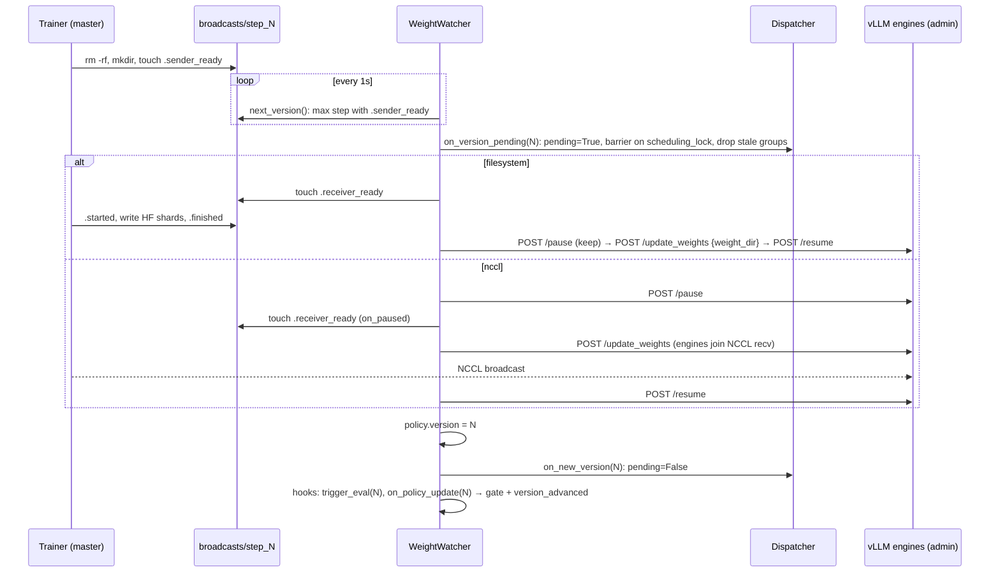
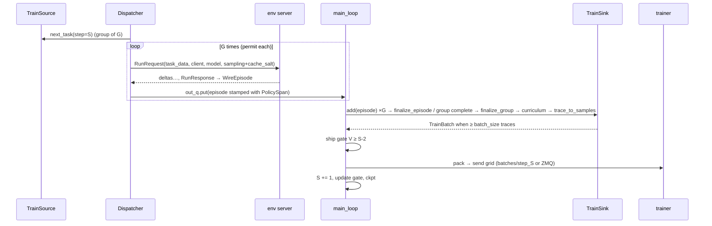

# Orchestrator — prime-rl @ b944873

> Scope: the RL orchestrator process — rollout scheduling, env-server call site, inference client/admin plane, weight-version tracking and off-policy control, episode → `TrainingSample` → micro-batch compilation, batch shipping, online eval, orchestrator checkpoint/resume, metrics.
> Files read in full (LOC): `src/prime_rl/orchestrator/` — `orchestrator.py` (1077), `dispatcher.py` (867), `clients.py` (556), `metrics.py` (546), `inference_metrics.py` (458), `train_sink.py` (421), `concurrency.py` (338), `envs.py` (273), `trajectories.py` (180), `types.py` (172), `watcher.py` (139), `utils.py` (116), `patches.py` (115), `eval_source.py` (110), `train_source.py` (85), `eval_sink.py` (84), `ckpt.py` (77), `live.py` (68), `periodic_logger.py` (56), `generation_source.py` (49), `annotations.py` (49), `packing.py` (35); `algo/__init__.py` (82), `algo/base.py` (80), `algo/routing.py` (85), `algo/grpo.py` (46), `curriculum/__init__.py` (14), `curriculum/base.py` (91) (interface only); `src/prime_rl/entrypoints/orchestrator.py` (28), `entrypoints/env_server.py` (65); `packages/prime-rl-configs/src/prime_rl/configs/orchestrator.py` (803), `configs/shared.py` (255); `src/prime_rl/utils/async_utils.py` (70), `utils/heartbeat.py` (53); `src/prime_rl/transports/batch/{__init__,base,filesystem,zmq,types}.py` (56/55/62/141/125); `transports/weights/{__init__,base,filesystem,nccl}.py` (51/169/75/213, receiver side); `src/prime_rl/eval/online.py` (223), `eval/runner.py` (345); `deps/verifiers/verifiers/v1/serve/{client,types}.py` (239/63), `deps/verifiers/verifiers/v1/episode.py` (169). Partial reads (cited ranges only): `trainer/batch.py` (148–252, 370–500, 675–913), `utils/pathing.py` (146–425), `utils/utils.py` (1–90), `entrypoints/rl.py` (230–400), `configs/rl.py` (396–457, 680–720, 835–855), `transports/weights/nixl/nixl.py` (450–502), `trainer/ckpt.py` (285–324); located by grep only (claims marked for D/C confirmation): `trainer/rl/train.py` broadcast/step lines, `trainer/rl/data.py:193`. Tests read: `tests/unit/orchestrator/test_clients.py`, `test_batch.py`, `test_metrics.py`. Docs cross-checked: `docs/algorithms.md` (Async/Off-Policy, Multi-Turn), `docs/inference.md` (Overview, Router, Adaptive Concurrency).
> Related docs: 01-deployment-topology-and-launch.md (A: launcher, env-server spawn, resume logic), 02-config-system.md (A), 04-algorithms-loss-data-path.md (C: algorithms, curricula, S9, packing consumer), 05-trainer.md (D: trainer ckpt + broadcast export), 06-inference-and-transports.md (E: server routes, weight transports, batch wire), 07-verifiers-core.md (F), 08-harnesses-runtimes-serve.md (G: env-server protocol/pools), 10-envs-and-tasks.md (I: taskset loading), 11-observability-eval-ops.md (J: monitors, standalone eval).

---

## 1. Mental model

The orchestrator is the **single asyncio process that turns "tasks" into "trainer micro-batches"**. It never runs a model and never runs an environment itself. It (a) owns the tasksets and samples tasks, (b) sends each task to an **env server** (a separate process that runs the harness/agent and calls the inference router), (c) receives finished `vf.WireEpisode`s back, (d) scores them via a per-env `Algorithm` (advantages), filters them via a per-env `Curriculum`, compiles admitted traces into `TrainingSample`s, packs those into per-DP-rank `MicroBatch` grids and ships them to the trainer, and (e) tracks which policy version the inference engines are serving, driving each weight update on the engines when the trainer offers a new version.

Think of it as a **pipeline of single-purpose components wired by one `Orchestrator` object** (`orchestrator.py:1-18`): `TrainSource`/`EvalSource` (what to run) → `Dispatcher` (when/how many, one asyncio task per episode) → `out_q` → `Orchestrator.main_loop` → `TrainSink`/`EvalSink` (grouping, scoring, admission, batch cut) → `BatchPacker` + `BatchSender` (ship). Orthogonally, `WeightWatcher` advances a shared mutable `Policy` object and notifies observers; `ConcurrencyController` + `InferenceMetricsCollector` adapt the in-flight cap from vLLM `/metrics`; `PeriodicLogger` samples gauges.

The async/off-policy design is **"bounded lag, tagged provenance, drop what's too stale"**: dispatch is paused when the collecting batch runs more than `TARGET_LAG = 1` batches ahead of the applied policy (`orchestrator.py:92-95`, `976-1000`); every episode is stamped with a `PolicySpan(start, end)` of the live-policy versions it spanned (`dispatcher.py:721`); nothing older than `max_off_policy_steps` (default 8) ships, enforced by a queue sweep in the sink (`train_sink.py:180-219`) and an early in-flight cancel in the dispatcher (`dispatcher.py:399-437`). In-flight rollouts are **not interrupted** by a weight update — they keep generating across it (the engines are frozen with `pause(mode="keep")` and resumed, so a single completion can straddle the swap) and their span records the drift. Group members and later turns keep the group-open `cache_salt`, so they can reuse KV computed under the old weights (§7.1).

---

## 2. Where it runs

**Process.** One OS process, `Orchestrator` title (`orchestrator.py:1069`). CPU-only (it loads a tokenizer and an HF `AutoConfig`, no weights). Entry points: console script `orchestrator = prime_rl.entrypoints.orchestrator:main` (`pyproject.toml:45`) → `entrypoints/orchestrator.py:19-24` (parses `OrchestratorConfig` via `cli`, then `asyncio.run(run_orchestrator(config))`), or `python -m prime_rl.orchestrator.orchestrator` → `orchestrator.py:1065-1073`, which additionally **installs uvloop** (the console-script path does not).

**Who launches it.** The `rl` launcher spawns `orchestrator @ <config_dir>/<ORCHESTRATOR_CONFIG>` with `Popen`, logs to `<log_dir>/orchestrator.log`, env = `os.environ ∪ DEFAULT_COMMON_ENV_VARS ∪ config.env_vars ∪ orchestrator.env_vars ∪ wandb-shared vars` (`entrypoints/rl.py:294-313`). It spawns **one env server per (split, source)** before the orchestrator (`rl.py:262-281`), and the trainer via `torchrun` after (`rl.py:330-367`). A monitor thread per child pushes failures into `error_queue`; any child failure tears everything down (`rl.py:383-399`). Placement across nodes/SLURM/k8s: see 01 (A).

```
            ┌──────────────── rl launcher (python) ─────────────────┐
            │ Popen: inference router+vLLM  | env-server × N | orch  | torchrun trainer
            └───────────────────────────────────────────────────────┘
   env-server (per source) <──ZMQ DEALER/ROUTER── Orchestrator ──HTTP admin──> each vLLM engine
      │ runs harness/agent                          │   (/pause,/update_weights,/resume,
      └──HTTP data plane (router)──> vLLM           │    /init_broadcaster,/load_lora_adapter,
                                                    │    /health,/v1/models,/metrics)
                                     batches/step_N/rank_R.bin  or  ZMQ PUB :5555 (+READY PULL :5556)
                                                    ▼
                                                 trainer ranks ──broadcasts/step_N/.sender_ready…──> Orchestrator (WeightWatcher)
```

**Lifecycle.**
- *Start*: `run_orchestrator` (`orchestrator.py:1057-1062`, `@clean_exit` → wandb finish + `sys.exit(1)` on exception, `utils/utils.py:46-68`) → `Orchestrator(config).start()` → `setup()` (§3.2) → spawn background tasks → `main_loop()` inline.
- *Steady*: dispatcher task schedules episodes; main loop consumes `out_q`, ships batches; watcher applies weight versions.
- *Normal end* (`max_steps` set): after shipping batch `max_steps`, wait for inference to apply `v{max_steps}` (`orchestrator.py:754-755`), `start_draining` (cancel in-flight train, keep eval) (`764-773`), exit main loop when `draining and dispatcher.is_idle` (`505-508`), `wait_for_final_broadcast` (`487-493`), final checkpoint (`438-441`), stop loggers, `monitors.finalize()` (clean exit only, `442-452`), `stop()` with a 300 s global budget, else `os._exit(0)` (`1007-1054`, `SHUTDOWN_TIMEOUT_S = 300` at `90`).
- *Crash*: any exception in `main_loop`, or a dispatcher/watcher task that ends/raises (`_raise_if_component_stopped`, `561-571`, polled every loop iteration and on each 0.5 s `out_q` timeout), propagates; teardown still runs, finalize is skipped ("a crashed run must not be marked completed", `450-452`); process exits 1; the launcher kills the run. **Exception:** `stop()` also runs in that `finally`, and if teardown exceeds `SHUTDOWN_TIMEOUT_S` (300 s) it calls `os._exit(0)` (`orchestrator.py:1046-1052`). A crashed orchestrator whose teardown wedges therefore exits **0**, which the launcher counts as a finished orchestrator (multi-node writes `.orchestrator.done`, 01). **Blind spot:** health is *not* polled while the main loop sits in the ship-gate hold (`620-624`: bare `version_advanced.wait()`, no timeout). A watcher that dies during a hold leaves the orchestrator hung. The run only ends when the trainer's handshake times out (`weight_broadcast.timeout`, 1200 s, `transports/weights/base.py:75-92`).
- *Signals*: there is no SIGTERM handler, so a launcher SIGTERM kills the process without teardown or the final checkpoint. SIGINT goes through `asyncio.run` → `CancelledError` → the `finally` teardown (incl. checkpoint).
- `max_steps = None` → runs forever; `wait_for_final_broadcast` is a no-op (`491-492`).

---

## 3. Mechanics

### 3.1 Object graph (who holds what)

```
Orchestrator
 ├─ progress: Progress(step=1, total_tokens, total_samples, total_problems)   types.py:26-33
 ├─ policy:   Policy(version=0, model_name)  ← shared by reference with Dispatcher & Watcher  types.py:17-23
 ├─ clients:  InferenceClient(model.client, train_client_type="renderer", eval_client_type="openai_chat_completions")  orchestrator.py:199-205
 ├─ admin_plane: AdminPlane | DynamoAdminPlane                              clients.py:239-245
 ├─ train_envs: TrainEnvs{name → TrainEnv(EnvClient, GenerationSource, Algorithm)}   envs.py:235-260
 ├─ eval_envs:  EvalEnvs{name → EvalEnv(EnvClient, examples)}                envs.py:263-273
 ├─ train_source: TrainSource(curricula per env, rng=Random(42))            train_source.py:17-36
 ├─ eval_source:  EvalSource(queue of TaskRequest)                          eval_source.py:21-50
 ├─ dispatcher:   Dispatcher(out_q, inflight, groups, dispatch_allowed Event, scheduling_lock)  dispatcher.py:123-211
 ├─ concurrency:  ConcurrencyController  ⇄ bound to dispatcher.set_limit/cancel_inflight  orchestrator.py:335,352-356
 ├─ inference_metrics: InferenceMetricsCollector(admin clients, on_load=concurrency.observe)  orchestrator.py:359-368
 ├─ train_sink:   TrainSink(on_result=train_source.on_result)               orchestrator.py:369-377
 ├─ eval_sink:    EvalSink                                                   orchestrator.py:379
 ├─ receiver:     WeightReceiver (filesystem | nccl | nixl)                  orchestrator.py:304-310
 ├─ watcher:      WeightWatcher(receiver, policy, observers=[dispatcher]) + hooks [trigger_eval, on_policy_update]  orchestrator.py:380-388
 ├─ packer:       BatchPacker ;  sender: FileSystemBatchSender | ZMQBatchSender   orchestrator.py:262-266
 ├─ ckpt_manager: CheckpointManager (always exists)                          ckpt.py:74-77
 └─ periodic_logger, lag_monitor, heart (optional BetterStack Heartbeat)
```

Components never reference the orchestrator (`orchestrator.py:16-17`); coupling is via shared `Policy`/`Progress` objects, callbacks (`on_result`, `on_episode_complete`, `set_limit`, `on_overload`, `on_load`), the `VersionObserver` protocol (`types.py:163-172`) and the `dispatch_allowed` event the orchestrator toggles.

### 3.2 Startup sequence (`Orchestrator.setup`, `orchestrator.py:184-401`)

1. `set_default_executor()` — default thread pool = `ThreadPoolExecutor(64)` for all `asyncio.to_thread` (`utils.py:82-85`).
2. Tokenizer via `setup_tokenizer(config.tokenizer)` (`190-193`) — note: `TrainSink` stores it but never uses it (`train_sink.py:80`).
3. `InferenceClient` (data-plane client *configs*) + admin plane (`199-206`).
4. `monitors.setup(producer="orch", …)` (`208-217`); `run_id = $PRL_RUN_ID or uuid4().hex`, `run_name = $PRL_RUN_NAME` → sandbox base labels (`219-224`); optional `Heartbeat` (`226-227`).
5. Construct `TrainEnvs` (builds per-env `GenerationSource` and `Algorithm` via `build_algorithm`, `envs.py:250-260`) and `EvalEnvs` (`229-238`). No I/O yet.
6. Resolve `resume_step`: `resume.dir` → `dir_step` (the `step_N` suffix); else `resume.step`; else latest `checkpoints/step_*` — the max `step_N` dir name, no completeness check; none found ⇒ warning + fresh start (`240-246`, `pathing.py:301-311`). `progress.step = resume_step + 1` (`255-257`).
7. `BatchPacker(config)` (loads HF `AutoConfig` for FLOP-aware bin costs; falls back to token counts on failure, `packing.py:12-26`) and the batch sender at `current_step = progress.step` (`262-266`). **The ZMQ sender binds its PUB/PULL sockets here.**
8. `await train_envs.start()`, then eval envs (`270-279`): per env, wait for the launcher-published address file (≤ 600 s), open an `EnvClient` (ZMQ DEALER), poll `health` (≤ 600 s), `vf.load_taskset(...)` client-side; finite tasksets are materialized in a thread and optionally shuffled with seed 42 (`envs.py:95-119`, `ENV_SERVER_STARTUP_TIMEOUT = 600.0` at `42`, `TASKSET_SHUFFLE_SEED = 42` at `47`). Eval envs then freeze `examples = first num_examples tasks` (`envs.py:187-194`).
9. `TrainSource(train_envs)` builds one `Curriculum` per env over the tasks (`train_source.py:20-36`); if resuming, `ckpt_manager.load(progress, train_source, …)` and re-set `progress.step = resume_step + 1` (`281-286`).
10. `await admin_plane.wait_for_ready(model.name)` — every engine `/health` (and the router's, if `admin_base_url` is set), then `/v1/models` must list the model (`288-291`, `clients.py:154-163`).
11. `gather(env.generation_source.setup(), env.algorithm.setup())` — connect frozen generation endpoints / frozen teachers and wait for their readiness (`294-297`, `generation_source.py:32-37`, `algo/base.py:18-32`).
12. `setup_weight_receiver(...)` + `receiver.initialize()` (NCCL: `POST /init_broadcaster` to each engine; NIXL: `init_nixl_broadcast` + ModelExpress publish; filesystem: no-op) (`299-311`).
13. Build `EvalSource`, `ConcurrencyController`, `Dispatcher`, bind controller hooks, start `InferenceMetricsCollector` and do one awaited `probe()` (return value **ignored**) (`322-368`), `TrainSink`, `EvalSink`, `WeightWatcher` with hooks (`369-388`), `EventLoopLagMonitor`, `PeriodicLogger` (`391-396`).
14. `await watcher.sync_startup(sync_version, timeout)` — rendezvous with the trainer's **startup broadcast** `v{resume_step or 0}`; timeout `ckpt.wait_for_weights_timeout` or `STARTUP_WEIGHT_WAIT_TIMEOUT_S = 1200` (`317-320`, `398-401`, `100`). The timeout wraps only `wait_published` (`.sender_ready`); the `receive` after it is unbounded (`transports/weights/base.py:166-169`), so a filesystem `.finished` wait at startup can hang. Under NCCL the trainer is meanwhile blocked in `setup_weight_sender` (`trainer/rl/train.py:185`) until step 12's `/init_broadcaster`, a wait bounded by `weight_broadcast.timeout` (1200 s); slow steps 8–11 (big tasksets, slow env servers, frozen pools) can expire it (12, F1). This fires the update hooks once: `trigger_eval(sync_version)` (startup eval unless `skip_first_step`/resumed) and `on_policy_update` (opens the dispatch gate).

Then `start()` (`403-420`) spawns: `event_loop_lag` task, the periodic logger task, `dispatcher.start()` task, `watcher.start()` task, and runs `main_loop()` in the current task.

### 3.3 Asyncio / thread architecture

Everything runs on **one event loop**. Long-lived tasks:

| Task | Created at | Loop body | Blocks on |
|---|---|---|---|
| main (orchestrator) | `start()` inline | `main_loop`: `wait_for(out_q.get(), 0.5)` → route to sinks → maybe `finalize_train_batch` | `out_q`; `version_advanced` (ship gate hold); `sender.send`; `to_thread(pack)` |
| `dispatcher` | `orchestrator.py:418` | `fill_inflight()`; if nothing in flight sleep ≤0.1 s; else `asyncio.wait(inflight, FIRST_COMPLETED, timeout=0.5)` → `handle_completed_request` (`dispatcher.py:324-348`) | `out_q.put` (bounded); `scheduling_lock`; rate limiter |
| per-episode tasks | `dispatcher.py:612` | `run_episode()` → `env.run(...)` → `EnvClient.run` → one ZMQ request; `finally` releases router sessions (`593-610`) | env server reply (no timeout) |
| dispatcher `live_task` | `dispatcher.py:327` | every 0.5 s `monitors.log_live(events)` (`393-397`) | monitors |
| `watcher` | `orchestrator.py:419` | every 1 s: `receiver.next_version(ckpt_step)`; if newer → `apply_policy_update` (`watcher.py:56-65`) | filesystem markers (FS `.finished` wait untimed); admin HTTP; `update_lock`; `scheduling_lock` **and `out_q.put`** (via `on_version_pending` → `drop_group`) |
| inference metrics poll | `inference_metrics.py:296-305` | every 5 s scrape `/metrics` (+ `/v1/models` once) on each admin URL → `concurrency.observe` → `monitors.log(step=None)` | HTTP (5 s timeout each) |
| `Pipeline_periodic_logger` | `periodic_logger.py:30-31` | every `log.interval` (10 s) `collect_pipeline_view()` → console + `monitors.log(step=None)` | monitors |
| `event_loop_lag` | `orchestrator.py:415` | 0.1 s sleeps measuring oversleep into a 1000-deque (`async_utils.py:25-42`) | — |
| per-`EnvClient` receiver | `serve/client.py:62-91` | `recv_multipart` → route `delta` frames / resolve futures | ZMQ |

Threads: the 64-worker default executor (`trace_to_samples`, `packer.pack`, filesystem-sender encode/write, taskset materialization, NIXL waits); `WireEpisode.model_validate` runs in a thread but is **serialized to one at a time per `EnvClient`** by `BoundedSemaphore(1)` (`serve/client.py:60,137-152`); `Heartbeat.beat()` spawns a daemon thread per beat (`heartbeat.py:39-53`).

**Queues / synchronization primitives.**
- `Dispatcher.out_q: asyncio.Queue[DispatchResult]`, `maxsize = max(8, concurrency.max_inflight)` when a ceiling is configured (default 1024), else unbounded (`dispatcher.py:193-194`). Producers: dispatcher task (completions), `drop_group` (watcher via `on_version_pending`; overload task; `EvalRunner` `cancel_eval_step`). Sole consumer: `main_loop`. Permits are released *before* the `put` (`638`), so queued + in-flight can exceed `maxsize`. Items: `vf.WireEpisode` | `DispatchFailure` | `GroupCancellation` (`types.py:71-74`). Every dispatched attempt reaches `out_q` exactly once in one of these forms (`dispatcher.py:9-12`) — except on drain/shutdown cancellations (§3.4.6).
- `Dispatcher.dispatch_allowed: asyncio.Event` — orchestrator-owned train gate (`dispatcher.py:202-206`).
- `Dispatcher.scheduling_lock: asyncio.Lock` + `policy_update_pending: bool` — the weight-swap barrier (`207-208`, `399-441`).
- `WeightWatcher.update_lock` — serializes applies and makes `stop()` wait for an in-flight apply (`watcher.py:40`, `67-77`).
- `Orchestrator.version_advanced: asyncio.Event` — pulsed by `on_policy_update` so held work re-checks (`162`, `1002-1005`).

**Backpressure chain.** Slow sink/ship → main loop not draining `out_q` → `out_q.put` blocks inside `handle_completed_request`/`emit_episode` → dispatcher loop stops scheduling (it's the same coroutine) while already-running episode tasks continue to completion. Trainer slow → policy version lags → dispatch gate closes (no new train episodes) and, if batches still fill from buffered/in-flight work, the **ship gate** holds the main loop inside `finalize_train_batch` (`613-625`), which in turn stops `out_q` draining. Inference overloaded → controller lowers the cap (and may cancel) (§3.7). Env slow → nothing but the per-episode tasks waiting; no orchestrator-side rollout timeout.

### 3.4 The Dispatcher (`dispatcher.py`)

#### 3.4.1 Permits, cap, burst smoothing, rate limit
- One **permit = one episode = one `run` request** to an env server; shared by train and eval (`dispatcher.py:3-7`). `available_permits = max_inflight - current_inflight` (`230-232`).
- `max_inflight` is the controller's dynamic cap, moved via `set_limit` (lowering it sheds nothing by itself, `234-238`).
- **Admission burst cap**: the pool may only *grow* by `burst_cap = max(min_burst, max_inflight // 10)` per 5 s window, where `min_burst = max(group_size over train envs)` (or 8 with no train envs) (`177-180`, `269-276`). Natural completions refund one admission (`release(refund_admission=True)`, `624-630`, `638`); cancellations do not.
- Optional `AsyncLimiter(tasks_per_minute, 60)` awaited in `acquire()` (`168-170`, `617-622`) — note this await happens while holding `scheduling_lock`.

#### 3.4.2 Modes and the fill loop
`fill_inflight()` (`443-476`) loops until something blocks it:
1. Return if `policy_update_pending` (weight swap in progress) or no permits / no burst budget.
2. Under `scheduling_lock`: re-check pending; if mode `PREFER_EVAL`: if `eval_has_work` is false flip to `PREFER_TRAIN` and continue; else `try_schedule("eval")` — **eval ignores the dispatch gate**. If mode `PREFER_TRAIN`: return if `dispatch_allowed` is clear; else `try_schedule("train")`.
3. `try_schedule` returns False when nothing could be scheduled → return.

Note PREFER_TRAIN never schedules eval; eval only runs when the orchestrator flips to `PREFER_EVAL` (`trigger_eval`, `orchestrator.py:788`), and the in-flight eval tail drains after flipping back (`dispatcher.py:13-16`).

#### 3.4.3 Groups
`try_schedule(kind)` (`485-506`) first **continues any existing group of that kind with `episodes_to_schedule > 0`** (prefix-cache locality: a task's `group_size` episodes go back-to-back; oldest open group first). This happens only once `fill_inflight` gets past the dispatch gate, so a closed gate also parks the *remaining members* of open train groups. Otherwise it opens a fresh group from the source: `TrainSource.next_task(step=progress.step)` or `EvalSource.next_task()` (`508-534`). `GroupState` (`types.py:116-129`) pins `kind, env_name, task, step, episodes_to_schedule = target_episodes = request.rollouts or env.config.group_size, policy_version_at_start = policy.version (at open), group_id`.

So a "group" = `group_size` independent `env.run` calls for the same task; an episode may itself contain several traces (multi-agent), each trace may have several branches (§3.11).

#### 3.4.4 Scheduling one episode (`schedule_group_episode`, `536-615`)
- Client choice: eval → `policy_clients.eval_client` (chat-completions `EvalClientConfig`) with `policy.model_name`; train → `generation_source.clients.train_client` (renderer / token-in-out `TrainClientConfig`), model = live policy name or the frozen endpoint's name (`213-220`, `547-553`).
- `cache_salt = str(group.policy_version_at_start)` for live-policy work, `None` for frozen (`559-565`); forwarded as `sampling.extra_body.cache_salt` (`envs.py:121-125`).
- `episodes_to_schedule -= 1`, `acquire()`, `admissions_in_window += 1`, build `InflightEpisode(kind, env_name, group_id, task, policy_version=group.policy_version_at_start, step=group.step, client_config, started_at=monotonic())` (`567-579`).
- Launch `run_episode()` task: `env.run(client, model_name, cache_salt, task_data=task.data.model_dump(mode="json"), on_delta)`; `on_delta` folds env-server stream deltas into live bookkeeping and queues live events (`583-591`, `live.py:44-56`); `finally` → `clients.finish_sessions(sorted(session_ids))` shielded from cancellation (`604-610`), where session ids are the trace ids seen (`584`, `602`).

#### 3.4.5 Completion (`handle_completed_request`, `632-693`)
- Pop meta (None ⇒ already claimed by a drop/cancel → ignore), `retire`, `release(refund_admission=True)`.
- Task raised → `DispatchFailure(kind, env_name, group_id, step, policy_version, task_type, task_key, task_hash, error=vf.Error(...))` to `out_q` (`645-666`); `CancelledError` → silently return.
- Episode post-validation: no traces + ok → mark `EmptyEpisode` error; any clean trace with `num_turns == 0` → `EmptyTrajectory` error, trace and episode marked not ok (`668-679`). Metrics counters for errors.
- `on_episode_complete(env, kind, tokens, duration)` → controller growth clock (`689-692`).
- `emit_episode` (`705-729`): validate `(task.key, task.hash)` provenance matches the dispatched task (`116-120`); advance group accounting (group removed once `emitted >= target`, `695-703`); stamp `episode.env.name`, `episode.group = GroupInfo(id)`, and `episode.run = TrainRunInfo(id=run_id, name=run_name, work=TrainWorkInfo|EvalWorkInfo(step=group.step, policy=PolicySpan(start=group.policy_version_at_start, end=policy.version)))` — `policy=None` for frozen-sourced train work; `put` on `out_q`.

#### 3.4.6 Cancellation paths
| Path | Trigger | Scope | Emits to `out_q` |
|---|---|---|---|
| `drop_group(gid, reason)` | stale / overload / superseded | all in-flight + never-dispatched members of one group; permits released synchronously, then tasks cancelled (`731-779`) | one `GroupCancellation(count = inflight + unscheduled, reason)` |
| stale | `on_version_pending` (watcher, before engine pause): live-policy train groups with `policy_version_at_start < (progress.step-1) - max_off_policy_steps` (`399-437`) | train only | via `drop_group(reason="stale")` |
| overload | controller `on_overload(n)` → `cancel_inflight(n)`: youngest train groups first by oldest-member start time, until ≥ n live episodes shed (`240-267`) | train only | via `drop_group(reason="overload")` |
| superseded | `cancel_eval_step(step)` — only called by `EvalRunner` (standalone/SFT eval, `eval/runner.py:209-219`) (`817-853`) | eval | `GroupCancellation(kind="eval", reason="superseded")` |
| drain | `cancel_inflight_train_episodes()` at `max_steps` (`794-815`) | in-flight train; groups forgotten | **nothing** |
| shutdown | `cancel_inflight_episodes()` in `stop()` (`781-792`) | everything | nothing |

Cancelling an episode task makes `EnvClient._request` fire a best-effort `cancel` request to the env server (`serve/client.py:118-129`), so the server aborts the rollout.

### 3.5 Env-server call site (S3, orchestrator side)

G owns the protocol and pools; I owns taskset/env resolution. What the orchestrator does:

- **Addressing.** `OrchestratorConfig.env_addresses[(split, resolved_name)] = source.serve.address` (None = launcher-managed) (`configs/orchestrator.py:797-803`). For None, the orchestrator polls `<config_dir>/envs/<split>/<name>.address` (every 0.5 s, ≤ 600 s) which the spawned server writes atomically once bound (`envs.py:50-62`, `pathing.py:222-227`, `entrypoints/env_server.py:24-31`). Default server bind is `tcp://127.0.0.1:0` (`env_server.py:46`). `config_dir` = `$PRL_ATTEMPT_CONFIG_DIR`, else legacy `<output_dir>/configs/resolved` if it is a dir and `configs/latest` is absent, else `<output_dir>/configs/latest/resolved` (`pathing.py:158-169`).
- **One `EnvClient` per env** (DEALER socket, HWM 0 = unbounded, `serve/client.py:44-60`); all of that env's episodes multiplex over it. The server-side broker→worker hop keeps ZMQ's default HWM of 1000 per worker, and a send to a dead worker past that blocks the whole broker (08 §7). The server's worker pool (sized by `serve.pool`, `serve.max_concurrent`, `env_server.py:42-51`) provides parallelism.
- **Request.** `RunRequest(task_data: dict, client: vf.ClientConfig, model: str, sampling: vf.SamplingConfig)` — the *client config* (base URL, api-key var, headers, renderer config for train) is shipped to the server, which builds its own HTTP client and talks to the inference router directly (`serve/types.py:42-50`, `envs.py:127-145`). The server is stateless about data: the orchestrator ships the full `task.data` each time (`envs.py:1-17`).
- **Streaming.** Frames `[request_id, kind, data]`; `kind == b"delta"` frames stream per turn/phase and are assembled client-side (`EpisodeAssembly`) and relayed to `on_delta` (`serve/client.py:80-86`, `200-206`); final reply `RunResponse(head, traces: list[TraceSummary])` → `WireEpisode.model_validate` in a thread.
- **Result shape.** `vf.WireEpisode = Episode[WireTaskData, State, WireAgentConfig]` with `id, env: EnvInfo(id,name), task: TraceTask, group, run, ok, errors, traces: list[Trace]` (`deps/verifiers/verifiers/v1/episode.py:87-166`). The orchestrator stamps `env.name`, `group`, `run` (§3.4.5).
- **Post-processing in `Env.run`.** If `episode.ok` is False, every still-ok trace gets the episode error appended and `ok=False` — "partial episodes never train" (`envs.py:146-153`).
- **No timeout.** Rollouts run untimed on the client (`serve/client.py:100-102`); rollout time limits live in the harness/env (F/G). Env-server death is caught by the launcher's monitor thread, not by the orchestrator.

### 3.6 Inference clients (S2, client side)

**Data plane.** The orchestrator itself sends almost no inference traffic; it hands `vf.ClientConfig`s to env servers. `setup_client` builds `TrainClientConfig(base_url, api_key_var, headers, renderer=renderer_config, renderer_model_name)` for `client_type="renderer"`, else `EvalClientConfig(base_url, api_key_var, headers)` (`clients.py:259-280`). Headers = static `headers` ∪ `headers_from_env` resolved from env vars ∪ auto `X-Prime-Team-ID` for Prime Inference URLs (`33-46`). **Load balancing across replicas is entirely the router's job** (single `base_url`; `configs/shared.py:177-178`; routing policies in `docs/inference.md:192-198`).

Two direct data-plane uses:
- `InferenceClient.score(token_ids)` → `PrefillScorer` → `POST {root}/inference/v1/generate` with `{"model", "token_ids", "sampling_params": {"max_tokens":1,"temperature":1.0,"top_p":1.0,"prompt_logprobs":1}}`, flattened to one logprob per token (0.0 for token 0) (`clients.py:49-71`, `103-106`, `523-556`). Used by algorithms needing reference logprobs (C).
- `InferenceClient.finish_sessions(ids)` → `POST {router_root}/finish_session?session_id=<id>` (5 s, retried, errors logged at debug) — only when `admin_base_url` is set (i.e. a router fronts the engines) (`94-100`, `113-129`). Releases sticky-routing sessions (`docs/inference.md:194`): the env server's interception sends `X-Session-ID = trace.id` (`deps/verifiers/verifiers/v1/interception/server.py:789,798`; header name `clients/client.py:16`), and the dispatcher collects exactly those trace ids from deltas and the final episode (`dispatcher.py:584,602`).

**Admin plane** (`AdminPlane`, `clients.py:132-236`): one `httpx.AsyncClient` per URL in `admin_base_url` (else `[base_url]`), `/v1` suffix stripped, `max_connections=4`, `timeout=None`, `Authorization: Bearer <key>` if the key var is set (`283-308`). **Order is load-bearing**: it must match GPU rank order for NCCL/NIXL rank offsets and the metrics-role list (`137-140`). `setup_admin_plane` swaps in `DynamoAdminPlane` when `client.dynamo.enabled` (`239-245`; E).

| Op | Route / payload | Timeout & retry |
|---|---|---|
| readiness | `GET /health` every 1 s until 2xx; 404 ⇒ "no route", treated as ready; then `GET /v1/models` must contain `model_name` unless `skip_model_check` (`311-367`) | total `wait_for_ready_timeout` (3600 s) |
| NCCL init | `POST /init_broadcaster {host, port, rank_offset = i * (inference_world_size // n_engines), inference_world_size, timeout}` (`165-203`) | no retry, **no client timeout** (`timeout=None` client); `HTTPStatusError` is caught: 404 logs a warning, **any other status is swallowed silently**; transport errors (refused/reset) propagate |
| NIXL init | same route + `session_id` via `_admin_post` (`491-520`) | retried |
| weight update | `POST /pause?mode=keep&clear_cache=false` (all engines) → `on_paused()` → `POST /update_weights {"weight_dir": <posix or null>}` (all) → `finally POST /resume` (`205-232`, `415-433`) | `_admin_post`: retry 5xx/timeouts/transport errors (not 4xx), exp backoff 1–10 s, stop at 2×timeout or 10 attempts; per-attempt read timeout `ADMIN_TIMEOUT_S = 300` (pause/resume; ≤ 600 s total), `UPDATE_WEIGHTS_TIMEOUT_S = 720` (≤ 1440 s total ⇒ at most 2 attempts that time out) (`370-412`). Each engine retries independently inside one `gather`. `/resume` always runs (`finally`). The trainer's `weight_broadcast.timeout` (1200 s, `shared.py:40-43`) bounds only its wait for the ack, not the transfer. A read-timeout retry of `/update_weights` queues behind the still-running collective on the engine, then waits for a broadcast that never comes, until the 1440 s budget kills the orchestrator. Unsafe for NCCL/NIXL; filesystem is safe (06 §3.6.1) |
| LoRA | `POST /load_lora_adapter {"lora_name": model_name, "lora_path"}` on every engine, **no pause** (`460-488`) | retry 404/500/transport, 30 s/attempt, 120 s total |
| metrics | `GET /metrics` (Prometheus text), `GET /v1/models` for `max_model_len` (`inference_metrics.py:323-374`) | 5 s, errors swallowed |

Frozen models (a generation source or teacher that is an external endpoint) get their own `InferenceClient` via `connect_frozen_client` and a one-shot `check_inference_ready` with transient admin clients (`algo/base.py:18-32`, `clients.py:248-256`). Frozen generation uses the renderer client too (it must return tokens) (`generation_source.py:16-37`), and drops `logprobs` from sampling args (`43-49`).

### 3.7 Adaptive concurrency (`concurrency.py` + `inference_metrics.py`)

The controller is a pure state machine; the collector pushes `observe(samples)` every 5 s; the dispatcher pushes `record_episode(...)` per completion; the controller pulls `get_inflight()` and pushes `set_limit(n)` / `on_overload(excess)` (`concurrency.py:1-28`, `148-162`).

- **Samples** (`EngineLoadSample`, `concurrency.py:98-113`): per engine: `kv_capacity_tokens` (from `vllm:cache_config_info` label `kv_cache_size_tokens`, else `num_gpu_blocks*block_size`), `max_model_len` (from `/v1/models`), `kv_usage = kv_cache_usage_perc`, `running`, `waiting`, `waiting_capacity` (`num_requests_waiting_by_reason{reason="capacity"}`), `preemptions_delta` (counter delta, 0 on first poll) (`inference_metrics.py:376-413`). `prefill`-role engines are excluded from overload signals (`concurrency.py:199-203`).
- **Initial cap**: `initial_inflight` if set, else `min_inflight` until the first capacity observation, then `Σ kv_capacity / max(engine max_model_len or seq_len)` clamped to `[min_inflight, max_inflight]` (`123-126`, `255-265`).
- **Grow** (per completion): if last poll was `clear` with zero queued and not draining (gate valid 15 s, `GROWTH_GATE_TTL_S`), and `inflight+1 ≥ 0.9·cap`, then $\text{cap} \leftarrow \text{cap}\cdot m^{1/\text{inflight}}$ with $m = 1 + 0.2\,\max(0, 1 - u_{\max}/0.8)$ — i.e. ×≤1.2 per full pool turnover, tapering with KV usage $u_{\max}$ (`166-187`, `251-253`, constants `42-89`). Zero-token completions (errors) never grow the cap.
- **Trim**: $u_{\max} > 0.8$ and cooldown elapsed (6 polls) → target $\lfloor \text{inflight}\cdot 0.7/u_{\max}\rfloor$; above 0.9 also cancel the excess (hard trim) (`284-293`).
- **Cut**: any preemption, or capacity-queue $>0.5\times$ running for 6 consecutive polls → target 0.8×inflight (preemption) / 0.9×inflight (queue), or 0.5× if escalated; cancel excess; freeze further cuts until inflight ≤ cap and engines settled; escalation persists for a 6-poll grace window (`233-282`).
- `resize_down` never raises the cap (`297-305`). The RL orchestrator binds `on_overload = dispatcher.cancel_inflight` (train-only); `EvalRunner` binds none (evals are never cancelled on load, `eval/runner.py:133-138`).
- Gauges: `concurrency/{max_inflight,turnover,capacity,signal,growth_multiplier}` (`331-338`).

### 3.8 Weight updates and policy versioning

**Discovery is filesystem-marker based for every transport.** Directory `<output_dir>/broadcasts/step_N/` (`pathing.py:287-292`). Markers: `.sender_ready` (trainer offers vN), `.receiver_ready` (orchestrator ack), `.started`, `.finished` (`transports/weights/base.py:17-26`). `next_version(current)` = max step dir with `.sender_ready`, or `current` (`base.py:143-146`). The trainer blocks on `.receiver_ready` for every version (lockstep handshake, `base.py:53-93`), so at most one un-acked offer exists.

`WeightWatcher.start()` polls every `poll_interval = 1.0` s (`watcher.py:27`, `56-65`). `apply_policy_update(next_step)` under `update_lock` (`79-121`):
1. `wait_published(next_step)` (0.2 s polls on `.sender_ready`, `base.py:148-156`).
2. `ckpt_step = next_step` (published, not yet applied).
3. **`observer.on_version_pending(next_step)` for each observer, *before* pausing engines** — the dispatcher sets `policy_update_pending = True`, waits for `scheduling_lock` (barrier: no new dispatch can cross the swap), then drops stale train groups (`dispatcher.py:399-437`). Rationale: aborts must be processed while engines still step, else NIXL KV-transfer cleanup races crash the decode engine (`watcher.py:93-102`).
4. `receiver.receive(next_step)` — per transport (E owns details):
   - filesystem: ack → wait `.finished` (1 s polls) → `adapter_config.json` present ? `load_lora_adapter` (no pause) : `admin_plane.update_weights(weight_dir, transport="filesystem")` (`transports/weights/filesystem.py:61-75`).
   - nccl: `update_weights(step_dir, transport="nccl", on_paused=ack)` — pause engines, *then* ack so the trainer enters the collective only once engines sit in the receive RPC (`nccl.py:193-213`).
   - nixl: ack → (first time) discover trainer via ModelExpress → wait trainer "ready" notification → `update_weights(None, "nixl")` → notify "complete" (`nixl/nixl.py:477-502`).
5. `policy.version = next_step`; `_notify_update`: `observer.on_new_version` (dispatcher clears `policy_update_pending`), then hooks in registration order: `trigger_eval(step)` (if eval configured), `on_policy_update(step)` → `update_dispatch_gate()` + `version_advanced.set()` (`watcher.py:121-131`, `orchestrator.py:386-388`, `1002-1005`).

Observer exceptions are logged and swallowed; **hook exceptions and `receive` failures kill the watcher task**, which the main loop turns into a run failure (`watcher.py:103-110`, `124-131`; `orchestrator.py:561-571`) — except during a ship-gate hold (§2). An observer that *blocks* (not raises) blocks the whole update (§7.2).

**What is blocked during one update.** The watcher holds `update_lock` from `wait_published` through the hooks. `policy_update_pending` is set at step 3 and cleared at step 5. In between, `fill_inflight` returns at once (`dispatcher.py:450,456`), so **no new episode of either kind is dispatched**, eval included. The barrier therefore spans the whole `receive`:
- filesystem: the entire trainer HF export until `.finished` (`wait_for_path`, 1 s polls, **no timeout**, `pathing.py:414-425`);
- NIXL: waiting for the trainer's "ready" notification;
- NCCL: pause + collective.

Engines are paused only inside `update_weights`. Still running throughout: in-flight episode tasks, completion handling (`out_q.put`), `main_loop`, sinks, shipping (subject to the ship gate), metrics.



**How each sample's generating version is known.** Only through the episode's `run.work.policy: PolicySpan(start, end)` (`episode.py:31-61`): `start = group.policy_version_at_start` (policy version when the *group* opened — shared by all members, even members dispatched after a later update), `end = policy.version` at emission. Frozen-sourced train work has `policy=None`. **`TrainingSample`/`MicroBatch` carry no version** (`transports/batch/types.py:30-125`); staleness is enforced and measured entirely orchestrator-side.

**In-flight rollouts across an update:** continue (not interrupted, not re-tagged). The server's `/pause` always calls `pause_generation(mode="keep", clear_cache=False)`, whatever the query params (`inference/vllm/server.py:66-70`). In vLLM, `"keep"` = "freeze requests in queue; they resume on `resume_generation`", and `clear_cache=False` keeps the KV and prefix caches (`AsyncLLM.pause_generation` docstring; read in vLLM 0.24 — the pin is ≥0.29). So a request that is mid-decode at the swap resumes under the **new** weights on KV computed with the **old** ones. The orchestrator comments saying `/pause` "drains in-flight requests" (`clients.py:387-388`, `416`) are inaccurate. The episode's `end` records the drift; the `in_flight` staleness share measures it (`utils.py:48-61`).

### 3.9 Off-policy control (S9 orchestrator side; C owns the full accounting)

Notation: $S$ = `progress.step` (the batch being collected, 1-indexed; the trainer trains batch $S$ at trainer step $S$ starting from weights $\theta_{S-1}$); $V$ = `policy.version` applied at inference (0-indexed). Episode staleness at ship into batch $S$: $\Delta = (S-1) - \text{start}$ (`utils.py:48-61`).

1. **Dispatch gate** (`update_dispatch_gate`, `orchestrator.py:976-1000`): $\text{lead} = (S-1) - V$; gate open iff $\text{lead} \le$ `TARGET_LAG` $=1$, i.e. $V \ge S-2$. Re-evaluated right after each ship and on each applied policy. Closed gate stops *all* new train scheduling, including continuing an open group; eval ignores it. Since $V \le S-1$ always, a group **opens** with $(S-1)-\text{start} \in \{0,1\}$. That bound holds **only at group open**: `start` is pinned per group, and open groups are continued first. A member dispatched after $S$ advanced therefore starts at $\Delta \ge 2$. Example: open at $S=6, V=4$; batch 6 ships ($S=7$, gate closes); $v_5$ lands and the gate reopens; the remaining members dispatch with start 4, $\Delta=2$. Eval preemption (`PREFER_EVAL`) likewise parks half-dispatched train groups.
2. **Ship gate** (`finalize_train_batch`, `607-625`): batch $S$ ships only when $V \ge S-1-\text{TARGET\_LAG} = S-2$. It waits on `version_advanced` with **no timeout and no component-health check**; the time accrues into `time/wait_for_policy`. The hold condition is identical to the dispatch-gate-closed condition, so during a hold no train work is dispatched while eval still can be. Consequence: when $S$ ships, only batches $S-1$ (possibly training) and $S$ are beyond the applied version. The trainer thus has at most **2** unconsumed batches (TARGET_LAG + 1), which keeps ZMQ PUB (HWM 10) from ever dropping (`zmq.py:13-21`).
3. **Staleness bound** `max_off_policy_steps = 8` (`configs/orchestrator.py:603-604`): $\text{min\_fresh} = (S-1) - m$ (`utils.py:42-45`).
   - *Hard guarantee*: `TrainSink._drop_stale` voids queued traces whose `policy.start < min_fresh` — a full sweep once per new $S$ (at the next `_maybe_batch`) plus a scoped check for each newly inserted group; a no-op while `min_fresh <= 0` (`train_sink.py:180-219`, `313`). Voided episodes are marked `cancelled` and counted in `off_policy/dropped`.
   - *Compute saver*: `on_version_pending` drops live-policy train groups with `policy_version_at_start < min_fresh` (computed from the current $S$) (`dispatcher.py:421-431`). A `stale` `GroupCancellation` also voids the group's already-arrived episodes (`train_sink.py:251-262`).
   - Frozen-sourced and eval work never go stale.
   - `max_off_policy_steps` is `ge=0`. Any value $m < \text{TARGET\_LAG}=1$ (i.e. $m=0$) voids, on arrival, every rollout dispatched at lead 1: start $= S-2 <$ min_fresh $= S-1$. That burns inference on work that can never train.
4. **Metrics** (`orchestrator.py:691-706`): `off_policy/{mean,max}`, `off_policy/in_flight/{mean,max}` (updates during generation: $\min(\Delta, \text{end}-\text{start})$), `off_policy/in_queue/{mean,max}` (remainder: time buffered after completion), `off_policy/dropped`; live gauges `dispatcher/off_policy/{max,mean}` over in-flight live train episodes (`dispatcher.py:310-320`, `857-867`).

Worked timeline (balanced pipeline): ship batch 5 → $S=6$; if $V=4$, lead $=1$ → dispatch continues under $\pi_4$ ($\Delta=1$ for batch 6). When trainer finishes step 5 and broadcasts $v_5$, watcher applies it, $V=5$, new rollouts get $\Delta=0$ if they make batch 6. If instead batch 6 ships while $V=4$: $S=7$, lead $=2$ → gate closes until $v_5$ lands; batch 7 can't ship until $V\ge5$. This matches `docs/algorithms.md:164-175` ("inference at step $n$ samples with $\pi_{n-1}$") in the balanced steady state.

### 3.10 TrainSink: episodes → groups → admission → samples → batch (`train_sink.py`)

State: `pending_groups[gid]: list[Episode]`, `pending_group_failures[gid]`, `pending_group_cancellations[gid]`, `pending_batch: dict[trace_id, list[TrainingSample]]` (insertion-ordered; the "queue"), `episode_by_trace`, `pending_tokens`, window accumulators `pending_episodes: TrainEpisodes`, `pending_failures`, `pending_cancelled_attempts`, `pending_stale_attempts` (`87-106`).

1. `add(episode)` (`129-138`): `algorithm.finalize_episode(episode)` → `score_episode` if the episode has any clean trainable trace with sampled tokens (`algo/base.py:73-76`); append to its group; if complete → `process_group` → `_maybe_batch`.
2. `fail(DispatchFailure)` / `cancel(GroupCancellation)` count toward completion without being episodes (`140-161`).
3. **Group complete** iff `arrived + failed + cancelled.count >= env.config.group_size` (`163-167`). Groups therefore finalize with *fewer* real episodes when members error or are overload-cancelled.
4. `process_group` (`226-323`):
   - stale cancellation → void whole group (not shown to curriculum) and return;
   - `survivors` = clean (`not has_error`), `agent.trainable` traces with any sampled token (`algo/base.py:35-42`);
   - if any survivors → `algorithm.finalize_group(group)` → `score_group` (assigns per-token advantages onto verifier nodes, e.g. GRPO $A_i = r_i - \bar r$ over survivors, `algo/grpo.py:24-46`);
   - admission: `TrainSource.on_result(group)` → `Curriculum.on_result` (sampler observes, every gate must admit; runs **after** scoring so gates can read advantages) (`train_source.py:42-54`, `curriculum/base.py:50-66`);
   - rejected / no survivors → recorded in window as not admitted, contribute zero output;
   - else per survivor: `trace_to_samples` in a thread (§3.11), stamp `temperatures = [env temperature] * len`, enforce sampling masks when the env truncates (top-p/top-k) with policy sampling (`RuntimeError` otherwise), `stamp_loss_routing(sample, algorithm.action_loss_type)`; if `constant_trainer_batch_size` (default True) prune zero-advantage RL tokens now and drop samples with no live rl/ce/ref_kl weight (`34-59`, `294-297`);
   - insert into `pending_batch`, then scoped stale check (`304-323`).
5. `_maybe_batch` (`169-178`): full stale sweep (once per $S$), then ready iff `len(pending_batch) >= batch_size` (**counts traces, not samples**) or `pending_tokens >= token_batch_size`.
6. `process_batch` (`360-421`): FIFO — first `batch_size` traces, or traces until the token threshold is crossed; if `constant_trainer_batch_size` is False, zero-advantage pruning happens *after* selection (batch can shrink). Surplus traces stay queued for the next step (they accumulate `in_queue` staleness). Returns `TrainBatch(episodes = whole arrival window, cohort = shipped traces only, samples, failures, buffered_episode_ids, cancelled_attempts, stale_attempts)` (`types.py:132-145`); resets window accumulators only when samples were produced.

Consequences worth knowing: all-equal-reward GRPO groups get zero advantages and (with the default `constant_trainer_batch_size`) are filtered out entirely; a group's traces can straddle two batches; `ratio` weights the *choice of env per group*, not per rollout (`train_source.py:38-40`).

### 3.11 Trajectories → `TrainingSample` (`trajectories.py`)

A `vf.Trace` is a message graph; `trace.branches` are root→leaf paths, each already a flat token sequence with `token_ids`, `sampled_mask`, `logprobs`, per-token `advantages`, `reference_logprobs`, `routed_experts`, `sampling_mask`, `multi_modal_data`, `mm_token_type_ids` (`trajectories.py:1-14`; F owns `Trace`/`Branch`). Multi-turn merging ("best-effort interleaving" / extension property, `docs/algorithms.md:484-556`) happens in verifiers/renderers when building branches; the orchestrator just emits one sample per branch.

- `iter_trainable_branches` (`91-114`): skip `branch.trainable == False`; a sampled node shared by several branches (a fork) is trainable only in the first branch containing it (later branches keep it as masked context); drop branches with no trainable token.
- `trace_to_samples` (`136-180`) builds `TrainingSample(token_ids, mask, logprobs, temperatures=[] (filled by sink), env_name, ref_logprobs, mm_kwargs (per-image renderer items concatenated along dim 0 as `EncodedTensor`s), mm_token_type_ids, routed_experts (re-aligned to len), rl_weights/ce_weights/ref_kl_weights (per-node loss-weight streams, each shared node counted once; None if all zero), advantages=branch.advantages, sampling_mask (counts/ids re-aligned), trace_id, branch_index)`.
- Advantages are assigned by algorithms onto nodes in sampled-token order (`algo/routing.py:11-35`); `is_trainable(trace)` = any nonzero advantage (`63-65`); non-`rl` algorithms reroute action tokens to `ce`/`ref_kl` weights (`68-85`).

### 3.12 Packing and shipping (S6 producer; E owns the wire, C the consumer)

`finalize_train_batch` → `await asyncio.to_thread(packer.pack, batch.samples)` → `prepare_batch(rollouts, seq_len, num_train_workers, bin_cost, pad_to_multiple_of)` (`packing.py:28-35`, `trainer/batch.py:874-913`):
1. `prepare_sample` → one `MicroBatch` per sample; **truncates silently to `seq_len`** (multimodal cut at an image boundary); asserts per-token alignment; raises if RL tokens have no advantages (`trainer/batch.py:370-498`).
2. First-fit-decreasing packing into bins of ≤ `seq_len` tokens; with >1 worker, split heaviest bins until the count is a multiple of `num_train_workers` (`692-729`).
3. Pad each bin to `pad_to_multiple_of` (= trainer CP degree) (`747-796`).
4. Separate multimodal/text groups, pad each group's count to a multiple of workers with zero-loss dummies (`847-871`), balanced partition (Karmarkar–Karp + swap refinement; equal counts per rank) by FLOP-aware `bin_cost` (`148-249`, `732-744`).
Result: `list[list[MicroBatch]]`, outer index = DP rank, all inner lists equal length (asserted by both senders).

Senders (`setup_batch_sender(output_dir, num_train_workers, progress.step, rollout_transport)`, `transports/batch/__init__.py:21-29`):
- **filesystem**: msgpack-encode each rank's list → `<output_dir>/batches/step_<S>/rank_<R>.bin.tmp` → atomic rename to `rank_<R>.bin`, in a thread; `current_step += 1` (`filesystem.py:9-35`). The step directory index is the sender's own counter, initialized to `progress.step` at setup and advanced once per `send`.
- **zmq** (default in `OrchestratorConfig`): PUB bound on `tcp://{host}:{port}` (default `localhost:5555`, `SNDHWM=hwm=10`), READY PULL on `port+1`; first `send` blocks until all `num_train_workers` ranks pushed their rank id; each rank's payload goes as multipart `[b"data_rank|<R>|", msgpack]` (`zmq.py:11-80`). Here `_current_step` is **log-only** (`zmq.py:45,75,80,119,132-133`): both ends just take the next message, so ordering alone couples them. Trainer ranks send READY once, in the receiver constructor (`zmq.py:112`).
  Every trainer rank builds a receiver with `dp_rank = rank // (world/dp)` (`trainer/rl/data.py:189-193`), so CP/non-DP peers subscribe to the same topic and send the same id. The barrier dedups by id (a `set`, `zmq.py:52-61`), so with CP>1 it does not prove every peer subscribed. This is masked in practice: every rank builds its receiver (`trainer/rl/train.py:231`) before the startup broadcast (`:267-273`), and the orchestrator ships nothing until `sync_startup` has consumed that broadcast.
- **Both counters start at `progress.step`** — orchestrator `resume_step+1` (`orchestrator.py:264-266`), trainer loaded `progress.step+1` passed to `DataLoader` (`trainer/rl/train.py:217,231-236`, `data.py:193`). **Orchestrator-only restart is unsupported**, for three reasons. (a) `sync_startup` expects a fresh trainer startup broadcast. (b) ZMQ: the new sender's `_ready` is False and no trainer rank re-sends READY, so the first `send` blocks forever. (c) Filesystem: it rewrites `batches/step_{resume+1…}` while the trainer waits on its own later step. The launcher always restarts all processes together.

After `send`: `progress.step += 1`, `update_dispatch_gate()`, maybe checkpoint (§3.15) (`orchestrator.py:636-640`).

### 3.13 Main loop and "when a step is done" (`orchestrator.py:495-762`)

`main_loop` pulls one item at a time (0.5 s timeout to re-check component health). Routing: `GroupCancellation` → `train_sink.cancel` (asserts kind == train); `DispatchFailure` → eval/train sink `fail`; episode → validate provenance (`run` must be `TrainRunInfo`), `stamp_arrival` (trace.info `kind`, `dispatch{step,time}`, `arrival{step,time}`, `annotations.py:20-30`), `monitors.log([episode], step, kind, "all")` (eval: dispatch step; train: current $S$), then the sink. A returned `TrainBatch` is finalized unless draining/stopped (late batches after `max_steps` are dropped).

**A step is done** when `TrainSink` cuts a batch with non-empty samples *and* the ship gate passes. `finalize_train_batch(batch)`:
1. `step_time` = time since previous batch arrival; drain if `step > max_steps` (resume past end) (`584-592`); skip (don't advance) if `batch.samples` empty (`594-598`); warn if ≤10 % of effective traces are trainable (`599-605`).
2. Ship gate hold (§3.9).
3. `monitors.log(effective.vf_episodes, step, "train", "effective")` + `log_annotations(stamp_batch(...))` (effective flag, ship step, scalar advantage, per-branch advantages) (`630-631`, `annotations.py:33-49`).
4. Pack (thread) → `sender.send` → `progress.step += 1` → gate → `maybe_save_ckpt(step)` → `trim_process_memory()` (gc + `malloc_trim`).
5. Metrics (§3.16), discard accounting with a warning if >50 % of attempts were discarded (stale/errored/no-signal) (`720-742`), heartbeat, `progress.total_*` counters, `Step …` console line (`864-909`).
6. If `step >= max_steps`: `wait_for_version(step)` (bounded by `weight_broadcast.timeout`, then "proceeding anyway") and `start_draining` (`754-761`).



### 3.14 Online eval (RL orchestrator) and the shared eval engine

- **Trigger**: watcher hook `trigger_eval(version)` after each applied policy (including the startup sync) (`orchestrator.py:775-799`). Skips a step already triggered, and the resume step unless `eval.retrigger_on_resume`. `EvalSource.trigger(step, force=is_final)` fires envs where `first_trigger` (fresh run, unless `skip_first_step`) or `force` or `step % interval == 0`; enqueues one `TaskRequest(rollouts=group_size)` per example, round-robin across fired envs (`eval_source.py:59-92`). Eval "step" = **policy version**, not train step.
- **Scheduling**: `switch_mode(PREFER_EVAL)`; eval preempts new train admissions (not in-flight train) until all eval groups are fully dispatched, then flips back (`dispatcher.py:458-470`). Eval uses the chat-completions client against the live policy with eval sampling args, `cache_salt` = group start version.
- **Completion**: `EvalSink` keys `(env, step)`, finalizes when arrivals+failures+cancellations = `len(examples) × group_size` (`eval_sink.py:48-66`); `finalize_eval_batch` logs `eval/{env}/{all,effective}/…` incl. per-agent `avg@k`, `pass@k`/`pass^k` (binary rewards, effective only), dispatch failure rates, and `eval/{env}/policy_version = min(group start versions)` (`orchestrator.py:911-956`, `metrics.py:370-401`).
- Evals are **not** cancelled on weight updates in the RL orchestrator; an epoch can therefore span several policy versions (see Gotchas).
- `eval/online.py` is **not** the RL path: it is the SFT launcher's online-eval process, reusing `EvalRunner` (`eval/runner.py`), which composes an eval-only `Dispatcher` (`train_envs=None`, `progress=None`, `max_off_policy_steps=0`), `EvalSource`/`EvalSink`, controller without `on_overload`, and a `WeightReceiver` driven by a directory scan instead of `WeightWatcher`; with `cancel_on_new_checkpoint` it cancels a superseded epoch via `cancel_eval_step` (`eval/online.py:35-197`, `eval/runner.py:77-249`). It fails fast if concurrency is adaptive but no `/metrics` exist (`runner.py:150-159`) — the RL orchestrator does not.

### 3.15 Checkpoint / resume (S8, orchestrator side)

- **What**: `torch.save({"progress": Progress, "train_source": {"rng": Random.getstate(), "envs": {name: {"sampler": …, "gates": {…}}}}})` to `<output_dir>/checkpoints/step_<N>/orchestrator/progress.pt` via tmp file + `os.replace` (`ckpt.py:1-47`, `train_source.py:67-71`, `curriculum/base.py:68-72`).
- **When**: after shipping step $N$ if `ckpt.interval` and `N % interval == 0`, excluding `N == max_steps` (`orchestrator.py:958-974`). Also once at teardown for the last shipped step (`progress.step - 1`) whenever `ckpt` is configured (`435-441`). The teardown save also runs on an exception or SIGINT, but **not on SIGTERM** (no handler). Synchronous on the event loop by design (`971-973`).
- **Timing vs the trainer**: the orchestrator writes `step_N/orchestrator/` right after *shipping* batch $N$, i.e. ≤2 trainer steps before the trainer saves `step_N/trainer/` (`trainer/rl/train.py:600-611`). A crash-teardown save writes a step the trainer never checkpoints (the trainer saves its final checkpoint only after a clean loop exit, `:730-733`). Either way, a crash can leave a max `step_N` dir holding only `orchestrator/`. Latest-resolution picks it, and the trainer's load raises `FileNotFoundError` (`trainer/ckpt.py:266-267`). Recovery = explicit `--resume.step` at a complete step.
- **Not saved**: in-flight episodes, dispatcher groups, `TrainSink` buffers (queued surplus traces), eval queue/partial epochs, concurrency cap, window metrics. They are simply lost on resume.
- **Load**: `resume.dir/"orchestrator"` or own `step_<resume_step>/orchestrator`; missing file → `FileNotFoundError` (checked *before* `skip_progress`, so the file must exist even then); `ckpt.skip_progress` skips loading progress *and* train-source state; strict field checks on train-source/curriculum keys (`ckpt.py:49-71`, `train_source.py:73-85`). `progress.step` is always forced to `resume_step + 1` regardless (`orchestrator.py:251-257`, `286`).
- **Pairing with the trainer**: the trainer at resume step $N$ starts at $N+1$ and broadcasts `v{N}` at startup (`trainer/rl/train.py:263-273`), which the orchestrator's `sync_startup(N)` consumes; the trainer's batch receiver starts at the same `start_step` as the orchestrator's sender (`trainer/rl/data.py:193`). The launcher cleans `batches/step_>N` and `broadcasts/step_≥N` (`pathing.py:379-397`, `rl.py:683-686`). `ckpt.keep_last`/`keep_interval` are **not read by the orchestrator** — the trainer deletes whole `checkpoints/step_N/` dirs, taking the orchestrator subdir with them (`trainer/ckpt.py:290-322`). **Exception — `[ckpt] output_dir`** (rl-level) propagates to the trainer only (`packages/prime-rl-configs/src/prime_rl/utils/validation.py:90-91`; orchestrator `CheckpointConfig` has no such field). The trainer and launcher then use `<ckpt.output_dir>/checkpoints` (`rl.py:678-679`), while the orchestrator keeps `<run_dir>/checkpoints`. Result: two independent step sets, and orchestrator checkpoints are **never cleaned**.

### 3.16 Metrics and logging

| Family | Keyed by | Emitter |
|---|---|---|
| `train/{agg\|<env>}/{all\|effective}/…` — episode-level `num_{total,input,output}_tokens`, `num_turns`, `num_branches` (mean/max/min/p10/p90), `has_error`, `cancelled` (all only); per-agent `<agent>/reward`, distributions, `is_truncated`/`is_completed` rates, `timing/{setup,agent,agent/model,agent/harness,finalize,scoring,total}`, `metrics/<name>`, `rewards/<name>`, `stop_condition/*`, `error/<type>`, `solved_{none,all,some}`, `is_trainable`, `is_admitted` | train step | `metrics.py:258-367`, `orchestrator.py:643-663` |
| `…/dispatch_failure/{mean,<ErrorType>}` | step | `metrics.py:18-28` |
| `progress/{tokens,input_tokens,output_tokens,rollouts,tasks,total_*}`, `time/{step,pack,save_ckpt,wait_for_policy}`, `off_policy/*`, `batch/<env>` share, `curriculum/<env>/{admission_rate,sampler/*,gate/*}` | step | `orchestrator.py:665-710`, `train_source.py:56-65` |
| `eval/<env>/{all,effective}/…`, `avg@k`, `pass@k`, `pass^k`, `policy_version` | eval step (= policy version) | `orchestrator.py:929-944` |
| `dispatcher/{inflight,queued,mode,off_policy,cancelled,errored}/*`, `watcher/{policy_version,update_count,last_update_weights_time,last_wait_for_ckpt_time}`, `concurrency/*`, `event_loop_lag/*` | wall time (`step=None`) | periodic logger, `orchestrator.py:801-862` |
| `inference/{server0.0\|agg\|prefill\|decode}/<vllm metric>[:rate\|:mean]/{min,max,sum,mean,median,p50,p90,p99,pooled}` | wall time | `inference_metrics.py:263-449` (only if `collect_inference_metrics`) |
| traces: `monitors.log(episodes, step, kind, "all"/"effective")`, `log_annotations`, `log_live` (stream deltas, ≤2 Hz, ≤20 000 buffered events), `log_eval_plan` | — | `orchestrator.py:546,630-631,798`; `dispatcher.py:368-397` |

Console: periodic `Train batch x/y (…%) (+N buffered) | <eval env> a/b; K inflight episodes (train=…, eval=…)` and per-step `Step N | time | Reward | Trainable | Turns | Branches | Max Off-Policy | Error | Cancelled | Truncation` (+ per-env lines for multi-env) (`orchestrator.py:824-851`, `880-909`). J owns the monitors backends.

---

## 4. Interfaces & contracts

### 4.1 Episode provenance stamped by the orchestrator (consumed by sinks, monitors, trainer annotations)

| Field | Value | Cite |
|---|---|---|
| `episode.env.name` | orchestrator env key (`resolved_name`) | `dispatcher.py:715` |
| `episode.group` | `GroupInfo(id=str(group_uuid))` | `716` |
| `episode.run` | `TrainRunInfo(type="train", id=$PRL_RUN_ID\|uuid, name=$PRL_RUN_NAME, work=…)` | `727-728` |
| `run.work` | `TrainWorkInfo\|EvalWorkInfo(step=<dispatch step: train S or eval version>, policy=PolicySpan(start,end)\|None)` | `717-726`, `episode.py:48-61` |
| `trace.info.kind / dispatch / arrival` | stamped on arrival | `annotations.py:20-30` |
| annotation update `{effective, ship{step,time}, advantage, branches{idx:{advantages}}}` | at ship | `annotations.py:33-49` |

### 4.2 Batch wire (producer view; E owns the format)

`TrainingSample` (in-process only: built and packed inside the orchestrator, never sent to the trainer, so its field order is not a wire contract; `MicroBatch` below is): `token_ids: list[int]`, `mask: list[bool]`, `logprobs: list[float]`, `temperatures: list[float]`, `env_name: str`, `ref_logprobs?`, `mm_kwargs?: dict[str, EncodedTensor(dtype, shape, data)]`, `routed_experts?: RoutedExperts(data, shape[seq,layers,topk], dtype)`, `mm_token_type_ids?`, `rl_weights?`, `ce_weights?`, `ref_kl_weights?`, `advantages?`, `sampling_mask?: SamplingMask(ids: int32 bytes, counts: int32 bytes)`, `trace_id?`, `branch_index?` (`transports/batch/types.py:30-87`). All per-token arrays share `len(token_ids)`.

`MicroBatch` (on the wire, `list[MicroBatch]` per rank, msgpack): `input_ids, loss_mask, advantages, inference_logprobs, position_ids, sequence_lengths, temperatures, env_names, seq_lens, ref_logprobs?, routed_experts?, mm_kwargs?, mm_token_type_ids?, rl_weights?, ce_weights?, ref_kl_weights?, sampling_mask?, trace_ids?, branch_indices?` (`types.py:90-125`). No policy version, no step.

### 4.3 Files read & written

| Path (under `output_dir`) | Writer | Reader | When |
|---|---|---|---|
| `configs/<attempt>/resolved/envs/<split>/<name>.address` | env server | orchestrator | startup |
| `batches/step_<S>/rank_<R>.bin` (filesystem transport) | orchestrator | trainer rank R | per ship |
| `broadcasts/step_<N>/.sender_ready`, `.started`, `.finished`, weights / `adapter_config.json` | trainer | orchestrator (watcher) | per version |
| `broadcasts/step_<N>/.receiver_ready` | orchestrator | trainer | per version |
| `checkpoints/step_<N>/orchestrator/progress.pt` | orchestrator | orchestrator (resume) | interval + final |
| `monitors/…`, logs | monitors (J) | dashboard | continuous |

### 4.4 Env vars read

`PRL_RUN_ID`, `PRL_RUN_NAME` (`orchestrator.py:219-224`), `PRL_ATTEMPT_CONFIG_DIR` (`pathing.py:164`), `PRL_OUTPUT_DIR` (default `output_dir`, `configs/orchestrator.py:570-571`), the client's `api_key_var` (default `VLLM_API_KEY`), `PRIME_API_KEY`/`PRIME_TEAM_ID` for Prime Inference (`clients.py:22-46`), `headers_from_env` targets, `PRIME_LOG_LEVEL`/`PRIME_VF_LOG_LEVEL` (log defaults, `shared.py:199-204`). Env server: sets `VF_RUN_ID` from `PRL_RUN_ID` (`env_server.py:57-60`).

### 4.5 Ports

ZMQ batch PUB `rollout_transport.port` (5555) and READY PULL `port+1` (5556), **bound by the orchestrator** on `rollout_transport.host` (`zmq.py:27-34`, `shared.py:242-252`); inference router `base_url` (default `http://localhost:8000/v1`); engine admin URLs (single-node: `backend_port`, `configs/rl.py:846-854`); NCCL rendezvous `29501`, NIXL ModelExpress `8001` (trainer-hosted, `configs/orchestrator.py:459-476`); env servers on OS-assigned ports.

### 4.6 Config fields (`OrchestratorConfig` and sub-blocks, `packages/prime-rl-configs/src/prime_rl/configs/orchestrator.py`)

Top level (`518-607`):

| Field | Default | Effect |
|---|---|---|
| `algo` | `GRPOAlgoConfig()` | default algorithm; copied into every train source without its own (`627-634`); drives sampling source + scoring (C) |
| `model.name` | `Qwen/Qwen3-0.6B` | served model name; tokenizer/`AutoConfig` source; LoRA adapter shadows it |
| `model.client.*` | see below | live-policy deployment client |
| `model.lora` | None | **no orchestrator runtime effect** (validated against trainer in `configs/rl.py:528-550`) |
| `model.trust_remote_code`, `model.vlm` | False / None | tokenizer/AutoConfig loading |
| `train.source[]` | `[]` | train envs (`TrainSourceConfig`) |
| `train.sampling` | `TrainSamplingConfig()` | group-level sampling defaults merged into sources (`314-325`) |
| `tokenizer` | auto from model | `setup_tokenizer`; name/trust_remote_code auto-filled (`609-615`) |
| `renderer` | `AutoRendererConfig()` | forwarded in the train client config to env servers; `auto` must resolve via `MODEL_RENDERER_MAP` or config fails (`698-730`) |
| `eval` | None | `RLOnlineEvalConfig` enables online eval |
| `log.level/vf_level/json_logging/interval` | info/info/False/10.0 | logging; `interval` = periodic logger period; `vf_level` → env-server log level |
| `log.log_data` | False | not read by orchestrator code |
| `env_vars` | `{}` | merged into orchestrator and env-server process env by the launcher (`rl.py:276,309`) |
| `monitors` | `TrainMonitorsConfig()` | wandb/prime/file monitors (J) |
| `collect_inference_metrics` | True | mirror vLLM metrics to monitors; the poll runs regardless |
| `inference_metrics_roles` | None | P/D role per admin URL (must match count) |
| `ckpt` | None | enables saving; see below |
| `resume` | None | `ResumeConfig{step, dir}`; empty block = latest |
| `weight_broadcast` | `FileSystemWeightBroadcastConfig()` | receiver transport (rl launcher defaults NCCL unless LoRA/no inference, `rl.py:447-451`) |
| `rollout_transport` | `ZMQTransportConfig()` | batch sender |
| `output_dir` | `$PRL_OUTPUT_DIR` or `outputs` | root for batches/broadcasts/checkpoints/configs |
| `tasks_per_minute` | None | global dispatch rate limit |
| `batch_size` | None → 128 if neither set | traces per step; must be divisible by top-level `group_size` (`733-745`) |
| `token_batch_size` | None | token-based batching (xor with `batch_size`) |
| `constant_trainer_batch_size` | True | prune zero-advantage samples *before* counting (constant effective batch) vs after selection |
| `concurrency` | `ConcurrencyConfig()` | see below; `max_inflight`/`initial_inflight` ≥ `group_size` (`746-749`) |
| `group_size` | 1 | default rollouts per task for train sources without their own (`751-754`) |
| `seq_len` | 2048 | packing bin size + truncation; controller fallback cost; zero-output accounting |
| `num_train_workers` | 1 | DP ranks = grid width; auto-filled by rl (`rl.py:687-714`) |
| `pad_to_multiple_of` | 1 | micro-batch padding (trainer CP) |
| `max_steps` | None | ship budget; triggers drain + final eval force |
| `max_off_policy_steps` | 8 | staleness bound (§3.9) |
| `heartbeat` | None | BetterStack URL pinged per shipped step |

Validators with behavioral effect: `setup_truncated_sampling` (truncating policy sampling requires temperature>0, top_k ≤ `TRAIN_TOP_K_BOUND=512`, defaults top_k=512 with a warning, rejects opd/opsd) (`644-691`); `resolve_env_config` sets `extra_body.top_k=-1, min_p=0.0, return_token_ids=True` on policy-sourced envs (`758-769`); `validate_policy_top_k_consistency` forbids mixing top_k>0 and unset across policy sources (`771-786`).

`TrainSourceConfig` (extends `EnvConfig`: `env` (vf.EnvConfig), `serve` (vf.ServeConfig; `address` set ⇒ externally managed), `name`, `shuffle=False`) (`156-194`, `268-286`): `sampling` (`temperature=1.0`, `top_p=1.0`, `top_k=None`, `max_completion_tokens=None`, `extra_body={}`; always sends `logprobs=True`, `45-108`), `ratio=1.0`, `group_size=1` (inherits top-level), `algo=None` (inherits), `curriculum=None` (`CurriculumConfig{sampler: standard|difficulty_pool, gates: {name: advantage_range}}`, `197-265`).

`EvalSourceConfig` / `OnlineEvalSourceConfig`: `sampling` (`EvalSamplingConfig`: all None-defaulting, incl. `min_p`, `reasoning_effort`), `num_examples=-1`, `group_size=1`, `interval=100` (`289-304`). `RLOnlineEvalConfig`/`ScheduledEvalConfig`: `source`, `sampling`, `num_examples`, `group_size`, `interval=100`, `skip_first_step=False`, `retrigger_on_resume=False` (`338-424`).

`CheckpointConfig` (`427-441`): `interval=None` (no periodic save), `wait_for_weights_timeout=None` (→1200 s), `keep_last`/`keep_interval` (unused by orchestrator), `skip_progress=False`.

`ConcurrencyConfig` (`485-506`): `initial_inflight=None`, `min_inflight=1`, `max_inflight=1024` (None = unbounded, also makes `out_q` unbounded).

Weight broadcast (`444-482`): `timeout=1200` (also bounds `wait_for_version`), `nccl{host="localhost", port=29501, inference_world_size=1}`, `nixl{port=8001, session_id="default", overlap_transfer_and_replay=False}`.

`ClientConfig` (`shared.py:173-196`): `wait_for_ready_timeout=3600`, `base_url="http://localhost:8000/v1"`, `api_key_var="VLLM_API_KEY"`, `headers={}`, `headers_from_env={}`, `skip_model_check=False`, `admin_base_url=None`, `dynamo=None`. `ZMQTransportConfig`: `host="localhost"`, `port=5555`, `hwm=10`.

Hard-coded behavior constants (not configurable): `TARGET_LAG=1`, `STARTUP_WEIGHT_WAIT_TIMEOUT_S=1200`, `SHUTDOWN_TIMEOUT_S=300` (`orchestrator.py:90-100`); watcher poll 1 s; metrics poll 5 s; admission window 5 s; `LIVE_INTERVAL_S=0.5`, `LIVE_EVENT_CAP=20000`; env startup 600 s; taskset/env shuffle seed 42; all controller constants (`concurrency.py:42-89`).

---

## 5. Invariants & assumptions

1. **Every dispatched attempt resolves exactly once** into `out_q` (episode, `DispatchFailure`, or covered by one `GroupCancellation`) — otherwise a group never reaches `group_size` and its arrived episodes sit forever in `pending_groups`. Exception by design: drain/shutdown cancellations emit nothing (`dispatcher.py:781-815`).
2. `drop_group` releases permits in a **synchronous, non-yielding claim sweep** before awaiting anything; `handle_completed_request`'s `meta is None` guard makes late completions of claimed tasks no-ops (`dispatcher.py:737-749`, `634-636`).
3. **No dispatch *call* crosses a weight swap**: `policy_update_pending` + `scheduling_lock` barrier between `on_version_pending` and `on_new_version` (`dispatcher.py:413-417`, `450-457`). This does *not* make groups, episodes or requests version-pure (§7.1).
4. `policy.version` only advances after inference applied the version; `ckpt_step` (published) may run ahead (`watcher.py:89-116`, `base.py:148-151`).
5. Steps are 1-indexed, versions 0-indexed; batch $S$ trains $\theta_{S-1}$; the trainer broadcasts $v_S$ after step $S$ and $v_{\text{start}-1}$ at startup — every version is broadcast (the ship gate and final `wait_for_version` rely on it, `orchestrator.py:607-612`).
6. Batch sender counter and trainer receiver counter both start at `progress.step` and advance once per batch. Filesystem uses the counter as the path; ZMQ is ordering-coupled only (counter is log-only, no step id on the wire, `zmq.py:66-80`). Both processes must (re)start together (§3.12).
7. Admin client order == GPU rank order (`clients.py:137-140`).
8. A group shares one `policy_version_at_start` and one `task`; the sink relies on this to void whole groups on staleness (`train_sink.py:251-255`, `314-318`).
9. Task provenance `(key, hash)` must round-trip through the env server (`dispatcher.py:116-120`).
10. `num_train_workers` must equal the trainer's DP size, `pad_to_multiple_of` its CP degree, `seq_len` the trainer's (rl validates shared seq_len, `configs/rl.py:434`).
11. Truncated (top-p/top-k) policy sampling requires the engine to return sampling masks; missing masks are a hard error (`train_sink.py:284-292`).
12. `env_name != "all"`/`"agg"` (reserved metric keys) (`configs/orchestrator.py:190-193`, `trainer/batch.py:399`).

---

## 6. Extension points

| Seam | Recipe | Lockstep changes |
|---|---|---|
| New algorithm (credit assignment) | subclass `Algorithm` in `orchestrator/algo/<x>.py`, override `score_episode` and/or `score_group` (assign advantages via `assign_advantages`), set `action_loss_type`, register in `ALGORITHM_CLASSES` (`algo/__init__.py:43-53`) | config class in `configs/algorithm.py` with matching `type`/`action_loss_type` (asserted, `algo/__init__.py:58`); C owns |
| Task selection / admission | new sampler or gate in `orchestrator/curriculum/{samplers,gates}.py`, config in `configs/orchestrator.py` (`TaskSamplerConfig`/`AdmissionGateConfig` unions), dispatch in `Curriculum.__init__` (`curriculum/base.py:35-48`) | must implement `state_dict`/`load_state_dict`/`metrics` (checkpointed, strict keys) |
| New env | verifiers env + taskset (I/F); add a `[[orchestrator.train.source]]`; external server via `serve.address` | none in orchestrator |
| Frozen generation source / teacher | `algo.sampling.source = FrozenModelConfig(...)` → `GenerationSource.setup` connects (`generation_source.py:32-37`) | endpoint must serve token-in/out (renderer client) |
| Batch transport | implement `BatchSender`/`BatchReceiver` (`transports/batch/base.py`), add to `setup_batch_sender/receiver` and `TransportConfig` union | trainer side + `configs/rl.py` shared transport validation |
| Weight transport | implement `WeightReceiver.receive` (+ `initialize`) and a sender; register in `transports/weights/__init__.py` and `WeightBroadcastConfig` unions | keep the marker handshake (`.sender_ready` → ack → `.finished`) |
| Admin plane backend | subclass `AdminPlane` (e.g. `DynamoAdminPlane`), select in `setup_admin_plane` (`clients.py:239-245`) | receivers call `update_weights`/`initialize_nccl` on it |
| Concurrency policy | replace `ConcurrencyController` (interface: `max_inflight`, `bind(set_limit, get_inflight, on_overload)`, `record_episode`, `observe(list[EngineLoadSample])`, `gauges`) | no config seam: it is constructed directly in `orchestrator.py:335` and `eval/runner.py:116`, so replacing it means editing both |
| Extra per-episode processing | `VersionObserver` (add to `WeightWatcher(observers=…)`), `watcher.on_update(hook)`, `Dispatcher(on_episode_complete=…)` | — |
| Metrics | extend `TraceMetrics`/`TrainMetrics` (`metrics.py`) or `collect_pipeline_view` | monitors (J) |

There is **no plugin registry** for sinks/sources/dispatcher; changing the pipeline shape means editing `Orchestrator.setup/main_loop`.

---

## 7. Gotchas & limitations

1. **Old-weight KV reuse across a weight swap. VERDICT: CONFIRMED from the dispatcher side, on every transport.**

   *Group level.* A group pins `policy_version_at_start = policy.version` when it opens (`dispatcher.py:532`). Every member's salt is `cache_salt = str(group.policy_version_at_start)` (`:563`). Members are dispatched one per `schedule_group_episode` call (`episodes_to_schedule -= 1`, `:567`), and `try_schedule` continues open groups before opening new ones (`:496-499`). The update barrier only blocks *scheduling calls* between `on_version_pending` and `on_new_version` (`:413-417`, `:441`, `:450-457`). After the swap, the old group's remaining members go out with the **old salt** onto the **new weights**. The closed dispatch gate and `PREFER_EVAL` preemption also park half-dispatched groups across swaps. The server never resets the prefix cache on update: `/pause` uses `clear_cache=False` and there is no `reset_prefix_cache` (06). Members share the task prompt, so the prefix hit is near-certain.

   *Episode level.* The salt lives in the `RunRequest`'s `SamplingConfig` (`envs.py:121-125`). `TrainClient` pops it from the rollout-wide sampling on **every** turn (`deps/verifiers/verifiers/v1/clients/train.py:370,439`). So after a swap, later turns of an in-flight multi-turn episode reuse the prompt/previous-turn KV computed under the old weights.

   *Request level.* A request mid-decode is frozen by `mode="keep"` and resumes on new weights over its old KV (§3.8).

   *Effect.* The behaviour policy $\mu$ becomes a hybrid (new weights over old-weight KV) that matches no single $\pi_v$. `PolicySpan.start` still names the old version, so staleness is over-counted, not under-counted. The recorded `inference_logprobs` are the probabilities actually sampled from, so the trainer's $\pi_\theta/\mu$ ratio and IPO/IcePop masks see a true (larger) mismatch rather than a silent bias. What breaks is any assumption that $\mu = \pi_{\text{start}}$ *(reasoning)*. `load_lora_adapter`'s docstring (`clients.py:463-465`) assumes per-version salting prevents this; it does only for new groups.

2. **Ship-gate deadlock. VERDICT: REAL, conditional. Executed a probe against the real `Dispatcher` + `WeightWatcher` with a fake receiver.**

   *Mechanism.* The main loop is the sole `out_q` consumer. In the ship-gate hold (`orchestrator.py:613-625`) it waits for $V \ge S-2$, and nothing else drains `out_q`. The watcher applies that version via `on_version_pending` → `drop_group(reason="stale")` → `await out_q.put(GroupCancellation)` (`dispatcher.py:431,766`). This runs *before* `receive`. If `out_q` is full, the watcher blocks inside the observer, which is a block, not an exception, so `watcher.py:103-109` cannot swallow it. `receive` is never reached, `policy.version` never advances, and `policy_update_pending` stays True, so all dispatch is frozen too. The hold waits forever. It has no timeout and no health check. The trainer fails after 1200 s with a misleading "No receiver joined the broadcast" (`transports/weights/base.py:75-92`); the launcher tears down.

   *Conditions (all required):*
   - (a) `out_q` is bounded: `concurrency.max_inflight` is not None. It is bounded by default, `maxsize = max(8, 1024)`.
   - (b) The trainer is ≥2 batches behind, so the main loop is in the hold. During the hold the train dispatch gate is also closed.
   - (c) `out_q` reaches `maxsize` during the hold. It is fed by completions of the in-flight train work at hold start, plus **eval**, which ignores the gate and keeps dispatching new rollouts, plus any backlog. Eval-heavy configs reach this easily. Train-only configs reach it when the cap sits at a small ceiling (e.g. `max_inflight = 64` ⇒ `maxsize = 64`).
   - (d) When the awaited version is applied, some live-policy train group with `start < (S-1) - max_off_policy_steps` still has an in-flight or unscheduled member. With the default $m=8$ that needs a straggler ~8 steps old, which is plausible because there is no rollout timeout (item 11). With small $m$ it is routine.

   *Probe* (real classes, one stale group): bounded+full `out_q` ⇒ receive never reached, `policy_update_pending=True`, hold never released; bounded+empty or unbounded ⇒ version advances.

   *Mitigations:* `concurrency.max_inflight = None`, a larger `max_off_policy_steps`, or keeping eval epochs small. Fix: non-blocking cancellation puts, or drain `out_q` during the hold.

3. **The ship-gate hold is a health blind spot.** It has no timeout and no `_raise_if_component_stopped` (`orchestrator.py:620-624`). A watcher that crashes during a hold, e.g. an `update_weights` failure, hangs the orchestrator until the trainer's 1200 s handshake timeout.
4. **`batch_size` counts traces, not `TrainingSample`s** (`train_sink.py:111-115`, `174`); a multi-branch or multi-agent rollout contributes several samples. Its docstring says "Samples" (`configs/orchestrator.py:576-577`).
5. **Samples longer than `seq_len` are silently truncated** in packing (`trainer/batch.py:415-441`) — no metric in the orchestrator.
6. **No `/metrics` ⇒ concurrency stuck at `min_inflight` (default 1)** in the RL orchestrator. When no engine answers, the collector never calls `on_load` (`inference_metrics.py:342-343`, `observe([])` also returns, `concurrency.py:192-193`). `can_grow` therefore stays False, and growth happens only in `record_episode` under that gate (`concurrency.py:181-187`). The startup `probe()` result is ignored (`orchestrator.py:368`). With the default `group_size`, members then run one at a time. Set `concurrency.initial_inflight` (the cap stays there) or `min_inflight = max_inflight`. `EvalRunner` fails fast instead (`eval/runner.py:145-159`).
7. **Overload-cancelled groups still train with a partial group** (reason `overload` is not voided like `stale`, `train_sink.py:251-277`) — GRPO baselines over fewer members. Same for groups with errored members. Curricula observe all-errored groups (`_admit(group) if group else False`, `train_sink.py:264-268`), but never stale-voided or failure/cancellation-only groups.
8. **Eval epochs can mix policy versions**: RL online evals are not cancelled on weight updates; groups opened after an update carry the newer start, and the reported `eval/<env>/policy_version` is the *min* (`orchestrator.py:923-928`, `942`). Docstring "measurements for the policy version they started with" (`dispatcher.py:19-21`) is per group, not per epoch.
9. **`/init_broadcaster` non-404 HTTP errors are swallowed without a log line** (`clients.py:192-196`). Transport errors do raise. There is no timeout. The result is a later NCCL hang/timeout instead of a clear failure.
10. **Retrying `/update_weights` is unsafe for NCCL/NIXL** (per-engine read-timeout retries vs the trainer's 1200 s collective, §3.6 table; 06 §3.6.1). Filesystem is safe.
11. **No rollout timeout, no env-server liveness check after startup** (`serve/client.py:100-102`); relies on the harness and the launcher's process monitor. Externally managed servers (`serve.address`) have no such monitor.
12. `WireEpisode` validation is **serialized per env client** (`BoundedSemaphore(1)`), a throughput cliff for huge traces from a single env.
13. `tasks_per_minute` waits happen while holding `scheduling_lock`, delaying the weight-swap barrier by up to a rate-limit interval (`dispatcher.py:455`, `568`, `617-622`).
14. The `orchestrator` console script does **not** install uvloop; `python -m prime_rl.orchestrator.orchestrator` does (`entrypoints/orchestrator.py:19-24` vs `orchestrator.py:1070-1072`).
15. **Resume is lossy and can pick an incomplete step.**
    - In-flight and buffered work is discarded. The `StandardSampler` cursor advances at group *open* (`curriculum/samplers/standard.py:32-41`), so those tasks are **skipped**, not retried. `DifficultyPoolSampler` was not checked.
    - Trainer, orchestrator and launcher each take the max `checkpoints/step_*` name independently, with no completeness marker. The orchestrator writes `step_N/orchestrator` up to 2 trainer steps before `step_N/trainer`, and a crash-teardown writes a step the trainer never saves. After a crash, latest-resolution can land on an orchestrator-only dir, and the trainer raises `FileNotFoundError` (§3.15).
    - RAE baselines and other algorithm state are not checkpointed (`algo/rae.py:29-37`).
    - Orchestrator-only restart is unsupported (§3.12).
16. `ckpt.keep_last/keep_interval` on the orchestrator config are dead fields; retention is trainer-driven — and with rl-level `ckpt.output_dir` set, orchestrator checkpoints live in a different tree and are never cleaned (§3.15).
17. `GroupCancellation` of kind `eval` would trip `assert item.kind == "train"` in `main_loop` (`orchestrator.py:517`) — fine today (RL never cancels eval groups), a trap if you add eval cancellation.
18. `asyncio.wait(list(inflight))` every loop iteration is O(in-flight) (`dispatcher.py:340-344`); with ~1000 episodes and fast turns this shows up as event-loop lag (tracked in `event_loop_lag/*`).
19. `ratio` weights env choice per *group*; envs with larger `group_size` get proportionally more rollouts (`train_source.py:38-40`).
20. `BatchPacker` loads `AutoConfig.from_pretrained(model.name)` — needs HF access/cache; failure silently downgrades to token-count balancing (`packing.py:16-26`).
21. **Test coverage gap**: no unit tests for `Dispatcher`, `TrainSink`, `ConcurrencyController`, `WeightWatcher`, `ckpt.py` (tests cover clients, metrics, packing, algorithms, curricula only: `tests/unit/orchestrator/`).
22. **`time/wait_for_policy` double-counts.** It sums two sources: the ship-gate hold (`orchestrator.py:619-625`) and the dispatch-gate-closed interval, added when the gate reopens (`997-999`). The hold condition equals the gate-closed condition ($V < S-2$), so during every hold both clocks run. The metric therefore counts the hold time twice, plus any pre-hold gate-closed time. The "add more trainer nodes" warning keys on this sum (`712-718`).
23. **Filesystem weight transport stalls all dispatch for the trainer's whole HF export** (untimed `.finished` wait under `policy_update_pending`, §3.8).
24. **A task-provenance mismatch kills the run.** `_validate_episode_task` raises `ValueError` in `emit_episode` (`dispatcher.py:116-120`, `712`), called from `handle_completed_request` (`:693`) inside `Dispatcher.start` (`:346`), whose `try` catches only `CancelledError` (`:347`). Nothing else catches it, so the dispatcher task dies. `main_loop` re-raises it via `_raise_if_component_stopped` (`orchestrator.py:504,513,561-571`), and the orchestrator exits 1. If the main loop is in a ship-gate hold at that moment, the error surfaces only after the hold releases (item 3). One bad env-server echo fails the whole run rather than one episode.
25. **The orchestrator trusts `trace.ok`.** Its only content checks are empty episode and zero-turn trace (`dispatcher.py:668-679`); `survivors` filter on `has_error` only (`algo/base.py:35-42`). Any trace the env server returns `ok` with ≥1 turn trains. Example (per 07): a harness that exits cleanly after a 400 overlong-prompt error trains its partial trajectory.
26. **Sticky-session release needs `admin_base_url`.** `finish_sessions` is a no-op unless `model.client.admin_base_url` is set (`clients.py:96-100`, `115-116`). With a bare router `base_url`, sessions are never released.
27. **A crash can exit 0.** Teardown that exceeds 300 s ends in `os._exit(0)` even on the crash path (`orchestrator.py:1046-1052`), so the launcher sees success (§2).

---

## 8. For a custom framework

**Essential design (keep):**
- *Episode-as-unit with provenance stamping.* One request = one episode; the orchestrator stamps group, run, and a policy **span** on arrival. Staleness is computed from provenance, not from wall time. Cheap, exact, auditable.
- *Two-level off-policy control*: a lag gate on dispatch (throughput vs freshness knob) plus a hard staleness sweep at batch cut. The separation "compute-saving early cancel" vs "correctness sweep in the sink" is the right factoring — the early cancel can be approximate because the sink is exact.
- *Weight-swap barrier*: pending flag + scheduling lock so no dispatch *call* straddles a swap, and cancel stale work *before* pausing engines. Do not copy two things: routing the cancel's bookkeeping through a bounded queue whose only consumer may be waiting on this very update (Gotcha 2), and the per-group salt (Gotcha 1). Also the lockstep marker handshake that makes the trainer block until the consumer acks each version.
- *Adaptive in-flight cap driven by engine KV metrics* (AIMD with turnover-clocked growth). Static caps are wrong for agentic workloads; this is a real win and small (338 lines).
- *Env execution out-of-process, taskset in-process.* Stateless env servers receiving full task data keep scaling and resume simple.
- *Pack-then-balance to DP ranks with dummy padding*, with modality-uniform step indices for FSDP.

**Incidental (simplify or replace):**
- The pipeline is hand-wired in `setup()`; a small typed DAG (source → scheduler → sink → shipper) with explicit queues would make eval/train and the SFT-eval reuse less ad hoc.
- `PolicySpan.start` is per group; tag per *episode* dispatch (and salt per episode) to avoid the straddling ambiguity and old-weight KV reuse (Gotcha 1).
- Carry `policy_version` (and ideally `step`) on the batch wire so the trainer can verify ordering and compute its own staleness diagnostics; today the ZMQ path is ordering-coupled with no step id.
- Make eval epochs version-pure (pin a version or cancel/restart on update) or report per-version metrics.
- Replace the filesystem-marker polling for version discovery with an explicit control channel (the data plane already has ZMQ); keep the markers only for the filesystem weight payload.
- Checkpoint the sink buffer and in-flight task list (or at least the task keys) so resume doesn't silently skip tasks.
- Bound rollouts with an orchestrator-side deadline and add env-server liveness, rather than relying on the launcher.
- Separate "trace count" from "sample count" batching explicitly in config.

**Coupling points to watch when re-implementing:** step/version indexing convention (§5.5), the admin-plane route set and its ordering assumption, the `vf.ClientConfig` handed to env servers (renderer client = token-in/out contract, F/H), `TrainingSample`/`MicroBatch` positional msgspec layout, and the broadcast marker protocol shared with the trainer.

---

## 9. Open questions

1. `pause_generation(mode="keep")` semantics were read in vLLM 0.24 (freeze, then resume on new weights); confirm unchanged at the pinned vLLM ≥0.29 — `vllm/v1/engine/async_llm.py`, `pause_scheduler_async`.
2. How often Gotcha 2's conditions (c)+(d) coincide in real eval-heavy / tight-`max_off_policy_steps` runs. The mechanism is established; the frequency is runtime-only.
3. `DifficultyPoolSampler` resume semantics (the standard sampler skips dispatched-but-untrained tasks) — `orchestrator/curriculum/samplers/pool.py`.
4. `DynamoAdminPlane` behavior differences (worker discovery, rank ordering) — E, `src/prime_rl/inference/dynamo.py`.
5. The trainer's handling of empty/short grids and of `num_train_workers` mismatch (orchestrator asserts only grid rectangularity) — C/D, `trainer/rl/data.py`.
