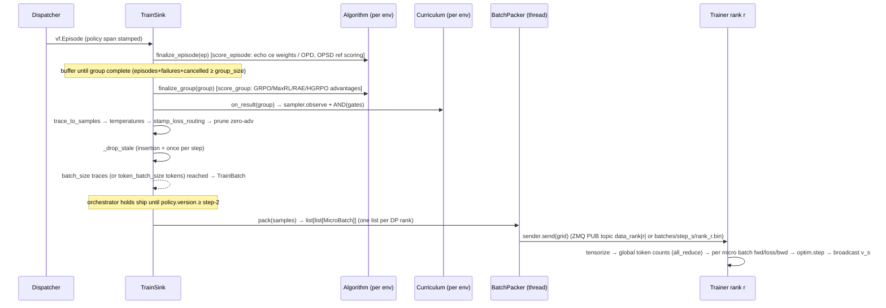

# Algorithms, Loss, and the Sample→Loss Data Path — prime-rl @ b944873

> Scope: the orchestrator-side `Algorithm` abstraction (credit assignment + loss routing), curricula, how an admitted trace becomes packed per-rank `MicroBatch`es, and how the RL trainer turns each micro batch into logprobs → loss → gradients; plus seam **S9** (step / policy-version / staleness accounting) in full and the **consumer side of S6**.
>
> Files read in full: `src/prime_rl/orchestrator/algo/{base (80), __init__ (82), grpo (46), hierarchical_grpo (42), max_rl (29), opd (45), opsd (78), rae (43), echo (110), routing (85), debug (30), sft (14)}.py`; `src/prime_rl/orchestrator/curriculum/{__init__ (14), base (91)}.py`, `gates/{__init__ (6), base (26), adv (36)}.py`, `samplers/{__init__ (7), base (32), standard (49), pool (99)}.py`; `packages/prime-rl-configs/src/prime_rl/configs/{algorithm (423), trainer (828), orchestrator (803)}.py`; `src/prime_rl/trainer/rl/{loss (423), data (279), annotations (90), train (756)}.py`; `src/prime_rl/trainer/batch.py (913)`; `src/prime_rl/orchestrator/{packing (35), trajectories (180), train_sink (421), train_source (85), utils (116), generation_source (49), orchestrator (1077)}.py`; `src/prime_rl/transports/batch/{types (125), base (55), filesystem (62), zmq (141), __init__ (56)}.py`; `src/prime_rl/utils/sequence.py (52)`; `docs/algorithms.md (556)`; tests `tests/unit/train/rl/test_loss.py (326)`, `tests/unit/orchestrator/{test_advantage (270), test_algorithms (477), test_batch (528), test_curriculum (177)}.py`.
> Read in part (for cross-checks, cited where used): `orchestrator/dispatcher.py` (1–160, 300–740), `orchestrator/envs.py` (156–273), `orchestrator/clients.py` (56–130, 523–556), `orchestrator/types.py` (Policy/Progress), `trainer/model.py` (1081–1138), `trainer/ckpt.py` (Progress), `trainer/utils.py` (`scale_gradients_`, `Tensors`), `trainer/parallel_dims.py` (259–260), `utils/cp.py` (73–138), `trainer/distributed/collectives.py` (all_gather autograd), `trainer/models/layers/lm_head.py` (97–101), `configs/rl.py` (687–714), `deps/verifiers/verifiers/v1/{trace.py (194–310, 527–570), graph.py (83–166), episode.py (31–61)}`.
>
> Related docs: `03-orchestrator.md` (B: dispatcher, sinks, watcher, ckpt), `05-trainer.md` (D: model/FSDP/CP/optimizer under the step), `06-inference-and-transports.md` (E: S6 wire + prefill scoring route + sampling replay on the engine), `07-verifiers-core.md` (F: Trace/Branch/MessageNode graph), `02-config-system.md` (A: `rl.py` auto-fill of `num_train_workers`, `pad_to_multiple_of`, shared `seq_len`).

---

## 1. Mental model

**An "algorithm" in prime-rl is an orchestrator-side annotator, and the trainer is algorithm-blind.** Each train env owns one `Algorithm` instance (`src/prime_rl/orchestrator/envs.py:253-259`) that writes per-token training annotations directly onto the verifiers message graph of finished episodes: advantages (`MessageNode.advantages`), reference logprobs (`MessageNode.reference_logprobs`), and named loss-weight streams (`MessageNode.loss_weights["ce"|"rl"|"ref_kl"]`) (`src/prime_rl/orchestrator/algo/routing.py:11-51`, `echo.py:82-90`). After admission, each trainable branch of each trace is flattened into a flat `TrainingSample` whose per-token arrays carry those annotations (`orchestrator/trajectories.py:136-180`), the algorithm's declared `action_loss_type` routes action tokens into one of three loss components (`routing.py:68-85`), and the trainer just executes

$$
\mathcal{L}=\frac{1}{N_{rl}}\sum_{t\in\mathcal{T}_{rl}} w^{rl}_t\,\ell^{rl}_t+\frac{1}{N_{ce}}\sum_{t\in\mathcal{T}_{ce}} w^{ce}_t\,\ell^{ce}_t+\frac{1}{N_{ref}}\sum_{t\in\mathcal{T}_{ref}} w^{ref}_t\,\ell^{ref}_t
$$

where each $N$ is the **global** (all-reduced over the `dp_cp` mesh) count of that component's member tokens in the step (`trainer/rl/train.py:300-322`, `trainer/rl/loss.py:305-414`). The only algorithm-specific knob on the trainer is which `rl` loss (`IPO` default, `IcePop`, or a user `custom` function) computes $\ell^{rl}$ (`configs/trainer.py:572-613`, `loss.py:291-302`); `ce` and `ref_kl` are fixed functions.

**Credit is computed on the orchestrator, per-token, before the wire.** Group-relative algorithms (GRPO, MaxRL, hierarchical GRPO, RAE, echo's action half, debug) compute a scalar per trace in their overridden `score_group`/`score_episode` hooks (which the orchestrator reaches only through the template methods `finalize_group`/`finalize_episode`, `base.py:73-80`) and broadcast it over that trace's sampled tokens (`routing.py:11-35`). Distillation algorithms (OPD, OPSD) do not assign credit; instead they prefill-score each branch under a reference model in `score_episode` and ship `ref_logprobs`, and the trainer evaluates the reverse-KL signal against the live policy (`opd.py:37-45`, `opsd.py:68-78`, `loss.py:216-260`). SFT is pure routing: sampled (teacher) tokens go to the `ce` component (`sft.py:14`).

**Off-policy accounting (S9) is version-based, not time-based.** Steps are 1-indexed (`orchestrator/types.py:30`, `trainer/ckpt.py:35`); policy versions are 0-indexed with $v_0$ = base weights. Trainer step $s$ consumes batch $s$, starts from weights $v_{s-1}$, takes **exactly one optimizer step**, and broadcasts $v_s$ (`train.py:572-596`). Every train group is stamped at dispatch with the version inference had applied (`dispatcher.py:532`); the episode carries a `PolicySpan(start, end)` (`dispatcher.py:721`). A trace's staleness when trained in batch $s$ is $(s-1)-\text{start}$ (`orchestrator/utils.py:48-61`), bounded hard by `max_off_policy_steps` (default 8) in the sink's queue sweep (`train_sink.py:180-219`). The only off-policy correction is the token-level importance ratio $\pi_\theta/\mu$ with trust-region masking inside the rl/ref_kl losses — no recompute of "old" logprobs, no PPO epochs.

---

## 2. Where it runs

| Piece | Process | Placement | Lifecycle |
|---|---|---|---|
| `Algorithm` instances (one per train env), `Curriculum` (one per train env), `TrainSink`, `BatchPacker` | orchestrator (single asyncio process, uvloop) | CPU host of the orchestrator | Built in `Orchestrator.setup()` (`orchestrator.py:230-236, 262, 281, 369-377`); `algorithm.setup()` connects frozen teachers after the policy pool is ready (`orchestrator.py:294-297`); frozen pools closed in `stop()` (`orchestrator.py:1036-1041`). |
| Reference / teacher scoring calls | orchestrator → HTTP `/inference/v1/generate` with `prompt_logprobs` on the teacher endpoint (OPD) or the **live policy** endpoint (OPSD) | wherever that endpoint is hosted; prime-rl never hosts frozen models (`configs/algorithm.py:27-34, 47-67`) | Per episode, at arrival, inside `TrainSink.add → process_episode → finalize_episode` (`train_sink.py:129-131, 221-224`). |
| Packing (`prepare_batch`) | orchestrator, in a worker thread (`asyncio.to_thread(self.packer.pack, …)`, `orchestrator.py:634`) | CPU | Once per shipped step. Note the code lives in `src/prime_rl/trainer/batch.py` but is imported and run by the orchestrator (`orchestrator/packing.py:4, 28-35`). |
| Batch receive → tensorize | trainer, every rank | CPU→GPU | `DataLoader.get_batch()` once per step (`train.py:288`, `trainer/rl/data.py:198-200`). |
| Forward / loss / backward / optimizer | trainer (torchrun ranks) | GPUs | `train()` loop (`train.py:253-719`). |

Crash/shutdown: algorithm state (e.g. RAE EMA baselines) lives only in orchestrator memory and is **not** checkpointed — the orchestrator checkpoint saves `progress` and `train_source` (curricula) only (`orchestrator.py:441, 973`; `rae.py:29-32`). Curriculum sampler/gate state *is* checkpointed via `TrainSource.state_dict` (`train_source.py:67-85`, `curriculum/base.py:68-85`).

---

## 3. Mechanics

### 3.1 End-to-end sample path (orchestrator → trainer)



### 3.2 The Algorithm object and its lifecycle

`Algorithm` (`orchestrator/algo/base.py:45-80`):

| Member | Semantics | Cite |
|---|---|---|
| `action_loss_type: ClassVar[Literal["rl","ce","ref_kl"]] = "rl"` | Which loss component the action (sampled, `mask=True`) tokens feed. Must equal the config class's `action_loss_type` — asserted in `build_algorithm`. | `base.py:53`, `algo/__init__.py:58` |
| `__init__(config, clients)` | `clients` is always the **live policy** `InferenceClient` (the same pool the dispatcher uses); `self.connected=None`. | `base.py:55-57`, `algo/__init__.py:56-64` |
| `async setup()` | Build/connect resources the algorithm owns (frozen teacher pool, renderer). Called once, concurrently for all envs, after the policy pool is ready. | `base.py:59-60`, `orchestrator.py:294-297` |
| `async connect(reference: FrozenModelConfig)` | Connects one frozen pool (`connect_frozen_client`, waits `check_inference_ready`) and stores it in `self.connected` (closed at shutdown). Only **one** tracked pool. | `base.py:18-32, 62-65`, `orchestrator.py:1039-1041` |
| `async score_episode(episode)` | **Overridable** rollout-local hook (base no-op). Reached as each episode arrives, before the group completes and before admission. | `base.py:67-68` |
| `async score_group(episodes)` | **Overridable** group-relative hook (base no-op). Receives the whole group (all arrived episodes, incl. errored traces — filter with `iter_trainable_traces`). | `base.py:70-71` |
| `async finalize_episode(ep)` | **Template method the orchestrator calls.** Calls `score_episode` only if the episode has ≥1 trainable trace — episodes with none are skipped entirely. | `base.py:73-76` |
| `async finalize_group(eps)` | **Template method the orchestrator calls.** Calls `score_group` unconditionally; the "≥1 trainable survivor" guard lives in the sink, not here. | `base.py:78-80`, `train_sink.py:264-266` |

**Call contract:** the orchestrator (`TrainSink`) never calls `score_*` directly — it calls `finalize_episode` (`train_sink.py:224`) and `finalize_group` (`train_sink.py:266`), which dispatch to the overridable `score_episode`/`score_group`. Algorithms override `score_*`, never `finalize_*`.

"Trainable trace" is defined by `iter_trainable_traces`: `not trace.has_error and trace.agent.trainable and any(any(node.mask) for node in trace.nodes)` (`base.py:35-42`). **Errored traces are excluded from group baselines** (they shrink the group rather than contributing a zero reward).

Lifecycle wiring in `TrainSink` (`train_sink.py`):

1. `add(episode)` → `process_episode` → `algorithm.finalize_episode(episode)` (`:129-131, :221-224`). Then the episode is appended to `pending_groups[group_id]` (`:132-134`).
2. A group is complete when `arrived + failed + cancelled_count ≥ group_size` (`:163-167`). Failures (`DispatchFailure`) and `GroupCancellation`s count toward completion but are never shown to the algorithm or the curriculum (`:140-161`).
3. `process_group` (`:226-323`):
   - A `stale` cancellation voids the whole group (all members share one dispatch version) and bypasses algorithm + curriculum (`:251-262`).
   - `survivors = iter_trainable_traces(group)`; if any, `await env.algorithm.finalize_group(group)` (`:264-266`).
   - `admitted = self._admit(group)` → `TrainSource.on_result` → per-env `Curriculum.on_result` (`:267, :329-330`; `train_source.py:42-54`). Rejected or survivor-less groups are recorded for metrics and dropped (`:268-276`).
   - For each survivor trace: `trace_to_samples` in a thread (`:281`), then per sample: `temperatures = [env temperature] * len(token_ids)` (`:279, :283`); if the env truncates sampling (top-p/top-k on the policy) and the sample has no `sampling_mask`, raise (`:284-292`); `stamp_loss_routing(sample, algorithm.action_loss_type)` (`:293`); if `constant_trainer_batch_size` (default True), drop samples with no remaining signal via `_prune_zero_advantages` (`:294-295`).
   - Surviving samples go into `pending_batch[trace_id]` (an insertion-ordered dict keyed by **trace**), token counters update, and `_drop_stale(samples_by_trace)` runs on the fresh insertion (`:304-321`).
4. `_maybe_batch` sweeps staleness once per step, then cuts a batch when `len(pending_batch) ≥ batch_size` (trace count) or `pending_tokens ≥ token_batch_size` (`:169-178`).
5. `process_batch` takes the first `batch_size` traces (or a token-count prefix), removes them from the pending dict (surplus traces carry over to the next step), optionally prunes zero-advantage samples at this point if `constant_trainer_batch_size=False`, and returns a `TrainBatch` with the flat `samples` list (`:360-421`).

**Timing consequence (docs mismatch):** reference scoring happens *per episode at arrival*, before group completion and before admission, with an unbounded `asyncio.gather` over that episode's branches (`opd.py:43`, `opsd.py:76`). `docs/algorithms.md:36` still says reference-KL algorithms "query a reference model at batch-ship time (bounded concurrency)" — stale; `docs/algorithms.md:433, 444` (arrival-time, pre-admission) matches code.

### 3.3 Per-env algorithm selection and routing

- Config: `OrchestratorConfig.algo: AlgoConfig = GRPOAlgoConfig()` (`configs/orchestrator.py:519`); each `TrainSourceConfig.algo: AlgoConfig | None = None` (`:279`). Validator `inherit_env_algorithms` deep-copies the top-level algo into every env that set none (`:627-634`), then `validate_env_algorithms` calls `algo.validate_env(env_cfg.env)` per env (`:636-642`; only `hierarchical_grpo` overrides it, requiring a `ProposerSolverEnvConfig`, `configs/algorithm.py:279-294`).
- Runtime: `TrainEnvs.__init__` builds, per env, `GenerationSource(config.algo.sampling, clients, renderer_config)` and `build_algorithm(config.algo, clients)` (`envs.py:250-259`). `build_algorithm` dispatches on `config.type` through the `ALGORITHM_CLASSES` dict (`algo/__init__.py:43-64`).
- Routing at sample compile time (`routing.py:68-85`, `stamp_loss_routing`):
  - `"rl"`: returns immediately — **no streams are written**; absent `rl_weights` means weight 1.0 on every `mask=True` token (the "hot path"). Any `ce_weights` an algorithm wrote on nodes (echo) survive (`test_algorithms.py:138-146`).
  - `"ce"`: `rl_weights = [0.0]*L`; `ce_weights` = existing ce stream (if any) with every `mask=True` position set to 1.0 (merge, not replace) (`test_algorithms.py:149-156`).
  - `"ref_kl"`: `rl_weights = [0.0]*L`; `ref_kl_weights` = fresh zeros with every `mask=True` position set to 1.0 (**overwrites** any algorithm-written ref_kl stream).
- Liveness gating (config-time): `rl` and `ref_kl` require `sampling.source == "policy"` because the importance ratio needs the live policy's sampling logprobs (`configs/algorithm.py:179-191`); `sft` requires a frozen source (`:354-365`). Frozen-source envs drop `logprobs` from sampling args (`generation_source.py:43-49`), get no cache salt (`dispatcher.py:562-565`), and get `policy=None` provenance (never stale) (`dispatcher.py:717-721`).

### 3.4 The shipped algorithms — exact math

Notation: a group $G$ = the trainable survivor traces of one dispatched group (all episodes sharing a `group_id`); $r_i$ = `trace.reward`; $A_i$ is broadcast to every sampled token of trace $i$ by `assign_advantages(trace, A_i)` (`routing.py:11-35`), leaving non-sampled positions 0.0 when spread onto a branch (`deps/verifiers/verifiers/v1/trace.py:231-268`).

#### GRPO (`type="grpo"`, default) — `grpo.py:24-46`
Without length penalty (`length_penalty=None`, the default, `configs/algorithm.py:208`):
$$A_i = r_i - \bar r,\qquad \bar r = \tfrac{1}{|G|}\textstyle\sum_{j\in G} r_j$$
No std normalization (Dr.-GRPO style). With `LinearLengthPenaltyConfig` (`configs/algorithm.py:96-108`; defaults $w_o=0.25, w_{in}=0.1, w_t=0.1$):
$$p_i = w_o\frac{o_i}{\max(1,\max_j o_j)} + w_{in}\frac{n_i}{\max(1,\max_j n_j)} + w_t\frac{t_i}{\max(1,\max_j t_j)},\qquad \tilde r_i = r_i - \bar r\,p_i,\qquad A_i = \tilde r_i - \overline{\tilde r}$$
with $o_i$ = `num_output_tokens`, $n_i$ = `num_total_tokens − num_output_tokens`, $t_i$ = `num_turns` (`grpo.py:33-44`). Note the penalty is scaled by the group pass-rate $\bar r$, so a group with $\bar r=0$ gets no penalty. A singleton group gets $A=0$ (`test_advantage.py:179-181`). **Multi-agent envs**: all trainable traces across all agents of the group are pooled into one baseline (use RAE / hierarchical GRPO instead).

#### MaxRL (`type="max_rl"`) — `max_rl.py:21-29`
$$A_i = \begin{cases}\dfrac{r_i-\bar r}{\bar r} & \bar r>0\\[4pt] 0 & \bar r\le 0\end{cases}$$
Assumes non-negative rewards (`test_advantage.py:184-190`: rewards $[1,0,0,0]\to[3,-1,-1,-1]$).

#### Hierarchical GRPO (`type="hierarchical_grpo"`) — `hierarchical_grpo.py:33-42`
Peer key $k(i) = (\text{agent}_i, \text{episode}_i)$ if $\text{agent}_i \in$ `episode_agents` (e.g. `["solver"]`), else $(\text{agent}_i, \varnothing)$ (the whole group). $A_i = r_i - \frac{1}{|P_{k(i)}|}\sum_{j\in P_{k(i)}} r_j$. Only valid on proposer-solver envs (`configs/algorithm.py:279-294`).

#### RAE (`type="rae"`) — `rae.py:39-43`
Per-env, per-agent-name EMA baseline $b_a$ (starts at 0, in memory only):
$$A_i = r_i - b_{a_i};\qquad b_{a_i}\leftarrow \lambda\, b_{a_i} + (1-\lambda)\, r_i\quad(\lambda=\texttt{decay}=0.95)$$
Scored against the **pre-update** baseline, traces processed in iteration order within the group (`rae.py:40-43`). Works with `group_size=1`.

#### Debug (`type="debug"`) — `debug.py:28-30`
$A_i = c$ (config `advantage`, default 1.0, must be nonzero, `configs/algorithm.py:380-391`) on every trainable trace, assigned in `score_episode`.

#### Echo (`type="echo"`) — `echo.py`
Subclass of GRPO: inherits `score_group` for action credit; overrides `score_episode` to write `ce` weights on **observation** tokens (`echo.py:36-90`). Per trainable branch (via `iter_trainable_branches`), walking nodes in order: for each non-sampled node *after the first sampled node* whose `message.role` is in the role table, every token (or only `is_content` body tokens when the renderer populated `node.is_content` with full length) gets weight $\alpha_{role}$ (default: `tool` only, $\alpha=0.1$, `configs/algorithm.py:221`), optionally ANDed with a user keep-mask `filter_fn(trace, **kwargs) -> list[list[bool]]` (one list per trainable branch, length = branch tokens; shape-validated, `echo.py:92-110`). Weights are merged into `node.loss_weights["ce"]` with elementwise max (`echo.py:82-90`). These tokens have `mask=False`, so they are outside the rl mask and its denominator; they enter only $\mathcal{T}_{ce}$. Tests: `test_algorithms.py:395-477`.

Note a subtle asymmetry: `EchoAlgorithm.score_episode` iterates `episode.traces` filtered by `not has_error and agent.trainable` itself (`echo.py:37-39`), but it is only invoked by `finalize_episode` when the episode has at least one trainable trace (`base.py:73-76`).

#### OPD (`type="opd"`, `action_loss_type="ref_kl"`) — `opd.py:27-45`
- Extra model: `teacher: FrozenModelConfig` (required; `name` + `base_url`, `configs/algorithm.py:308-313`), connected in `setup()` via `self.connect(self.teacher)` → an `InferenceClient` with default `openai_chat_completions` client type (`base.py:26-31`).
- `score_episode`: for every trainable branch of every trainable trace, `teacher.score(branch.token_ids)` concurrently (`opd.py:40-43`), then `assign_reference_logprobs(branch, logprobs)` projects the branch-aligned list onto sampled nodes (only nodes whose `reference_logprobs is None` — first branch wins for shared nodes) (`routing.py:38-51`).
- `score()` = `PrefillScorer.score` → `prefill_logprobs`: POST `{base}/inference/v1/generate` with `sampling_params={"max_tokens":1,"temperature":1.0,"top_p":1.0,"prompt_logprobs":1}`, returns one float per token, 0.0 for the first token (`clients.py:103-106, 523-556`). The teacher must therefore expose that route (docstring: "prime-rl server-side extension in `inference/vllm/serving_tokens.py`", `clients.py:525-526`) — see E.
- No advantages (`advantages=None` ships), `group_size` only fans out sampling (`configs/algorithm.py:297-304`).

#### OPSD (`type="opsd"`, `action_loss_type="ref_kl"`) — `opsd.py:34-78`
- Teacher **is the live policy pool** (`self.teacher_clients = self.clients`, `opsd.py:45`) — no extra deployment, and not version-pinned: the score reflects whatever weights inference has applied at scoring time [inferred from `opsd.py:45, 76`; no cache salt / version is passed].
- `setup()` builds its own renderer from the **policy's** tokenizer (`load_tokenizer(self.clients.model_name)`) and `config.renderer` (default auto) (`opsd.py:47-54`).
- For each trainable trace: demonstration = `trace.info[demo_key]` else `getattr(trace.task.data, demo_key)` else raise (`opsd.py:56-66`); `hint_block = renderer.render_ids([{"role":"system","content": template.format(demonstration=…)}], add_generation_prompt=False)`; for each trainable branch score `hint_block + branch.token_ids` and keep `full_logprobs[len(hint_block):]` (`opsd.py:72-78`).

#### SFT distillation (`type="sft"`, `action_loss_type="ce"`) — `sft.py:6-14`
No hooks. `sampling.source` must be a frozen model (`configs/algorithm.py:354-365`); the teacher's sampled tokens (`mask=True`) become `ce_weights=1.0`, `rl_weights=0` via routing. Frozen rollouts need tokens, so the generation source uses the renderer client for the frozen endpoint (`generation_source.py:32-37`).

#### What each algorithm needs from other models

| Algorithm | Extra model call | Where computed | Wire field |
|---|---|---|---|
| grpo / max_rl / rae / hierarchical_grpo / debug | none | orchestrator (CPU, torch on CPU for grpo/max_rl) | `advantages` |
| echo | none | orchestrator | `advantages` + `ce_weights` |
| opd | teacher prefill per trainable branch | teacher's vLLM `/inference/v1/generate` | `ref_logprobs` + `ref_kl_weights` (`rl_weights` all 0) |
| opsd | live-policy prefill of `hint_block + tokens` per trainable branch | policy inference pool | same as opd |
| sft | generation itself comes from the frozen teacher | teacher endpoint (renderer client) | `ce_weights` (`rl_weights` all 0) |

There is **no trainer-side reference model**: the trainer only ever runs the live policy forward; every reference logprob arrives precomputed on the wire (`loss.py:216-231`, `train.py:342`).

### 3.5 Trace → `TrainingSample` (multi-turn masks, branches, shared nodes)

- A `vf.Trace` is a message graph; `trace.branches` gives one root→leaf `Branch` per graph leaf, recomputed on every access (`deps/verifiers/verifiers/v1/trace.py:533-570`). A branch is non-trainable only if its leaf is a rejected compaction attempt (`trace.py:554-566`; `test_algorithms.py:216-300`).
- Per node: `token_ids` is the node's delta contribution (leading template scaffold + body; for an assistant node the generation prompt then the sampled completion); `mask` is True only on the sampled completion span; `logprobs`, `advantages`, `reference_logprobs` are **compact** (one entry per `mask=True` token) (`graph.py:112-140`). `Branch.spread` widens compact values to full length, 0.0 at non-sampled positions (`trace.py:231-252`). `Branch.advantages`/`reference_logprobs` return `None` when no node on the path was assigned (`trace.py:260-275`).
- `iter_trainable_branches(trace)` (`trajectories.py:91-114`) yields `(branch, mask)` for trainable branches, where a sampled node shared by several branches (mid-trajectory fork) is trainable only in the **first** branch containing it; later branches carry it as context (`mask False`). Branches left with no trainable token are skipped.
- `trace_to_samples` (`trajectories.py:136-180`) makes one `TrainingSample` per yielded branch with: `token_ids=branch.token_ids`, `mask` (above), `logprobs=branch.logprobs` (0.0 on context), `temperatures=[]` (filled by the sink), `ref_logprobs=branch.reference_logprobs`, `rl/ce/ref_kl_weights=_loss_weights(...)` (each shared node's weights counted once across branches; `None` if all-zero, `trajectories.py:117-133`), `advantages=branch.advantages`, `sampling_mask` (int32 bytes, realigned to token count, `:69-88`), `routed_experts` (realigned, `:52-66`), `mm_kwargs`/`mm_token_type_ids`, and identity `trace_id`, `branch_index`.
- Multi-turn = one flat sequence per branch interleaving context and sampled spans; there is no prompt/completion split (`transports/batch/types.py:30-36`). Env-provided observation tokens are `mask=False` and train only if an algorithm (echo) gives them `ce` weight.

### 3.6 Zero-signal pruning (`_prune_zero_advantages`) — `train_sink.py:34-59`

For samples with an advantage stream: every `mask=True` token whose advantage is exactly `0.0` gets `rl_weight=0.0` (materializing an `rl_weights` stream if one was absent). The sample is kept iff it still has any rl member, any nonzero `ce_weights`, or any nonzero `ref_kl_weights`. Samples with `advantages=None` pass unchanged. Consequences:
- Zero-advantage tokens leave $\mathcal{T}_{rl}$ entirely — they are not in $N_{rl}$ and do not get IPO's KL term either (`docs/algorithms.md:446`).
- With `constant_trainer_batch_size=True` (default, `configs/orchestrator.py:579`) pruning runs before a trace counts toward `batch_size`, so all-zero groups (e.g. GRPO groups with identical rewards) are replaced by fresh rollouts; with `False` it runs at ship time without replacement (smaller batches) (`train_sink.py:381-386`).

### 3.7 Packing: `TrainingSample` list → per-rank `MicroBatch` lists (`trainer/batch.py`, run by the orchestrator)

`BatchPacker(config)` holds `seq_len=orchestrator.seq_len`, `num_train_workers`, `pad_to_multiple_of`, and a `bin_cost` from the HF model config (falls back to token count if `AutoConfig` fails) (`orchestrator/packing.py:12-26`). `prepare_batch` (`batch.py:874-913`):

1. **`prepare_sample`** per sample (`batch.py:370-498`):
   - `input_ids=token_ids`, `loss_mask=mask`, `inference_logprobs=logprobs`, `position_ids=range(len)` (restart at 0 per sample, `:396`), `env_names=[env_name]*len`, `sequence_lengths=[len]`, `seq_lens=[len]`, identity lists of length 1.
   - `advantages=None` is legal only if the sample has no rl member tokens; otherwise `ValueError` (`:380-390`). Absent advantages become zeros.
   - Streams stay `None` if absent (keeps the GRPO wire small, `:391-395`).
   - **Truncation**: if `len > seq_len`, every per-token array is cut to `seq_len` (for multimodal, back to a whole-image boundary with `mm_kwargs` sliced, `:317-355, :415-441`). Tail tokens — including sampled ones — are silently dropped. Who/where: the **orchestrator**, at ship time, in `BatchPacker.pack`'s worker thread (`orchestrator.py:634` → `packing.py:28-35` → `prepare_sample`) — after the trace was admitted and counted toward `batch_size`; no log line or metric, and the trainer never sees the original length. Nothing upstream caps generation at `seq_len` (`orchestrator.seq_len` is only read by the packer and a zero-output estimate, `train_sink.py:342`).
   - Length-alignment asserts (`:443-476`).
2. **`packed_samples_into_micro_bs`** (`:692-729`): sort by decreasing length; **First-Fit-Decreasing** into bins of capacity `seq_len`; a sample fits a bin if total length stays ≤ `seq_len`, both agree on `routed_experts` presence, and multimodal samples have compatible `mm_kwargs` keys/dtypes/trailing shapes (`:526-549`). Samples of different loss components and temperatures pack together freely (`:527-529`; `test_batch.py:276-298, 318-357`). If `num_train_workers > 1`, split the heaviest multi-sample (text-only) bins by LPT until the bin count is a multiple of `num_train_workers` (`:675-689, :722-727`).
3. **`_materialize_bin`** (`:578-672`): concatenate per-token fields. A stream materializes if any packed sample carries it, and samples lacking it are back-filled with `STREAM_FILL = {"rl_weights": 1.0, "ce_weights": 0.0, "ref_kl_weights": 0.0}` (`:14, :583, :616-620`). `ref_logprobs` back-fills 0.0 (`:615`); `sampling_mask` back-fills zero-count rows (`:641-644`); `routed_experts` and `mm_kwargs` byte-concatenate along dim 0 (`:625-639`).
4. **`pad_micro_batch`** (`:747-796`): if `pad_to_multiple_of > 1` (auto-set to `trainer.model.cp` by `rl.py:689`), append `padding = (-L) mod pad_to_multiple_of` tokens: `input_ids=1`, `advantages=0`, `loss_mask=False`, `position_ids=0..pad-1`, `inference_logprobs=0`, `temperatures=1.0`, all present streams `0.0`, `env_names=""`; **folded into the last sample** (`sequence_lengths[-1] += pad`, `seq_lens[-1] += pad`).
5. **Modality split + rank distribution** (`:895-911`): multimodal and text micro batches are separate groups; each group is padded to a multiple of `num_train_workers` with `_make_dummy_batch` copies of the group's **first** (FFD ⇒ typically longest) micro batch — same tokens/length/`mm_kwargs`/`routed_experts`, so a dummy costs a full forward+backward; all loss-masked, all streams/sampling_mask/identity removed (`:847-871`), then `balanced_partition` (Karmarkar–Karp + pairwise-swap refinement on `bin_cost`, `:192-249`) assigns micro batches to ranks. Each rank's list is `[mm micro batches…, text micro batches…]`, so every step index has uniform modality across ranks (FSDP collective safety, `:885-888`; `test_batch.py:469-513`).
6. `_assert_token_arrays_aligned` on every micro batch incl. dummies (`:799-844`).

Bin cost (`:111-144`): $c(\text{bin}) = a\sum_k n_k + b\sum_k n_k^2$ with $a$ = per-token linear FLOPs (QKV, O-proj, FFN/MoE top-k + shared, LM head) and $b$ = per-token² attention FLOPs from the HF config; $(a,b)=(1,0)$ without a config.

There is **no micro-batch-size knob**, and **micro batches are variable-length**: each is one packed row of ≤ `seq_len` real tokens rounded up only to a multiple of `pad_to_multiple_of` (so up to `seq_len + pad_to_multiple_of − 1`; a CPU probe with `seq_len=10`, `pad_to_multiple_of=4` yields rows of 12 and 8 tokens). Nothing pads to `seq_len` — the `prepare_batch` docstring "Each micro batch is shape [1, seq_len]" (`batch.py:883`) and the `orchestrator.seq_len` docstring "Shorter samples are padded" (`configs/orchestrator.py:592`) are wrong. The number of micro batches per rank per step is data-dependent (equalized across ranks by dummies). Effective "gradient accumulation steps" = `len(micro_batches)` on that step.

### 3.8 Wire hop (S6 consumer side)

The orchestrator sends the grid via `BatchSender.send(list[list[MicroBatch]])`, which asserts `len(grid) == data_world_size (= num_train_workers)` and equal per-rank list lengths (`transports/batch/filesystem.py:20-22`, `zmq.py:68-70`). Encoding is `msgspec.msgpack` of `list[MicroBatch]` per rank; the receiver decodes with `Decoder(type=list[MicroBatch])` (`transports/batch/base.py:15, 34`).

- Filesystem: `output_dir/batches/step_{n}/rank_{r}.bin` written as `.tmp` then renamed; receiver waits for the path (`filesystem.py:24-35, 46-62`; `utils/pathing.py:261-262, 291-292`).
- ZMQ: one PUB socket (orchestrator) at `tcp://host:port`, topic `b"data_rank|{r}|"`; a PULL/PUSH READY barrier on `port+1` so the sender blocks until all ranks subscribed (`zmq.py:26-80, 90-134`). The step number is **implicit** (a local counter on each side), not carried in the payload (`zmq.py:45, 119, 133`).

Both sides start their step counter at their own `progress.step` (orchestrator `orchestrator.py:264-266`; trainer `train.py:231-236`) — a resume must restore both to the same step (see §3.11). Wire internals are E's; see `06-inference-and-transports.md`.

### 3.9 Trainer: `MicroBatch` → tensors (`trainer/rl/data.py:178-267`)

`DataLoader` computes `dp_rank = world.rank // (world.world_size // dp_world_size)` where `dp_world_size = parallel_dims.get_mesh("dp").size()` (`data.py:188-193`, `train.py:231-236`) — i.e. **CP ranks of one DP replica are contiguous and share the same micro batch list**. This holds because `cp` is the innermost device-mesh dim in both mesh builders (`["pp","dp_replicate","dp_shard(_mod_ep,_in_ep)","cp"]`, `trainer/parallel_dims.py:92-100, 162-165`) and the `"dp"` submesh flattens only the non-cp dims (`:141, :193`). **Every trainer rank (incl. each CP peer) builds its own receiver** for its `dp_rank`; with ZMQ the CP peers subscribe to the same topic and send duplicate READYs, which the sender dedups by rank id (`zmq.py:52-60`) — so the READY barrier alone would not guarantee every CP peer is subscribed, but in practice all ranks build the `DataLoader` (`train.py:231`) before the collective startup broadcast (`train.py:273`), and the orchestrator cannot ship step 1 before it has observed that broadcast (`orchestrator.py:400`). `_micro_batch_to_tensor` produces a `TensorMicroBatch` (`data.py:19-62, 202-267`): every token-level field gets a leading batch dim of 1; `sampling_mask` is expanded from `(ids, counts)` to a dense `[1, L, K]` int32 tensor padded with −1 (`K = max(counts.max(), 1)`, `:225-234`); `routed_experts` bytes → `[1, L, layers, topk]` int32 (`:213-224`); `lora_num_tokens = [L]` (single adapter, padding included, `:250`).

### 3.10 Trainer step: data → logprobs → loss → gradients (`trainer/rl/train.py:253-719`)

Per step:

1. **Startup broadcast (first iteration only):** broadcast $v_{\text{start\_step}-1}$ before waiting for data (`:263-276`) — $v_0$ from scratch.
2. `dataloader.wait_for_batch()`, `get_batch()` (`:278-290`).
3. **Global normalizers** (`:300-322`): per rank, sum over its micro batches
   $N^{loc}_{rl} = \sum[\text{loss\_mask}\wedge(w^{rl}\ne0)]$ (or $\sum \text{loss\_mask}$ if the stream is absent), $N^{loc}_{ce} = \sum[w^{ce}\ne0]$, $N^{loc}_{ref}=\sum[w^{ref}\ne 0]$; one `all_reduce(SUM)` over the `dp_cp` group; each clamped to ≥1. **CP cancellation (verified):** each CP rank counts its full, unsharded micro batch (the count loop at `:309-316` runs before any `shard_for_cp`), so every $N = cp\cdot N_{true}$. In the step, each CP rank all-gathers the logprobs *with grad* (`gather_for_cp` → custom-op `all_gather`, whose registered backward is `reduce_scatter_sum`, `utils/cp.py:104-105`, `trainer/distributed/collectives.py:155-219`) and computes the **same full-sequence** loss $\mathcal{L}_{full}/N$ (the loss inputs at `:482-495` are the unsharded micro-batch tensors). The distributed backward therefore yields, on each rank's local parameter copy, $\partial J/\partial\theta_c$ for $J=\sum_{c=1}^{cp}\mathcal{L}_{full}/N = \mathcal{L}_{full}/N_{true}$. FSDP's reduction runs over the `dp_shard_cp` (or HSDP) mesh, which includes `cp` (`parallel_dims.py:137-153, 189-208`), and its averaging is undone by `fsdp_gradient_divide_factor = dp_replicate·dp_shard·cp` (`parallel_dims.py:259-260`), so the summed gradient is exactly $\nabla\mathcal{L}_{full}/N_{true}$ — the $cp$ inflation cancels. (Any change that shards the loss inputs, or counts post-shard, breaks this by a factor of $cp$.)
4. **Per micro batch** (`:336-557`) — sequential forward/backward, i.e. gradient accumulation:
   - `labels = shift_tensor_left(input_ids)` (label at $t$ = token $t{+}1$, last position 0) (`:384`; `loss.py:96-104`). `sampling_mask` is shifted left likewise with pad −1 (`:385-388`).
   - CP: shard `input_ids/position_ids` (with `cu_seqlens` from the full `seq_lens`), `labels`, `routed_experts`, `sampling_mask`, `temperatures` (`:392-412, :426-430`).
   - `forward(model, input_ids, position_ids, labels=…, temperature=temperatures, seq_lens=…, routed_experts=…, sampling_mask=…)` (`:440-452`; `trainer/model.py:1081-1138`). Custom prime-rl models get `seq_lens` and build `cu_seqlens` from them (`utils/sequence.py:38-52`); HF models get only `position_ids` (packed-sequence boundaries inferred from position resets — [UNVERIFIED], HF internals). Multimodal batches carrying `image_grid_thw` get **no** `position_ids` at all (the model builds MRoPE ids itself) (`model.py:1116-1122`).
   - Logprobs: with the fused LM head, `out["logprobs"]`/`out["entropy"]` come back already temperature-scaled — it multiplies each vocab chunk's logits by $1/T_t$ before both the online logsumexp and the sampling-mask gather (`lm_head.py:159-194`), i.e. exact parity with the unfused path; entropy is full-vocab in both; otherwise computed from logits as `selective_log_softmax(logits / T)` or the sampling-mask replay variant (`:454-464`). CP: all-gather logprobs (with grad) and entropy (without) (`:467-469`).
   - `shift_tensor_right` realigns to "logprob of the token at its own position"; position 0 gets $\log(1/V)$ (entropy: $\log V$) (`:473-478`; `loss.py:107-122`).
   - `compute_loss(...)` with every tensor `.squeeze().split(sequence_lengths)` into per-sample views (`:482-495`) — see §3.12.
   - `begin_backward(...final_backward=last micro step)`, `loss.backward()`, `finish_backward` (`:498-501`).
   - Metrics per micro batch: entropy over `loss_mask` tokens (per env too), mismatch-KL $r-\log r-1$ over policy-sampled tokens only (excludes `ce`-action tokens), loss-fn metrics, MoE stats; `annotation_writer.export` (`:503-557`).
5. `annotation_writer.flush()` — collective gather of per-trace `trainer_logprobs`/`entropies` records to rank 0 (`:559`; `annotations.py:32-81`).
6. Undo FSDP's per-rank averaging: `scale_gradients_(…, fsdp_gradient_divide_factor = dp_replicate·dp_shard·cp)` (`:563-564`; `parallel_dims.py:259-260`) so the gradient is $\nabla\mathcal{L}$ of the global-token-normalized objective. With a gradient-offload manager the same factor is applied via `prepare_gradient_offload(…, fsdp_gradient_divide_factor)` (`:323-327`) and `scale_gradients_` is skipped.
7. Optional `clip_grad_norm_` (`optim.max_norm`, default 1.0), `optimizer.step()`, `zero_grad()`, `scheduler.step()` (`:566-576`).
8. Broadcast $v_{\text{step}}$ (`:583-597`), checkpoint on interval (`:600-613`), metrics (`:619-711`), `progress.step += 1` (`:719`).

### 3.11 S9 — step, policy version, staleness, async bound

**Indexing.**
- Orchestrator `Progress.step` starts at 1 and "is always the batch being collected" (`orchestrator/types.py:27-33`; `orchestrator.py:976-983`). It increments right after `sender.send` (`orchestrator.py:636-637`).
- Trainer `Progress.step` starts at 1 (`trainer/ckpt.py:34-37`); step $s$ consumes `batches/step_s` / the $s$-th ZMQ message.
- Versions are 0-indexed: $v_0$ = base. Trainer step $s$ trains weights $v_{s-1}$ and broadcasts $v_s$ tagged `step=s` (`train.py:263-276, 583-596`). The orchestrator's `Policy.version` is the latest version **inference has applied**, advanced by the `WeightWatcher` (`orchestrator/types.py:18-23`; `orchestrator.py:380-388`) — B/E own the watcher.
- Resume: trainer loads checkpoint step $k$, sets `progress.step = k+1`, broadcasts $v_k$ (`train.py:216-217, 267-276`); orchestrator sets `progress.step = resume_step + 1` and syncs to $v_{resume\_step}$ (`orchestrator.py:251-257, 286, 317, 400`). Checkpoint `step_k` on both sides means "step $k$ finished/shipped" (`orchestrator.py:435-441, 639-640`).

```
batch s (collected while progress.step == s) ──ship──▶ trainer step s: θ = v_{s-1} ──1 optim step──▶ v_s ──broadcast──▶ inference applies v_s ──▶ Policy.version = s
```

**Version tag on samples.** A train group records `policy_version_at_start = self.policy.version` when it is opened (`dispatcher.py:525-534`); all its episodes use `cache_salt = str(that version)` for live sources (`dispatcher.py:562-565`). At completion the episode gets `TrainWorkInfo(step=dispatch step, policy=PolicySpan(start=group version, end=current policy.version))` for live sources, `policy=None` for frozen sources (`dispatcher.py:705-729`; `deps/verifiers/verifiers/v1/episode.py:31-53`). `end > start` means weights changed during generation (in-flight rollouts span weight updates). The `TrainingSample`/`MicroBatch` wire carries **no version field** — staleness is enforced before packing, and the trainer never sees it.

**Staleness measure** (`orchestrator/utils.py:48-61`), for an episode trained in batch $s$ with span $[a,b]$:
$$\text{total} = \max(0,(s-1)-a),\quad \text{in\_flight} = \min(\text{total},\, b-a),\quad \text{in\_queue} = \text{total}-\text{in\_flight}$$
Logged per shipped step as `off_policy/{mean,max}`, `off_policy/in_flight/*`, `off_policy/in_queue/*`, `off_policy/dropped` (`orchestrator.py:691-706`). Frozen-sourced episodes have staleness 0.

**Staleness bound** $M$ = `max_off_policy_steps` (default 8, `configs/orchestrator.py:603-604`); `min_fresh_version(s, M) = (s-1) - M` (`utils.py:42-45`).
- Hard guarantee — the sink sweep: `_drop_stale` removes queued traces with `policy.start < min_fresh_version` (a) once per `progress.step` value over all of `pending_batch`, and (b) for each freshly inserted group (`train_sink.py:180-219, 313`). It is a no-op while `min_version ≤ 0` (`:200-201`). Dropped traces are marked cancelled for metrics.
- Compute saver — the dispatcher: `on_version_pending` (called by the watcher *before* the engines pause for a weight update) drops in-flight live-sourced train groups with `policy_version_at_start < min_fresh_version(progress.step, M)` as `reason="stale"` (`dispatcher.py:399-437`); the sink then voids any already-arrived members of that group (`train_sink.py:251-262`).
- So trained staleness satisfies $0 \le (s-1)-a \le M$. Note $a$ is the **group's** open version, not the member's dispatch version: remaining members of an open group are dispatched later (one at a time, `dispatcher.py:567`) and the dispatcher prefers finishing open groups (`dispatcher.py:496-499`), so a member dispatched after an update still carries $a$ (`complete_group_member`, `dispatcher.py:695-703`).

**Straddled rollouts (prefix-cache reuse across weight updates).** The live-source `cache_salt` is `str(group.policy_version_at_start)` (`dispatcher.py:562-565`), fixed per group, and the inference prefix cache is never reset on a weight update (E, `06-inference-and-transports.md` §3.6.1). So (i) group members dispatched after an update, and (ii) later turns of multi-turn episodes in flight across an update, decode under $v_{a+k}$ weights while reusing prefix KV computed under earlier weights. How this shows up in S9:
- **Staleness accounting: not visible as such, but the bound stays conservative.** The span is $[a,\ \text{version at completion}]$ with $a$ = group open version, so the member shows `in_flight ≥ 1` and total staleness $(s-1)-a$. Every salt-$a$ KV block was computed under weights $\ge v_a$ (a group is opened only once `policy.version == a`, which the watcher sets only after `receiver.receive(v_a)` returns, `watcher.py:113-116`, and nothing is scheduled while an update is pending — modulo §9 Q6 on multi-engine completion), so $(s-1)-a\le M$ still upper-bounds the age of every weight version that touched the trace.
- **IS ratio: the correction stays formally valid, but $\mu$ is not any single $v_k$.** $\log\mu$ is the logprob the engine reported *from the same forward pass that sampled the token* (stale KV + new weights), so $r_t=\pi_\theta/\mu$ is still the correct per-token importance weight for the distribution actually sampled from; it simply folds the hybrid into the mismatch, inflating $|\log r_t|$ (more IPO/IcePop trust-region masking, higher `mismatch_kl`). Nothing tags which tokens were affected; there is no per-token or per-turn version on the trace or the wire.

**Async bound ("async level")** — a hard-coded constant `TARGET_LAG = 1` (`orchestrator.py:92-95`), not a config field:
- Ship gate: batch $s$ ships only once `policy.version ≥ s - 1 - TARGET_LAG = s-2` (`orchestrator.py:607-625`), i.e. the trainer finished step $s-2$ and inference applied it. At most two batches ($s-1$, $s$) are shipped but not yet reflected in inference (ZMQ docstring: "in-flight steps bounded to TARGET_LAG + 1", `zmq.py:16-20`).
- Dispatch gate: train episodes — fresh groups *and* remaining members of already-open groups — are scheduled only while `lead = (progress.step - 1) - policy.version ≤ TARGET_LAG` (`orchestrator.py:976-1000`, `dispatcher.py:471-473`); separately, no episode of any kind is scheduled while a weight update is pending (`policy_update_pending`, `dispatcher.py:413-417, 450-457`). While collecting batch $s$, fresh groups therefore start from $v_{\ge s-2}$ ⇒ fresh-dispatch staleness ≤ 1; buffered/in-flight long rollouts can be older, up to $M$.
- Steady state when the trainer is the bottleneck: batch $s$ is generated from $v_{s-2}$ and trained at $v_{s-1}$ (staleness 1). When inference is the bottleneck the orchestrator catches up to $v_{s-1}$ (staleness 0). `docs/algorithms.md:166` (rollouts for step $n{+}1$ from $\pi_{n-1}$) matches this; the bullet at `docs/algorithms.md:173` ("rollouts $(x_n,y_n)$ from $\pi_{\max(0,n-1)}$") understates it by one.
- Eval dispatch ignores the gate (`dispatcher.py:444-448`).

**Off-policy correction.** Only token-level importance weighting inside the loss: $r_t = \exp(\log\pi_\theta(y_t) - \log\mu(y_t))$ with $\pi_\theta$ = trainer recompute at $v_{s-1}$ (single optimizer step per batch, so there is no separate "old-policy" pass) and $\mu$ = the inference engine's sampling logprob recorded during the rollout (`branch.logprobs`, `trajectories.py:160`). $r_t$ therefore folds together (i) staleness up to $M$ versions, (ii) intra-rollout weight changes incl. the stale-KV hybrids above, and (iii) trainer/inference numeric mismatch. Trust-region masking per loss (§3.12); no sequence-level correction, no ratio clipping.

### 3.12 The loss (`trainer/rl/loss.py`)

**Logprob definitions** (per packed position $t$, after the right shift):
$$\log\pi_\theta(y_t)=\frac{z_{t,y_t}}{T_t}-\log\sum_{v\in V}\exp\frac{z_{t,v}}{T_t}$$
with $T_t$ the per-token sampling temperature (every token of a sample gets the env's `sampling.temperature`, `train_sink.py:279-283`). If a replayable sampling mask $S_t$ exists (non-empty and contains the label, `lm_head.py:97-101`), the sum runs over $S_t$ only (`loss.py:66-84`; top-p/top-k "sampling replay"; the engine side is E's). $\log\mu(y_t)$ = `inference_logprobs` (0.0 on non-sampled positions). $\log\pi_{ref}(y_t)$ = `ref_logprobs` from the prefill scorer at temperature 1.0 (`clients.py:542`).

**`compute_loss`** (`loss.py:305-423`) iterates samples of the micro batch:
- rl: if `rl_weights is None`, run `rl_loss_fn.loss` with `loss_mask` = the sample's loss mask and no weights (hot path); else `rl_mask = loss_mask & (rl_w != 0)`, run only if non-empty, with weights `rl_w` (`:399-404`).
- ce: `ce_mask = ce_w != 0` (**not** ANDed with `loss_mask`), run `ce_loss_fn` if non-empty (`:405-408`).
- ref_kl: `ref_kl_mask = ref_kl_w != 0`, run `ref_kl_loss_fn` if non-empty (`:409-412`).
- Result: `rl_loss/rl_scale + ce_loss/ce_scale + ref_kl_loss/ref_kl_scale` (`:414`), with a zero-valued graph anchor `trainer_logprobs[0].sum()*0.0` so all-empty micro batches (dummies, fully truncated distillation samples) still backprop and keep FSDP collectives in lockstep (`:371-375`; `test_loss.py:256-285`). Every loss fn returns a **sum** over its tokens; normalization is only via the global scales.
- Metrics: scalar metrics per sequence are stacked; aggregated later over all sequences and ranks (unweighted mean over sequences) (`:416-423`; `trainer/utils.py:240-283`).

Let $r_t = e^{\log\pi_\theta(y_t)-\log\mu(y_t)}$, $p_t = \pi_\theta(y_t)$, $q_t=\mu(y_t)$, $m_t$ the component mask, $w_t$ the component weight (1 if absent).

**IPO (default rl loss)** — `IPOLossConfig(eps=0.3, adv_tau=1.0, kl_tau=0.0)` (`configs/trainer.py:572-581`), `loss.py:140-178`:
$$\ell^{IPO}_t = w_t\Big[-\,\mathbb{1}\big(|p_t-q_t|\le\epsilon\big)\,\tau_A\,A_t\,r_t\;+\;\tau_{KL}\,(\log r_t)^2\Big],\quad t\in m$$
The trust-region indicator is in **probability space** and not detached-sensitive (it is boolean); the KL term applies on all component tokens including masked ones; with default `kl_tau=0.0` it is off. Gradient of the PG term: $-\tau_A A_t r_t\nabla\log\pi_\theta(y_t)$ (ratio not detached, not clipped). Metrics: `masked_mismatch_kl`, `unmasked_mismatch_kl`, `is_masked`.

**IcePop** — `IcePopLossConfig(ratio_low=0.2, ratio_high=5.0, adv_tau=1.0)` (`configs/trainer.py:584-600`), `loss.py:181-213`:
$$\ell^{IcePop}_t = -\,w_t\,\mathbb{1}\big(\alpha\le \mathrm{sg}(r_t)\le\beta\big)\,\tau_A\,A_t\,r_t$$
Inclusive band on the detached log-ratio; rejected tokens have their log-ratio zeroed *before* `exp` so extreme ratios cannot produce NaN (`test_loss.py:95-128`). No KL term.

**ref_kl (fixed; opd/opsd)** — `loss.py:216-260`:
$$\ell^{ref}_t = w_t\Big[-\,\mathbb{1}\big(p_t-q_t\ge-0.2\big)\,\mathrm{sg}\big(\log\pi_{ref}(y_t)-\log\pi_\theta(y_t)\big)\,r_t\;+\;10^{-3}(\log r_t)^2\Big]$$
The one-sided trust region (0.2) and KL coefficient ($10^{-3}$) are hard-coded. Its gradient $-\mathrm{sg}(\Delta_t)\,r_t\nabla\log\pi_\theta$ is the importance-weighted per-token reverse-KL policy gradient. Raises if `ref_logprobs is None`. Metrics are namespaced `ref_kl/*` plus `ref_kl` (mean of $\Delta_t$).

**ce (fixed; sft actions, echo observations)** — `loss.py:263-276`: $\ell^{ce}_t = -w_t\log\pi_\theta(y_t)$; metric `nll`.

**Components summary.** Token-level normalization everywhere (global token mean per component — no per-sequence averaging, no GSPO; `test_gspo_loss` in `test_loss.py:42-64` just runs IPO). Entropy is computed under `no_grad` and only logged (`loss.py:87-93`, `train.py:504-515`) — there is no entropy bonus and no KL-to-base-model penalty in the rl component (IPO's `kl_tau` term regularizes toward the *behavior* policy $\mu$, not a reference). Components may overlap on a token; their gradients add, each with its own normalizer (`test_loss.py:288-317`).

### 3.13 Curricula (`orchestrator/curriculum/**`, `train_source.py`)

- `TrainSource` (one per orchestrator) builds one `Curriculum(env.config.curriculum, tasks)` per train env; finite tasksets are materialized to a list, infinite ones passed as an iterator (`train_source.py:26-31`).
- **Task selection**: `next_task(step)` picks an env by `random.Random(42).choices(env_names, weights=[ratio…])` then `next(curriculum.sampler)` (`train_source.py:21, 34, 38-40`). Called by the dispatcher when it opens a fresh train group (`dispatcher.py:508-515`). One task → one group of `group_size` rollouts.
- **Samplers** (`TaskSampler(Iterator[vf.Task])`: `__next__`, `observe(group)`, `state_dict/load_state_dict`, `metrics`, `samplers/base.py:12-32`):
  - `StandardSampler` (default): cycles finite tasksets in source order (unique `task.key` required), passes infinite iterators through; checkpoint = `cursor`, resume replays `cursor mod n` (`samplers/standard.py:15-49`).
  - `DifficultyPoolSampler` (finite only): per-task latest mean reward of trainable, non-errored traces in the group; task pool = first pool (sorted by `threshold`) with `score ≤ threshold`, else the last; sampling weight = pool weight, unseen tasks weight 1.0; `rng.choices` with replacement (seed 42 default); checkpoint = RNG state + `task_rewards` (`samplers/pool.py:18-99`; defaults hard≤0.25 w0.2, normal≤0.75 w1.0, easy≤1.0 w0.2, `configs/orchestrator.py:209-214`).
- **Gates** (`AdmissionGate.admit(group) -> bool`, `gates/base.py:10-26`): only `AdvRangeGate` ships — rejects a group iff **every** advantage value on trainable, non-errored traces lies in `[reject_min, reject_max]` (default `[0,0]`); groups without advantages (opd/opsd/sft) are admitted (`gates/adv.py:15-36`). **No gate is configured by default** (`CurriculumConfig.gates = {}`, `configs/orchestrator.py:263`).
- `Curriculum.on_result(group)`: validates one non-null `task.key` per group, calls `sampler.observe(group)` on **every** finalized group (admitted or not), evaluates all gates, returns `all(...)` (`curriculum/base.py:50-66`). Stale-cancelled groups never reach it (`train_sink.py:251-262`). Groups with arrived episodes but no trainable survivors (e.g. all errored) *do* reach it — `_admit(group)` runs whenever `group` is non-empty, and its result is then ignored (`train_sink.py:264-268`) — so `sampler.observe` sees them [intent: §9 Q2]. Groups made only of failures/cancellations do not.
- Resume: `TrainSource.state_dict` = env-mixing RNG state + per-env curriculum state (`train_source.py:67-85`). `StandardSampler` replays `cursor mod n` `next()` calls (infinite iterators: `cursor` calls on a fresh iterator), where `cursor` counts tasks *drawn* — so tasks of groups in flight or buffered at checkpoint time are skipped, not re-dispatched, on resume (`samplers/standard.py:30-49`).
- Metrics: `curriculum/{env}/admission_rate`, `curriculum/{env}/sampler/*`, `curriculum/{env}/gate/{name}/*` (`train_source.py:56-65`, `curriculum/base.py:87-91`).
- Ordering: gates see advantages because `finalize_group` runs before `_admit` (`train_sink.py:264-267`); reference scoring cost is paid before admission (`docs/algorithms.md:444`).

---

## 4. Interfaces & contracts

### 4.1 `TrainingSample` (orchestrator-internal; `transports/batch/types.py:30-87`)
`msgspec.Struct(array_like=True, omit_defaults=True)` — positional encoding; new fields must be appended (`:79-80`). All per-token lists have length $L$ = `len(token_ids)`.

| Field | Type | Meaning / producer |
|---|---|---|
| `token_ids` | `list[int]` | branch tokens (`trajectories.py:151`) |
| `mask` | `list[bool]` | trainable sampled tokens (first-branch rule for shared nodes) |
| `logprobs` | `list[float]` | sampling logprobs $\log\mu$, 0.0 off-sample |
| `temperatures` | `list[float]` | `[env temperature]*L` (sink) |
| `env_name` | `str` | env resolved name; `"all"` reserved (`batch.py:399`) |
| `ref_logprobs` | `list[float] \| None` | teacher/self-teacher prefill logprobs spread to L (0.0 off-sample) |
| `mm_kwargs` | `dict[str, EncodedTensor] \| None` | image tensors, cat dim 0 |
| `routed_experts` | `RoutedExperts \| None` | `{data: bytes, shape: [L, layers, topk], dtype: str}`; dtype carried from the inference payload (`uint8` default, `uint16` possible — `deps/verifiers/verifiers/v1/graph.py:714-739`) |
| `mm_token_type_ids` | `list[int] \| None` | 0 text / 1 image / 2 video |
| `rl_weights`, `ce_weights`, `ref_kl_weights` | `list[float] \| None` | component weights; None = absent (rl→1.0 on mask; ce/ref_kl→no component) |
| `advantages` | `list[float] \| None` | per-token credit, 0.0 off-sample; None = no rl credit |
| `sampling_mask` | `SamplingMask \| None` | `ids` int32 bytes, `counts` int32 bytes per token |
| `trace_id`, `branch_index` | `str \| None`, `int \| None` | identity for trainer annotations |

### 4.2 `MicroBatch` (the S6 wire payload; one `list[MicroBatch]` per DP rank per step; `types.py:91-125`)

Rows are in **wire (positional) order** — `array_like=True` encodes each struct as a msgpack array in declaration order (a round-trip in the venv yields a 19-element array: the 9 required fields, then `ref_logprobs … branch_indices` with `None` for absent). Decoding a shorter array fills trailing defaults, which is why fields may only be appended.

| Field | Wire type | Trainer tensor (`data.py:235-267`) | Notes |
|---|---|---|---|
| `input_ids` | `list[int]` | `[1,L]` int64 | $L$ varies per micro batch: ≤ `seq_len` real tokens + < `pad_to_multiple_of` padding |
| `loss_mask` | `list[bool]` | `[1,L]` bool | |
| `advantages` | `list[float]` | `[1,L]` float32 | always present (zeros if none) |
| `inference_logprobs` | `list[float]` | `[1,L]` float32 | |
| `position_ids` | `list[int]` | `[1,L]` int64 | restart at 0 per sample and for padding |
| `sequence_lengths` | `list[int]` | python list | per packed **sample** (loss split: `.split(sequence_lengths)`, annotation spans); last includes padding |
| `temperatures` | `list[float]` | `[1,L]` float32 | padding 1.0 |
| `env_names` | `list[str]` | python list (per token) | `""` = padding |
| `seq_lens` | `list[int]` | `[segments]` int64 | **attention** segments → `cu_seqlens` (custom models, CP attention params); built by extending each sample's `[len]` (`batch.py:640`), so == `sequence_lengths` at this pin, padding folded into both |
| `ref_logprobs` | `list[float] \| None` | `[1,L]` float32 \| None | 0.0 back-fill for ref-less samples |
| `routed_experts` | `RoutedExperts \| None` | `[1,L,layers,topk]` int32 (`frombuffer(dtype).reshape(shape).to(int32)`, `data.py:213-224`) | used only if `trainer.enable_router_replay` (else dropped; replay on + absent → `ValueError`, `train.py:352-359`); packing requires equal dtype/trailing shape (`batch.py:629-630`) |
| `mm_kwargs` | `dict[str,EncodedTensor] \| None` | dict of tensors, no batch dim | |
| `mm_token_type_ids` | `list[int] \| None` | `[1,L]` int64 | |
| `rl_weights`/`ce_weights`/`ref_kl_weights` | `list[float] \| None` | `[1,L]` float32 \| None | back-fill 1.0/0.0/0.0; padding 0.0 |
| `sampling_mask` | `SamplingMask \| None` | `[1,L,K]` int32, −1 padded, `K=max(max(counts),1)` (`data.py:225-234`; e.g. counts `[0,2,1]`, ids `[4,7,9]` → `[[-1,-1],[4,7],[9,-1]]`) | row = mask of the token *at that position*; trainer shifts left (pad −1) to label alignment |
| `trace_ids`, `branch_indices` | `list[str] \| None`, `list[int] \| None` | python lists | per sequence; `""`/−1 unknown |

`lora_num_tokens` is synthesized trainer-side (`[L]` int32).

### 4.3 Algorithm/graph annotation contract (`verifiers` nodes)
- `node.advantages`: compact over `mask=True` tokens; set only via `assign_advantages(trace, float | list[float])`. A list must have length = total sampled tokens across nodes that belong to ≥1 trainable branch, in `trace.nodes` order (`routing.py:13-29`); nodes only in non-trainable branches stay `None` (`test_algorithms.py:287-291`).
- `node.reference_logprobs`: compact; set via `assign_reference_logprobs(branch, full_len_values)`; first writer wins (`routing.py:38-51`).
- `node.loss_weights[name]`: **full-length** over `node.token_ids` (not compact) (`trajectories.py:125-130`; `graph.py:147-148`).

### 4.4 Loss plug-in contract
```python
@dataclass
class LossInputs:            # loss.py:14-29 — one packed sample
    trainer_logprobs: Float[Tensor, "seq"]
    inference_logprobs: Float[Tensor, "seq"]
    ref_logprobs: Float[Tensor, "seq"] | None
    advantages: Float[Tensor, "seq"]
    loss_mask: Bool[Tensor, "seq"]            # already the component's members
    loss_weights: Float[Tensor, "seq"] | None # None = 1.0
@dataclass
class LossOutputs:           # loss.py:32-37
    loss: Float[Tensor, ""]                   # SUM over member tokens (unnormalized)
    metrics: dict[str, Tensor]                # 0-d → stacked; 1-d → concatenated
def my_loss(inputs: LossInputs, **kwargs) -> LossOutputs: ...   # loss.py:47-54
```

### 4.5 Config fields owned here

| Field (path) | Type / default | Effect | Cite |
|---|---|---|---|
| `orchestrator.algo` | `AlgoConfig` / `GRPOAlgoConfig()` | default algorithm for all train envs | `configs/orchestrator.py:519` |
| `orchestrator.train.source[].algo` | `AlgoConfig \| None` / None → inherit | per-env algorithm | `:279, :627-634` |
| `algo.type` | `grpo\|echo\|max_rl\|rae\|hierarchical_grpo\|opd\|opsd\|sft\|debug` | discriminator | `configs/algorithm.py:394-405` |
| `algo.sampling.source` | `"policy" \| FrozenModelConfig` / `"policy"` | who generates train rollouts | `:83-88` |
| `algo.length_penalty` (grpo, echo) | `LinearLengthPenaltyConfig \| None` / None | shaping (§3.4) | `:208` |
| `algo.roles.{system,user,assistant,tool}.alpha` (echo) | `float>0` / tool=0.1 | observation ce weights; setting any role replaces the table | `:114-134, :221` |
| `algo.filter.{import_path,kwargs}` (echo) | / None | per-branch keep mask | `:137-153` |
| `algo.decay` (rae) | `[0,1)` / 0.95 | EMA | `:257` |
| `algo.episode_agents` (hierarchical_grpo) | `list[str]` (≥1), required | episode-scoped roles | `:275` |
| `algo.teacher` (opd) | `FrozenModelConfig`, required (`name`, `base_url` required) | teacher | `:308, :47-67` |
| `algo.demo_key` / `template` / `renderer` (opsd) | `"demonstration"` / hint template / auto | self-teacher conditioning | `:329-342` |
| `algo.advantage` (debug) | float ≠0 / 1.0 | constant credit | `:380-391` |
| `trainer.loss` | `IPOLossConfig \| IcePopLossConfig \| CustomLossConfig` / IPO | rl loss | `configs/trainer.py:613, 678` |
| `trainer.loss.{eps,adv_tau,kl_tau}` (ipo) | 0.3 / 1.0 / 0.0 | | `:572-581` |
| `trainer.loss.{ratio_low,ratio_high,adv_tau}` (icepop) | 0.2 / 5.0 / 1.0 | | `:584-600` |
| `trainer.loss.{import_path,kwargs}` (custom) | required / {} | | `:603-610` |
| `orchestrator.batch_size` | `int \| None` / 128 if neither set | traces per step; must divide by `group_size` | `configs/orchestrator.py:576, :732-744` |
| `orchestrator.token_batch_size` | `int \| None` | tokens per step (exclusive with `batch_size`) | `:582` |
| `orchestrator.constant_trainer_batch_size` | bool / True | prune before counting (§3.6) | `:579` |
| `orchestrator.group_size` / `source[].group_size` | ≥1 / 1 | rollouts per task | `:275, :588, :752-754` |
| `orchestrator.seq_len` | int / 2048 | packing bin size + truncation | `:591` |
| `orchestrator.num_train_workers` | ≥1 / 1 (auto = train GPUs // cp) | DP rank count for packing | `:594`; `rl.py:689-714` |
| `orchestrator.pad_to_multiple_of` | ≥1 / 1 (auto = cp) | micro batch padding | `:597`; `rl.py:689` |
| `orchestrator.max_off_policy_steps` | ≥0 / 8 | staleness bound $M$ | `:603-604` |
| `source[].curriculum.sampler` | `standard \| difficulty_pool` | task sampler | `:197-240, :260` |
| `source[].curriculum.gates.{name}` | `advantage_range{reject_min,reject_max}` | admission | `:243-256, :263` |
| `source[].ratio` | >0 / 1.0 | env mixing weight | `:272` |
| `source[].sampling.temperature/top_p/top_k` | 1.0 / 1.0 / None | $T_t$; truncation → sampling masks, top-k bound 512, opd/opsd rejected | `:45-108, :515, :644-691` |

Constants: `TARGET_LAG = 1` (`orchestrator.py:95`), `STREAM_FILL` (`batch.py:14`), ref_kl `0.2`/`1e-3` (`loss.py:238, 246`), `TRAIN_TOP_K_BOUND = 512` (`configs/orchestrator.py:515`).

---

## 5. Invariants & assumptions

1. **Per-token alignment.** Every per-token array (`loss_mask`, `advantages`, `inference_logprobs`, `position_ids`, `temperatures`, `env_names`, `ref_logprobs`, the three streams, `mm_token_type_ids`, `routed_experts` rows, `sampling_mask` counts) has length $L$ after packing and padding — asserted in `_assert_token_arrays_aligned` (`batch.py:799-844`).
2. **First token of every packed sample is never a loss member.** Labels are shifted over the whole packed row, so the right-shifted logprob at a sample's first position is conditioned on the previous sample (garbage). Correctness relies on producers never putting `mask=True` or nonzero `ce/ref_kl` weights on a sample's first token (true for chat traces, which start with a prompt node). The ce/ref_kl masks are `weight != 0`, **not** ANDed with `loss_mask` (`loss.py:406, 410`), so the invariant is on the producer. The annotation writer nulls the first value of every span for the same reason (`annotations.py:59-61`).
3. **Every DP rank gets the same number of micro batches, and at every index the same modality** (`batch.py:895-911`; sender asserts equal lengths, `filesystem.py:21-22`). FSDP collectives would otherwise hang.
4. **`num_train_workers` equals the trainer's DP degree** (world // cp) and CP ranks of a replica are rank-contiguous (`data.py:190-191`; guaranteed by cp-innermost mesh order, §3.9). Nothing on the trainer validates this. Too few workers ⇒ some trainer ranks wait forever (FS path never written / ZMQ topic never published). Too many ⇒ ZMQ sender blocks forever in the READY barrier (waits for `data_world_size` distinct ranks, `zmq.py:52-60`); FS writes `rank_r.bin` files nobody reads ⇒ those micro batches are **silently dropped** [static reading of `filesystem.py`/`zmq.py`].
5. **Samples with rl members must carry advantages** — `prepare_sample` raises otherwise (`batch.py:380-390`).
6. **`action_loss_type` declared twice in lockstep** (config class and runtime class) — asserted in `build_algorithm` (`algo/__init__.py:58`).
7. **rl/ref_kl require policy-sampled tokens** with sampling logprobs (config validator, `configs/algorithm.py:179-191`); **truncated sampling requires sampling masks on every sample** (`train_sink.py:284-292`) and one top-k mode across all live-policy envs (`configs/orchestrator.py:771-786`).
8. **One optimizer step per batch.** The importance ratio's numerator is the recompute at $v_{s-1}$; any multi-epoch extension would need a stored "old" logprob.
9. **Group identity**: every finalized group has exactly one non-null `task.key` (`curriculum/base.py:54-58`); finite tasksets have unique keys (`samplers/standard.py:21-26`, `pool.py:36-39`).
10. **Staleness is keyed on the group's open version**, not per-member or per-turn versions: all members of a group age out together (`train_sink.py:251-262, 314-316`). A straddled rollout (member dispatched, or turn decoded, after a weight update, reusing old-salt prefix KV) is therefore counted as staleness from the group's open version — conservative, so the $M$ bound still holds — and its hybrid behavior policy is absorbed into $\mu$ and the IS ratio with no marker (§3.11).
11. **msgspec array-like structs encode positionally** — reordering/inserting `TrainingSample`/`MicroBatch` fields breaks mixed-version orchestrator/trainer pairs (`types.py:79-80, 118`).
12. **Trainer and orchestrator step counters start equal** (both from their `progress.step`), since the transport has no step field (`zmq.py:45, 119`).

---

## 6. Extension points

### 6.1 New credit-assignment algorithm (code seam; no config import path)
Worked minimal example — RLOO (leave-one-out baseline $A_i = r_i - \frac{1}{|G|-1}\sum_{j\ne i} r_j$):

1. `packages/prime-rl-configs/src/prime_rl/configs/algorithm.py`:
```python
class RLOOAlgoConfig(BaseAlgoConfig):
    type: Literal["rloo"] = "rloo"
    action_loss_type: ClassVar[ActionLossType] = "rl"
```
   and add `| RLOOAlgoConfig` to the `AlgoConfig` union (`:394-405`). Override `validate_env` if the math encodes env structure (`:193-198`).
2. `src/prime_rl/orchestrator/algo/rloo.py`:
```python
class RLOOAlgorithm(Algorithm):
    async def score_group(self, episodes):
        traces = [t for _, t in iter_trainable_traces(episodes)]   # errored/untrainable excluded
        n, total = len(traces), sum(t.reward for t in traces)
        for t in traces:
            assign_advantages(t, 0.0 if n < 2 else t.reward - (total - t.reward) / (n - 1))
```
3. Register `"rloo": RLOOAlgorithm` in `ALGORITHM_CLASSES` (`algo/__init__.py:43-53`) and `__all__`.

Rules of the seam: use `iter_trainable_traces` (the docs example at `docs/algorithms.md:418-425` iterates raw `episode.traces`, which would include errored/untrainable traces in the baseline); pick `score_episode` for model I/O / rollout-local work and `score_group` for cohort-relative credit; per-token credit = `assign_advantages(trace, list)` in compact node order; extra models = add a `FrozenModelConfig` field and `await self.connect(cfg)` in `setup()` (only one pool is tracked for shutdown by `self.connected`; close others yourself). Custom loss routing beyond the three action types = write `node.loss_weights["rl"|"ce"|"ref_kl"]` (full-length per node) in a hook — with `action_loss_type="rl"` routing leaves them untouched (`routing.py:70-71`), which is how you'd add e.g. a KL-to-reference regularizer next to RL (set `ref_kl` weights = $\beta$ on action tokens and attach `ref_logprobs` via `assign_reference_logprobs`). Nothing in dispatcher, packer, or trainer changes.

### 6.2 New rl loss (config seam)
`[trainer.loss] type="custom" import_path="pkg.mod.fn" kwargs={...}` → `CustomLoss` imports it at trainer startup and calls `fn(inputs, **kwargs)` per packed sample for the rl component only (`loss.py:279-302`). Must return an unnormalized **sum** and apply `inputs.loss_weights` itself (IPO/IcePop do, `loss.py:168-169, 205-206`). Cannot replace `ce` or `ref_kl` (`configs/trainer.py:679`).

### 6.3 New task sampler / admission gate (code seam)
Subclass `TaskSampler` / `AdmissionGate`; add a config class to `TaskSamplerConfig` (discriminated union) or turn `AdmissionGateConfig` (currently a plain alias of `AdvRangeGateConfig`, `configs/orchestrator.py:256`) into an `Annotated[... , Field(discriminator="type")]` union; add the `isinstance` branch in `Curriculum.__init__` (`curriculum/base.py:35-48`). State in `state_dict` is checkpointed automatically. Despite "user-authored" in docstrings, there is no import-path hook.

### 6.4 Echo filter (config seam)
`algo.filter = {import_path, kwargs}` → `filter_fn(trace, **kwargs) -> list[list[bool]]` (`echo.py:32-34, 92-110`). Note `EchoFilterConfig`'s docstring calls the first arg `rollout`; it is the `vf.Trace`.

### 6.5 New wire field
Append to both `TrainingSample` and `MicroBatch` (positional encoding), fill in `trace_to_samples`, `prepare_sample` (incl. truncation), `_materialize_bin` (back-fill), `pad_micro_batch`, `_make_dummy_batch`, `_assert_token_arrays_aligned`, `TensorMicroBatch` + `_micro_batch_to_tensor`, `FakeDataLoader`, and the consumer in `train.py`. Miss one back-fill and arrays silently misalign across pack boundaries (`test_batch.py:318-393` guards the existing streams).

---

## 7. Gotchas & limitations

1. **IPO's trust region is in probability space**, so low-probability tokens can carry very large ratios: $q=0.01, p=0.3$ passes $|p-q|\le0.3$ with $r=30$ (confirmed on CPU: loss term $-30A$, gradient $-30A$). There is no ratio clipping; with default `kl_tau=0.0` nothing else restrains it (`loss.py:159-167`, `configs/trainer.py:572-581`). Unlike IcePop, IPO (and ref_kl) exponentiate the **unmasked** log-ratio (`loss.py:134-135, 165`), so a member token with $\log r > \sim 88$ (fp32 `exp` overflow, e.g. a bogus inference logprob ≤ −88) gives `0·inf = NaN` for the whole step even though the trust region masks it (CPU probe: $\log q=-100$ ⇒ loss and grad NaN).
2. **ref_kl hyper-parameters are hard-coded** (0.2 one-sided trust region, $10^{-3}$ KL coefficient; `loss.py:238, 246`) and not affected by `trainer.loss`.
3. **Temperature mismatch in distillation** [inferred]: reference logprobs are prefilled at `temperature=1.0` (`clients.py:542`) while trainer logprobs are divided by the env's sampling temperature (`train.py:459`, fused head likewise). With `temperature≠1`, `ref_kl` compares a tempered student to an untempered teacher, and `ce` (sft) trains the tempered distribution. Relatedly, `sampling.temperature` allows `0` (`configs/orchestrator.py:46`, rejected only for truncated sampling, `:658-662`), but the trainer divides logits by the per-token temperature (`train.py:459`; fused head `1/T`, `lm_head.py:55`) ⇒ greedy train sampling yields inf/NaN logprobs [static].
4. **Truncated sampling (top-p/top-k) is incompatible with opd/opsd** (config error, `configs/orchestrator.py:683-689`) and forces `top_k ≤ 512` (default-injected) so trainer mask tensors stay bounded (`:665-681`).
5. **Silent truncation** at `orchestrator.seq_len` drops tail tokens (including sampled ones and their credit) with no warning (`batch.py:415-441`). The trace still counts toward `batch_size`.
6. **`batch_size` counts traces, not samples/branches** (`train_sink.py:111-115, 360-363`); a branched trace yields several samples, so trainer token volume per step varies. Surplus traces spill into the next step and keep aging.
7. **Pruning changes normalization**: zero-advantage tokens are removed from $N_{rl}$ (§3.6) — e.g. in GRPO a trace whose reward equals the group mean contributes nothing, not even to the denominator.
8. **Errored traces shrink the baseline group** rather than counting as reward 0 (`base.py:35-42`).
9. **OPSD's teacher drifts**: it scores against whatever weights the live pool currently serves, and opsd/opd scoring runs pre-admission on every episode (rejected groups still paid for it) with unbounded per-episode concurrency (`opsd.py:76`, `opd.py:43`). The prefill-scoring request carries no `cache_salt` (`clients.py:540-543`), but that is harmless: any request with `prompt_logprobs` skips prefix-cache *reads* in vLLM, so the teacher prompt is always recomputed under the currently served weights (06 §3.2; vLLM 0.24 `sampling_params.py:481-485`, pin is 0.29).
10. **Multimodal OPD** [inferred]: `teacher.score(branch.token_ids)` sends token ids only; image placeholder tokens would be scored without pixel inputs. More generally, OPD sends the **student's token ids** to the teacher and SFT feeds the **teacher's token ids** (rendered with the teacher-name tokenizer + the policy's `renderer` config, `generation_source.py:36`, `base.py:25-28`, `clients.py:85`) straight to the student — both silently require a shared tokenizer/vocabulary; no validator checks it [no check found in `configs/algorithm.py`/`configs/orchestrator.py`].
11. **Orchestrator needs vLLM importable for OPD/OPSD** (`from vllm.entrypoints.scale_out.token_in_token_out.protocol import GenerateResponse` inside `prefill_logprobs`, `clients.py:528`).
12. **RAE baselines are lost on restart** (not checkpointed) and re-warm over ~$1/(1-\lambda)$ traces (`rae.py:29-32`).
13. **Logged `loss/mean` is not the step objective**: it's the mean over micro batches × ranks (CP duplicates included) of each micro batch's already-globally-normalized contribution (`train.py:506`; `trainer/utils.py:247-283`). Loss-fn metrics (`is_masked`, …) are unweighted means over sequences.
14. **Throughput/MFU accounting assumes fixed-length micro batches**: `num_tokens = micro_batches[0].shape[1] * batch_size * dp` (`train.py:298, 623-629`), but micro batches are always variable-length (packed, never padded to `seq_len`; §3.7) — the metric extrapolates the first micro batch's length and is approximate. Same for `progress.total_samples += batch_size`, which counts micro batches, not samples (`train.py:626`).
15. **`TARGET_LAG` is not configurable** (`orchestrator.py:95`); the only exposed async knob is `max_off_policy_steps`. The ship hold (`orchestrator.py:614-625`) is an `await self.version_advanced.wait()` inside `finalize_train_batch`, which the main loop awaits (`orchestrator.py:557-559`), so no episode is taken from the dispatcher's `out_q` while it holds (the dispatcher keeps running and fills `out_q`); see B's §3 for the watcher/`out_q` interaction.
16. **`_drop_stale` is inert until `(step-1) - M > 0`** (`train_sink.py:200-201`) — correct (versions ≥0), but means early steps never drop.
17. **Docs drift** (code is truth): `docs/algorithms.md:36` (ship-time bounded-concurrency scoring — actually arrival-time, unbounded), `:162` (`prime_rl.orchestrator.algo.advantage` module does not exist), `:144-153` table omits `debug`, `:173` staleness bullet (see §3.11), `:418-425` example uses raw `episode.traces`, and `:323` says `length_penalty` exists "on the grpo-family algorithms" while only `grpo` and `echo` (which subclasses `GRPOAlgoConfig`) have the field — `max_rl` does not (`configs/algorithm.py:208, 212, 229-240`); `:421` says opsd reads the example's `info[demo_key]` then a top-level rollout field, while code reads `trace.info[demo_key]` then `trace.task.data.<demo_key>` (`opsd.py:56-66`). In-code docstrings too: `prepare_batch` "shape [1, seq_len]" (`batch.py:883`) and `orchestrator.seq_len` "Shorter samples are padded" (`configs/orchestrator.py:592`) — micro batches are packed and variable-length (§3.7); OPD's class docstring "at ship time" (`opd.py:21-22`) — it scores at arrival.
18. **Padding tokens** use `input_ids=1` and are folded into the last sample's attention segment (`batch.py:769-774`); harmless because loss-masked and causally after the real tokens, but they do attend to that sample.

---

## 8. For a custom framework

**Keep (essential design):**
- *Algorithm-blind trainer with per-token component streams.* Shipping `(advantages, rl/ce/ref_kl weights, ref_logprobs)` per token and a fixed sum-of-components loss makes new algorithms orchestrator-only changes. The per-component global normalizer is the right default: mixing SFT/echo/RL tokens in one batch doesn't dilute any component's effective step size. Keep the "absent stream = identity" encoding; it keeps the common wire lean.
- *Annotate the native trace graph, compile late.* Scoring on the graph (nodes/branches) and flattening only admitted traces lets gates and metrics read advantages before packing and handles branching/forked trajectories (first-branch-trains-shared-node rule) in one place.
- *Version-stamped groups + a hard queue sweep.* Stamping the dispatch version at group open and enforcing $(s-1)-v \le M$ at the sink (with dispatcher cancellation only as a compute saver) is simple and airtight; decomposing staleness into in-flight vs in-queue is a great diagnostic.
- *Global token counts via one all-reduce before the micro-batch loop*, plus the zero-valued graph anchor so empty micro batches still run backward.
- *FLOP-aware pack-then-balance* (FFD bins, KK partition on $a n + b n^2$) and modality-uniform step indices.

**Simplify / replace:**
- Put the step/version on the wire (`MicroBatch` or a per-step header) so trainer and orchestrator can detect desync instead of relying on matching counters.
- Make `TARGET_LAG` a config field and document the two gates (ship gate and dispatch gate) as one "pipeline depth" parameter.
- Expose the ref_kl constants and give the rl loss a ratio clip option; the probability-space IPO trust region is a design choice worth revisiting for low-probability tokens.
- Temperature-consistent reference scoring (score the teacher at the student's sampling temperature or compute ref logits untempered on both sides).
- Replace positional msgspec structs with a versioned schema if orchestrator and trainer may be deployed at different commits.
- Move packing out of `trainer/batch.py` into an orchestrator module (it never runs on the trainer) — the current placement is incidental and confusing.
- Checkpoint algorithm state (RAE baselines) alongside curricula; the `state_dict` pattern already exists for samplers/gates.

**Coupling points to watch:** `num_train_workers`/`pad_to_multiple_of` must match trainer DP/CP (auto-filled only by the `rl` launcher, `rl.py:689-714`); the first-token-never-trained invariant couples trace producers to trainer label shifting; `action_loss_type` is declared in two classes.

---

## 9. Open questions

1. **HF-impl packed attention** — for `model.impl="hf"`, only `position_ids` are passed (`model.py:1116-1127`); confirm (D) that HF flash-attention derives segment boundaries from position resets, and that the padding segment (positions restart at 0 in `pad_micro_batch`) is treated as its own segment there while custom models fold it into the last sample via `seq_lens`.
2. **Curriculum on survivor-less groups (intent)** — the behavior is certain: `process_group` calls `self._admit(group)` whenever `group` is non-empty, even with no survivors, and discards the verdict (`train_sink.py:264-268`), so `sampler.observe` sees all-errored groups (`DifficultyPoolSampler.observe` returns early when no clean trainable trace exists, `samplers/pool.py:66-73`; gates see no advantages ⇒ admit). Whether this is intentional is unknown.
3. **`prompt_logprobs` entry ordering** — `prefill_logprobs` takes `next(iter(entry.values()))` as the prompt token's logprob (`clients.py:553`). Correct only if the server puts the actual prompt token first in each dict. The unit test (`tests/unit/orchestrator/test_prefill_logprobs.py`) uses single-entry dicts and does not pin this; vLLM is not in the checkout. E to confirm.
4. **Inference logprob semantics under truncation** — the config docstring says rollout logprobs are mask-renormalized (`configs/orchestrator.py:646-647`) to match `selective_log_softmax_with_sampling_mask`; E should confirm the engine returns renormalized (not full-vocab) logprobs, including temperature treatment.
5. **SFT inference logprobs** — frozen sources drop `logprobs` from sampling args (`generation_source.py:43-49`); what the renderer client stores in `node.logprobs` then (zeros? empty → `spread` pads 0.0) is F/H territory; it only affects the (excluded) mismatch metric.
6. **Watcher timing of `Policy.version`** — whether `policy.version` advances when *all* engines applied the update or on the first (B/E), which sets the exact meaning of "inference applied $v_k$" in the ship/dispatch gates.
